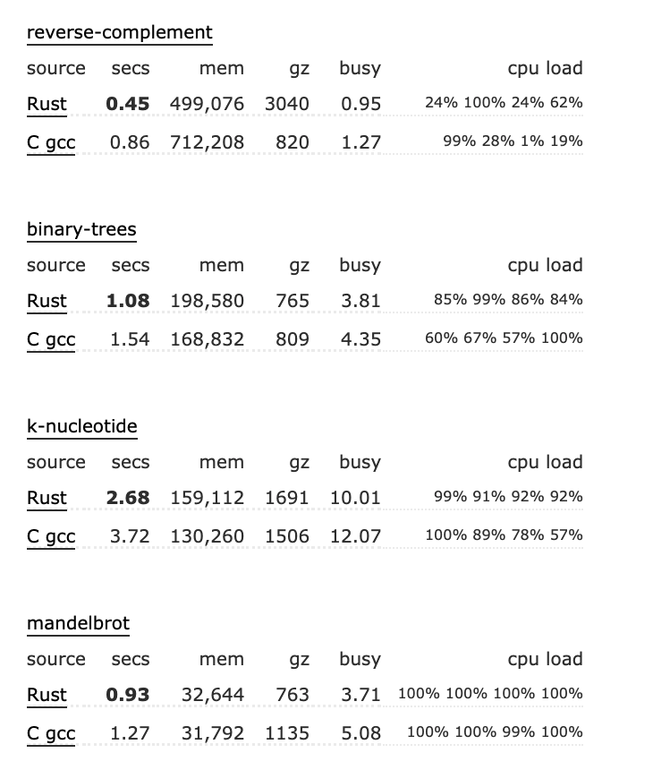
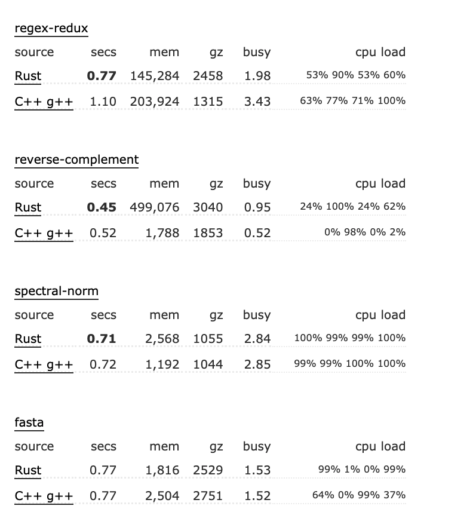

# 三万言｜2021 年 Rust 行业调研报告

作者：张汉东

>  [PDF 版本下载 ](https://github.com/ZhangHanDong/star-rust/blob/main/2021-reports/Rust%E8%A1%8C%E4%B8%9A%E8%B0%83%E7%A0%94%E6%8A%A5%E5%91%8A-20210623-latest.pdf)

---

## 文前

Rust 语言是一门通用系统级编程语言，无GC且能保证内存安全、并发安全和高性能而著称。自2008年开始由 Graydon Hoare 私人研发，2009年得到 Mozilla 赞助，2010年首次发布 0.1.0 版本，用于Servo 引擎的研发，于 2015年5月15号发布 1.0 版本。

自发布以来，截止到2021 年的今天，经历六年的发展，Rust 得到稳步上升，已逐渐趋于成熟稳定。

至 2016 年开始，截止到 2021年，Rust 连续五年成为[ StackOverflow 语言榜上最受欢迎的语言](https://insights.stackoverflow.com/survey/2020)。

2021年 2 月 9 号，**Rust 基金会宣布成立**。**华为、AWS、Google、微软、Mozilla、Facebook 等科技行业领军巨头加入 Rust 基金会**，成为白金成员，以致力于在全球范围内推广和发展 Rust 语言。

那 Rust 语言到底有何魅力，能让广大开发者和巨头公司这么感兴趣呢？

本文打算从 Rust 语言自身特性 和 Rust 行业应用盘点两个方面的社区调研来尝试来解答这个问题。供想选择 Rust 的公司参考。

其实 Rust 生态还有很多内容，等待大家挖掘。本文内容还未覆盖完全 Rust 生态的方方面面。

注明： 本文中所罗列数据均来源互联网公开内容。

## 认识 Rust 语言

编程语言设计在两个看似不可调和的愿望之间长期存在着矛盾对立。

- 安全 ( safe )。 我们想要强类型系统来静态地排除大量错误。 我们要自动内存管理。我们想要数据封装， 这样我们就可以对私有变量执行不变的对象的表示形式，并确保它们将不会被不受信任的代码破坏。
- 控制 (control )。 至少对于 Web浏览器，操作系统，或游戏引擎这样的 `系统编程 (system programming)` 程序，约束它们性能或资源是一个重要的问题，我们想了解数据的字节级表示。 我们想要用`底层语言 (low-level programming)` 的编程技术优化我们程序的时间和空间的使用。 我们希望在需要时使用 `裸机` 。

然而，按照传统的看法，鱼和熊掌不能兼得。 Java 之类的语言使我们极大的安全保证，但代价是牺牲对底层的控制。结果，对于许多系统编程应用程序，唯一现实的选择是使用一种像 C 或 C++ 提供细粒度的语言控制资源管理。 但是，获得这种控制需要很高的成本。例如，微软最近报告说，他们修复的 70％ 安全漏洞都归因于内存安全违规行为 [33](https://rustmagazine.github.io/rust_magazine_2021/chapter_4/safe_system.html#33)，并且都是能被强类型系统排除的问题。同样，Mozilla 报告指出，绝大多数关键 他们在Firefox中发现的错误是内存有关的[16 ](https://rustmagazine.github.io/rust_magazine_2021/chapter_4/safe_system.html#16)。

如果可以以某种方式两全其美: 安全系统编程的同时对底层有控制权，岂不美哉。因此，Rust 语言应运而生。

官方网如此介绍 Rust  : 一门赋予每个人 构建可靠且高效软件能力的语言。

Rust 语言有三大优势值得大家关注：

1. 高性能。Rust 速度惊人且内存利用率极高。由于没有运行时和垃圾回收，它能够胜任对性能要求特别高的服务，可以在嵌入式设备上运行，还能轻松和其他语言集成。
2. 可靠性。Rust 丰富的类型系统和所有权模型保证了内存安全和线程安全，让您在编译期就能够消除各种各样的错误。
3. 生产力。Rust 拥有出色的文档、友好的编译器和清晰的错误提示信息， 还集成了一流的工具——包管理器和构建工具， 智能地自动补全和类型检验的多编辑器支持， 以及自动格式化代码等等。

Rust 足够底层，如果有必要，它可以像 C 一样进行优化，以实现最高性能。

抽象层次越高，内存管理越方便，可用库越丰富，Rust 程序代码就越多，做的事情越多，但如果不进行控制，可能导致程序膨胀。

然而，Rust 程序的优化也很不错，有时候比 C 语言更好，C 语言适合在逐个字节逐个指针的级别上编写最小的代码，而 Rust 具有强大的功能，能够有效地将多个函数甚至整个库组合在一起。

但是，最大的潜力是可以无畏（fearless）地并行化大多数 Rust 代码，即使等价的 C 代码并行化的风险非常高。在这方面，Rust 语言是比 C 语言更为成熟的语言。

Rust 语言也支持高并发零成本的异步编程，Rust 语言应该是首个支持异步编程的系统级语言。

###  媲美 C / Cpp 的高性能

**Rust vs C**

**Rust vs Cpp**

**Rust vs Go**

用 Rust 编写的程序的运行时速度和内存使用量应该和用 C 编写的程序差不多，但这两种语言的总体编程风格不同，很难去概括它们的性能。

总的来说：

1. 抽象是一把双刃剑。Rust 语言抽象程度比 C 语言更高，抽象会隐藏一些不是那么优化的代码，这意味着，默认实现的 Rust 代码性能不是最好的。所以，你的 Rust 代码必须经过优化才能达到媲美 C 的性能。Unsafe Rust 就是高性能出口。
2. Rust 默认线程安全，消除数据竞争，让多线程并发编程更具实用价值。
3. Rust  在有些方面确实比 C 快。理论上，C 语言什么都可以做。 但在实践中，C 抽象能力比较低，不那么现代化，开发效率比较低。只要开发者有无限时间和精力，就可以让 C 语言在这些方面比 Rust 更快。

因为 C 语言足以代表高性能，下面就分别谈一下 C 和 Rust 的异同。如果你熟悉 C/Cpp，也可以根据此对比来评估 Cpp 和 Rust。

#### Rust 和 C 都是硬件直接抽象

Rust 和 C 都是直接对硬件的抽象，都可看作一种「可移植汇编程序」。

Rust 和 C 都能控制数据结构的内存布局、整数大小、栈与堆内存分配、指针间接寻址等，并且一般都能翻译成可理解的机器代码，编译器很少插入 "魔法"。

即便 Rust 比 C 有更高层次的结构，如迭代器、特质（trait）和智能指针，它们也被设计为可预测地优化为简单的机器代码（又称 "零成本抽象"）。

Rust的类型的内存布局很简单，例如，可增长的字符串`String` 和 `Vec<T>` 正好是`{byte*, capacity, length}`。Rust没有任何像 Cpp里的 移动 或 复制构造函数 这样的概念，所以对象的传递保证不会比传递指针或 `memcpy` 更复杂。

Rust 借用检查只是编译器对代码中引用的静态分析。生命周期（lifetime）信息早就在 中级中间语言（MIR） 生成前完全抽离了。

Rust 中不使用传统的异常处理，而是使用基于返回值的错误处理。但你也可以使用 恐慌（Panic）来处理像 Cpp 中那样的异常行为。它可以在编译时被禁用`（panic = abort）`，但即便如此，Rust 也不喜欢 与 Cpp异常 或 longjmp 混在一起。

#### 同样的 LLVM 后端

Rust与LLVM有很好的整合，所以它支持链接时间优化，包括ThinLTO，甚至是跨越C/C++/Rust语言边界的内联。也有按配置优化（Profile-guided Optimization，PGO）的支持。尽管 rustc 比 clang 生成的LLVM IR更加冗长，但优化器仍然能够很好地处理它。

C 语言用 GCC 编译比用 LLVM 更快，现在 Rust 社区也有人在开发 GCC 的 Rust 前端。

理论上，因为 Rust 有比C 更严格的不可变和别名规则，应该比 C 语言有更好的性能优化，但实际上并没有起到这样的效果。目前在LLVM中，超越 C语言的优化是一项正在进行的工作，所以Rust仍然没有达到其全部潜力。

#### 都允许手工优化，但有一些小例外

Rust 的代码足够底层和可预测，可以通过手工调整它的优化到什么样的汇编代码。

Rust 支持 SIMD ，对内联和调用约定有很好的控制。

Rust 和 C 语言足够相似，C 语言的一些分析工具通常可以用于 Rust 。

总的来说，如果性能绝对关键，并且需要手工优化压榨最后一点性能，那么优化 Rus t 与 优化 C 语言并没有什么不同。

但是在一些比较底层的特性，Rust 没有特别好的替代方法。

- `goto`。Rust 中没有提供`goto`，不过你可以使用循环的 break 标签来代替。C 语言中一般使用 goto 来清理内存，但是 Rust 因为有确定性析构功能，所以不需要 goto。然而有一个 非标准的 goto 扩展，对性能优化比较有用。
- 栈内存分配`alloca`和`C99`可变长度数组，可以节省内存空间，减少内存分配次数。但这些即使在 C 语言中也是有争议的，所以Rust远离了它们。

#### Rust 相比 C 语言的一些开销

如果没有经过手工优化，Rust 因为其抽象表达也会有一些开销。

- Rust缺乏隐式类型转换和只用usize的索引，这导致开发者只能使用这种类型，哪怕只需要更小的数据类型。64位平台上用usize做索引更容易优化，而不需要担心未定义行为，但多余的bit位可能会给寄存器和内存带来更大的压力。而在 C 中，你可以选择 32位类型。
- Rust 中的字符串，总是会携带指针和长度。但是很多 C 代码中的函数只接收指针而不管大小。
- 像 `for i in 0...len {arr[i]}` 这样的迭代，性能取决于 LLVM 优化器能否证明长度匹配。有时候，它不能，并且边界检查也会抑制自动矢量化。
- C 语言比较自由，对于内存有很多“聪明”的使用技巧，但在 Rust 里就没这么自由了。但Rust仍然给了内存分配很多控制权，并且可以做一些基本的事情，比如内存池、将多个分配合并为一个、预分配空间等等。
- 在不熟悉 Rust 借用检查的情况下，可能会用 Clone 来逃避使用引用。
- Rust 的标准库中 I/O 是不带缓存的，所以需要使用 **BufWriter** 来包装。这就是为什么有些人说 Rust 写的代码还不如 Python 快的原因，因为 99% 的时间都用在 I/O上了。

#### 可执行文件大小

每个操作系统都有一些内置的标准C库，其中有大约30MB的代码。C 语言的执行文件，可以“免费”使用这些库。

一个小的 "Hello World " 级 C 可执行文件实际上不能打印任何东西，它只调用操作系统提供的printf。

而 Rust 则不可以，Rust可执行文件会捆绑自己的标准库（300KB或更多）。幸运的是，这只是一次性的开销，可以减少。

对于嵌入式开发，可以关闭标准库，使用 "no-std"，Rust将生成 "裸 "代码。

在每个函数的基础上，Rust代码的大小与C差不多，但有一个 "泛型膨胀 "的问题。泛型函数为它们所使用的每一种类型都有优化的版本，所以有可能出现同一个函数有8个版本的情况，[cargo-bloat](https://lib.rs/cargo-bloat) 库有助于发现这些问题。

在Rust中使用依赖关系是非常容易的。与 JS/npm 类似，现在推荐使用小型且单用途的包，但它们确实在不断增加。`cargo-tree` 命令对于删减它们非常有用。

#### Rust 略胜 C  的一些地方

1. 为了隐藏实现细节，C 库经常返回不透明的数据结构指针，并确保结构的每个实例只有一个副本。它会消耗堆分配和指针间接寻址的成本。Rust 内置的隐私、单一所有权规则和编码惯例允许库暴露其对象，而不需要间接性，这样，调用者可以决定将其放入堆（heap）上还是栈（stack）中。可以主动或彻底地优化栈上的对象。
2. 缺省情况下，Rust 可以将来自标准库、依赖项和其他编译单元的函数内联。
3. Rust 会对结构体字段进行重排，以优化内存布局。
4. 字符串携带大小信息，使得长度检查速度很快。并允许就地生成子串。
5. 与 C++ 模板类似，Rust 中泛型函数会单态化，生成不同类型的副本，因此像 sort 这样的函数和 HashMap 这样的容器总是针对相应的类型进行优化。对于 C 语言，则必须在修改宏或者处理` void* `和运行时变量大小的效率较低的函数之间做出选择。
6. Rust的迭代器可以组合成链状，作为一个单元一起被优化。因此，你可以调用`it.buy().use().break().change().mail().upgrade()`，而不是对同一个缓存区多次写入的一系列调用。
7. 同样，通过 Read 和 Write 接口，接收一些未缓存的流数据，在流中执行 CRC 校验，然后将其转码、压缩，再写入网络中，所有这些都可以在一次调用中完成。虽然 C 语言中应该也可以做到，但它没有泛型和特质（trait），将很难做到。
8. Rust 标准库中内置高质量的容器和优化过的数据结构，比 C 使用起来更方便。
9. Rust的 serde 是世界上最快的JSON解析器之一，使用体验非常棒。

#### Rust 比 C 明显优越的地方

主要是两点：

1. Rust 消除数据竞争，天生线程安全，解放多线程生产力，是 Rust 明显比 C / Cpp  等语言优越的地方。
2. Rust 语言支持异步高并发编程。
3. Rust 支持 安全的编译期计算。

**线程安全**

即使是在第三方库中，Rust 也会强制实现所有代码和数据的线程安全，哪怕那些代码的作者没有注意线程安全。一切都遵循一个特定的线程安全保证，或者不允许跨线程使用。当你编写的代码不符合线程安全时，编译器会准确地指出不安全之处。

Rust 生态中已经有了很多库，如数据并行、线程池、队列、任务、无锁数据结构等。有了这类组件的帮助，再加上类型系统强大的安全网，完全可以很轻松地实现并发/并行化 Rust 程序。有些情况下，用 par_iter 代替 iter 是可以的，只要能够进行编译，就可以正常工作！这并不总是线性加速（ 阿姆达尔定律（Amdahl's law）很残酷），但往往是相对较少的工作就能加速 2~3 倍。

延伸：阿姆达尔定律，一个计算机科学界的经验法则，因 Gene Amdahl 而得名。它代表了处理器并行计算之后效率提升的能力。

在记录线程安全方面，Rust 和 C 有一个有趣的不同。

Rust 有一个术语表用于描述线程安全的特定方面，如 `Send` 和 `Sync`、`guards` 和 `cell`。

对于 C 库，没有这样的说法：“可以在一个线程上分配它，在另一个线程上释放它，但不能同时从两个线程中使用它”。

根据数据类型，Rust 描述了线程安全性，它可以泛化到所有使用它们的函数。

对于 C 语言来说，线程安全只涉及单个函数和配置标志。

Rust 的保证通常是在编译时提供的，至少是无条件的。

对于 C 语言，常见的是“仅当 turboblub 选项设置为 7 时，这才是线程安全的” （这句话并不是真的让你去设置 turboblub 选项，因为本来就没有这个选项，所以 C 语言不会保证你线程安全 ）。

**异步并发**

Rust 语言支持 `async/await`异步编程模型。

该编程模型，基于一个叫做 `Future` 的概念，，在 JavaScript 中也叫做 `Promise`。`Future` 表示一个尚未得出的值，你可以在它被解决（resolved）以得出那个值之前对它进行各种操作。在许多语言中，对 `Future` 所做的工作并不多，这种实现支持很多特性比如组合器（Combinator），尤其是能在此基础上实现更符合人体工程学的 `async`/`await` 语法。

`Future` 可以表示各种各样的东西，尤其适用于表示异步 I/O ：当你发起一次网络请求时，你将立即获得一个 `Future` 对象，而一旦网络请求完成，它将返回任何响应可能包含的值；你也可以表示诸如“超时”之类的东西，“超时”其实就是一个在过了特定时间后被解决的 `Future` ；甚至不属于 I/O 的工作或者需要放到某个线程池中运行的CPU密集型的工作，也可以通过一个 `Future` 来表示，这个 `Future` 将会在线程池完成工作后被解决。

**`Future` 存在的问题** 是它在大多数语言中的表示方式是这种基于回调的方法，使用这种方式时，你可以指定在 `Future` 被解决之后运行什么回调函数。也就是说， `Future` 负责弄清楚什么时候被解决，无论你的回调是什么，它都会运行；而所有的不便也都建立在此模型上，它非常难用，因为已经有很多开发者进行了大量的尝试，发现他们不得不写很多分配性的代码以及使用动态派发；实际上，你尝试调度的每个回调都必须获得自己独立的存储空间，例如 crate 对象、堆内存分配，这些分配以及动态派发无处不在。这种方法没有满足零成本抽象的第二个原则，如果你要使用它，它将比你自己写要慢很多，那你为什么还要用它。

Rust 中的方案有所不同。不是由 `Future` 来调度回调函数，而是由一个被称为执行器（executor）的组件去轮询 `Future`。而 `Future` 可能返回“尚未准备就绪（Pending）”，也可能被解决就返回“已就绪（Ready）”。该模型有很多优点。其中一个优点是，你可以非常容易地取消 `Future` ，因为取消 `Future` 只需要停止持有 `Future`。而如果采用基于回调的方法，要通过调度来取消并使其停止就没这么容易了。

同时它还能够使我们在程序的不同部分之间建立真正清晰的抽象边界，大多数其他 `Future` 库都带有事件循环（event loop），这也是调度 你的`Future` 执行 I/O 的方法，但实际上你对此没有任何控制权。

而在 Rust 中，各组件之间的边界非常整洁，执行器（executor）负责调度你的 `Future` ，反应器（reactor）处理所有的 I/O ，然后是你的实际代码。因此最终用户可以自行决定使用什么执行器，使用他们想使用的反应器，从而获得更强的控制力，这在系统编程语言中真的很重要。

而此模型最重要的真正优势在于，它使我们能够以一种真正零成本的完美方式实现这种状态机式的 `Future` 。也就是当你编写的 `Future` 代码被编译成实际的本地（native）代码时，它就像一个状态机；在该状态机中，每次 I/O 的暂停点都有一个变体（variant），而每个变体都保存了恢复执行所需的状态。

而这种 `Future` 抽象的真正有用之处在于，我们可以在其之上构建其他 API 。可以通过将这些组合器方法应用于 `Future` 来构建状态机，它们的工作方式类似于迭代器（`Iterator`）的适配器（如 `filter`、`map`）。但是这种方式是有一些缺点的，尤其是诸如嵌套回调之类，可读性非常差。所以才需要实现 `async` / `await`异步语法。

目前 Rust 生态中，已经有了成熟的 [tokio](https://tokio.rs/) 运行时生态，支持 epoll 等异步 I/O。如果你想用 io_uring ，也可以使用 [Glommio](https://github.com/DataDog/glommio) ，或者等待 tokio 对 io_uring 的支持。甚至，你可以使用 smol 运行时提供的 [async_executor](https://github.com/smol-rs/async-executor) 和 [async-io](https://github.com/smol-rs/async-io) 来构建你自己的运行时。

**编译期计算**

Rust 可以支持类似于 Cpp 那样的 编译期常量求值。这一点是明显比C优越的。

虽然目前功能还不如 Cpp 那样强大，但还在不断的维护中。

为什么 Rust 中支持 编译期计算这么谨慎呢？因为Rust 编译期求值是必须要保证安全的，所以有很多考虑。Rust 编译期求值不像 Cpp 那样自由且容易滥用。

### 可靠性

2020 年 6月份，来自3所大学的5位学者在ACM SIGPLAN国际会议（PLDI'20）上发表了一篇研究成果，针对近几年使用Rust语言的开源项目中的安全缺陷进行了全面的调查。这项研究调查了5个使用Rust语言开发的软件系统，5个被广泛使用的Rust库，以及两个漏洞数据库。调查总共涉及了850处unsafe代码使用、70个内存安全缺陷、100个线程安全缺陷。

在调查中，研究员不光查看了所有漏洞数据库中报告的缺陷和软件公开报告的缺陷，还查看了所有开源软件代码仓库中的提交记录。通过人工的分析，他们界定出提交所修复的BUG类型，并将其归类到相应的内存安全/线程安全问题中。所有被调查过的问题都被整理到了公开的Git仓库中：[https://github.com/system-pclub/rust-study](https://github.com/system-pclub/rust-study)

**调查结果说明：**

1. Rust语言的safe代码对于空间和时间内存安全问题的检查非常有效，所有稳定版本中出现的内存安全问题都和unsafe代码有关。

2. 虽然内存安全问题都和unsafe代码有关，但大量的问题同时也和safe代码有关。有些问题甚至源于safe代码的编码错误，而不是unsafe代码。

3. 线程安全问题，无论阻塞还是非阻塞，都可以在safe代码中发生，即使代码完全符合Rust语言的规则。

4. 大量问题的产生是由于编码人员没有正确理解Rust语言的生命周期规则导致的。

5. 有必要针对Rust语言中的典型问题，建立新的缺陷检测工具。

那么这份调查报告背后 Rust 的安全性是如何保证的呢？Unsafe  Rust 又是为什么 Unsafe 呢？

####   所有权： Rust 语言内存安全机制

Rust 的设计深深地吸取了关于安全系统编程的学术研究的精髓。特别是，与其他主流语言相比，Rust 设计的最大特色在于采用了**所有权类型系统**（在学术文献中通常称为*仿射*或*子结构*类型系统[36](https://rustmagazine.github.io/rust_magazine_2021/chapter_4/safe_system.html#36)）。

所有权机制，就是Rust 语言借助类型系统，承载其“内存安全”的思想，表达出来的安全编程语义和模型。

所有权机制要解决的内存不安全问题包括：

1. 引用空指针。

2. 使用未初始化内存。

3. 释放后使用，也就是使用悬垂指针。

4. 缓冲区溢出，比如数组越界。

5. 非法释放已经释放过的指针或未分配的指针，也就是重复释放。

注意，内存泄露不属于内存安全问题范畴，所以 Rust 也不解决内存泄露问题。

**为了保证内存安全，Rust 语言建立了严格的安全内存管理模型：**

- 所有权系统。每个被分配的内存都有一个独占其所有权的指针。只有当该指针被销毁时，其对应的内存才能随之被释放。
- 借用和生命周期。每个变量都有其生命周期，一旦超出生命周期，变量就会被自动释放。如果是借用，则可以通过标记生命周期参数供编译器检查的方式，防止出现悬垂指针，也就是释放后使用的情况。

其中所有权系统还包括了从现代 C++ 那里借鉴的 RAII 机制，这是 Rust 无 GC 但是可以安全管理内存的基石。

建立了安全内存管理模型之后，再用类型系统表达出来即可。**Rust 从 Haskell 的类型系统那里借鉴了以下特性：**

- 没有空指针
- 默认不可变
- 表达式
- 高阶函数
- 代数数据类型
- 模式匹配
- 泛型
- trait 和关联类型
- 本地类型推导

**为了实现内存安全，Rust 还具备以下独有的特性：**

- 仿射类型（Affine Type），该类型用来表达 Rust 所有权中的 Move 语义。
- 借用、生命周期。

借助类型系统的强大，Rust 编译器可以在编译期对类型进行检查，看其是否满足安全内存模型，在编译期就能发现内存不安全问题，有效地阻止未定义行为的发生。

内存安全的 Bug 和并发安全的 Bug 产生的内在原因是相同的，都是因为内存的不正当访问而造成的。同样，利用装载了所有权的强大类型系统，Rust 还解决了并发安全的问题。Rust 编译器会通过静态检查分析，在编译期就检查出多线程并发代码中所有的数据竞争问题。

#### Unsafe Rust ：划分安全边界

**为了和现有的生态系统良好地集成，**Rust 支持非常方便且零成本的 FFI 机制，兼容 C-ABI，并且从语言架构层面上将 Rust 语言分成 Safe Rust 和 Unsafe Rust 两部分。

其中 Unsafe Rust 专门和外部系统打交道，比如操作系统内核。之所以这样划分，是因为 Rust 编译器的检查和跟踪是有能力范围的，它不可能检查到外部其他语言接口的安全状态，所以只能靠开发者自己来保证安全。

Rust 的最终目标并不是完全消除那些危险点，因为在某种程度上，我们需要能够访问内存和其他资源。实际上，Rust 的目标是将所有的unsafe元素抽象出来。在考虑安全性时，你需要考虑“攻击面”，或者我们可以与程序的哪些部分进行交互。像解析器这样的东西是一个很大的攻击面，因为：

- 它们通常可以被攻击者访问；

- 攻击者提供的数据可以直接影响解析通常需要的复杂逻辑。

  你可以进一步分解，将传统的攻击面分解成“攻击面”（可以直接影响程序代码的部分）和“安全层”，这部分代码是攻击面依赖的代码，但是无法访问，而且可能存在潜在的 Bug。在 C 语言中，它们是一样的：C 语言中的数组根本不是抽象的，所以如果你读取了可变数量的项，就需要确保所有的不变量都保持不变，因为这是在不安全层中操作，那里可能会发生错误。

所以，Rust 提供了 `unsafe`  关键字和` unsafe `块，显式地将安全代码和访问外部接口的不安全代码进行了区分，也为开发者调试错误提供了方便。Safe Rust 表示开发者将信任编译器能够在编译时保证安全，而 Unsafe Rust 表示让编译器信任开发者有能力保证安全。

有人的地方就有 Bug。Rust 语言通过精致的设计，将机器可以检查控制的部分都交给编译器来执行，而将机器无法控制的部分交给开发者自己来执行。

Safe Rust 保证的是编译器在编译时最大化地保障内存安全，阻止未定义行为的发生。

Unsafe Rust 用来提醒开发者，此时开发的代码有可能引起未定义行为，请谨慎！人和编译器共享同一个“安全模型”，相互信任，彼此和谐，以此来最大化地消除人产生 Bug 的可能。

Unsafe Rust，是Rust的安全边界。世界的本质就是Unsafe的。你无法避免它。还有人说，因为Unsafe Rust的存在，所以也不见得能比C/C++安全到哪里去？Unsafe Rust确实和C/C++一样，要靠人来保证它的安全。但它对人的要求更高。

它也给了开发者一个Unsafe的边界，这其实也是一种安全边界。它把你代码里的雷区，显式地标记了出来。团队代码里review的话，可以更快地发现问题。这本身就是一种安全。而反观C++，你写出的每一行代码都是Unsafe的，因为它没有像Rust这样明显的界限（Unsafe 块）。

**以下是我总结的五条使用Unsafe的简单规范，方便大家做权衡：**

1. 能用Safe Rust就用Safe Rust；
2. 为了性能可以使用Unsafe Rust；
3. 在使用Unsafe Rust的时候确保不要产生UB，并且尽量判断其安全边界，抽象为 Safe 方法；
4. 如果无法抽象为Safe，需要标注为Unsafe，并配以产生UB的条件文档；
5. 对于Unsafe的代码，大家可以重点review。

所以，Unsafe 使用不当也会引发内存安全或逻辑 Bug 。所以，学习 如何对 Unsafe Rust 进行安全抽象至关重要。

不过，Rust 社区生态中有一个 Rust 安全工作组，该组提供 [cargo-audit等一系列工具](https://github.com/RustSec/rustsec)，并且维护[`RustSecurity` 安全数据库库](https://rustsec.org/advisories/)中记录的`Rust`生态社区中发现的安全问题。可以方便地检查 Rust 项目中依赖库的安全问题。

### 生产力

编程语言生产力，大概可以通过以下三个方面来评估：

1. 学习曲线。
2. 语言工程能力。
3. 领域生态。

#### 学习曲线

学习曲线的高低，依个人水平不同而不同。以下罗列了不同基础学习 Rust 应该注意的地方。

1. 完全零基础的开发者：掌握计算机基础体系知识结构，理解Rust语言和硬件/OS层的抽象，理解Rust语言核心概念、以及它的抽象模式，选择Rust语言的某个适用领域进行实操训练，通过实践来提升Rust语言的熟练度和理解深度，同时掌握领域知识。

2. 有C语言基础：由于C语言开发者对高级语言的抽象不是很理解，所以着重了解掌握Rust所有权机制，包括所有权的语义，生命周期和借用检查。了解Rust语言的抽象模式，主要是类型和trait；以及Rust本身的的OOP和函数式语言特性。

3. 有C++基础：C++开发者对于Rust语言的所有权有很好的理解能力，主要精力放在Rust的抽象模式和函数式语言特性上。

4. 有Java/Python/Ruby基础：着重理解攻克Rust所有权机制、抽象模式、函数式编程语言特性。

5. 有Go基础：Go语言开发者比较容易理解Rust的类型和trait抽象模式，但Go也是GC语言，所以所有权机制和函数式语言特性是他们的学习重点。

6. 有Haskell基础：Haskell系的开发者对Rust语言函数式特性能很好的理解，主要攻克所有权机制和OOP语言特性。

所以，对于有一定基础的开发者来说，学习Rust语言要掌握的几个关键概念有：

1、Rust所有权机制，包括所有权的语义，生命周期和借用检查

​		所有权机制是Rust语言最核心的特性，它保证了在没有垃圾回收机制下的内存安全，所以对于习惯了GC的开发者，理解Rust的所有权是最关键的一环，切记这三点：

- Rust中的每一个值都有一个被称为其所有者 (owner)的变量。
- 值有且只有一个所有者。
- 当所有者（变量）离开作用域，这个值将被丢弃。
  这其中又涉及到生命周期和借用检查等概念，是相对比较难啃的一块硬骨头。

2、Rust语言的抽象模式，主要是类型和trait。trait借鉴了Haskell中的Typeclass，它是对类型行为的抽象，可以通俗地类比为其他编程语言里的接口，它告诉编译器一个类型必须提供哪些功能语言特性。使用时要遵循一致性，不能定义相互冲突的实现。

3、OOP语言特性。熟悉面向对象编程（OOP）的常见的四个特性：对象、封装、继承和多态，可以更好地理解Rust的一些特性，比如impl、pub、trait等等。

4、函数式语言特性。Rust语言的设计深受函数式编程的影响，看到函数式特性，数学不好的人可能会望而却步，因为函数式编程语言的最大特点是把运算过程尽量写成一系列嵌套的函数调用,在Rust中，掌握闭包和迭代器是编写函数式语言风格的高性能Rust代码的重要一环。

#### 语言工程能力

Rust 已经为开发工业级产品做足了准备。

**为了保证安全性，**Rust 引入了强大的类型系统和所有权系统，不仅保证内存安全，还保证了并发安全，同时还不会牺牲性能。

**为了保证支持硬实时系统，**Rust 从 C++那里借鉴了确定性析构、RAII 和智能指针，用于自动化地、确定性地管理内存，从而避免了 GC 的引入，因而就不会有“世界暂停”的问题了。这几项虽然借鉴自 C++，但是使用起来比 C++更加简洁。

**为了保证程序的健壮性，**Rust 重新审视了错误处理机制。日常开发中一般有三类非正常情况：失败、错误和异常。但是像 C 语言这种面向过程的语言，开发者只能通过返回值、goto 等语句进行错误处理，并且没有统一的错误处理机制。而 C++和 Java 这种高级语言虽然引入了异常处理机制，但没有专门提供能够有效区分正常逻辑和错误逻辑的语法，而只是统一全局进行处理，导致开发者只能将所有的非正常情况都当作异常去处理，这样不利于健壮系统的开发。并且异常处理还会带来比较大的性能开销。

Rust 语言针对这三类非正常情况分别提供了专门的处理方式，让开发者可以分情况去选择。

- 对于失败的情况，可以使用断言工具。
- 对于错误，Rust 提供了基于返回值的分层错误处理方式，比如 Option 可以用来处理可能存在空值的情况，而 Result 就专门用来处理可以被合理解决并需要传播的错误。
- 对于异常，Rust 将其看作无法被合理解决的问题，提供了线程恐慌机制，在发生异常的时候，线程可以安全地退出。

通过这样精致的设计，开发者就可以从更细的粒度上对非正常情况进行合理处理，最终编写出更加健壮的系统。

**为了提供灵活的架构能力**，Rust 使用 特质（trait） 来作为零成本抽象的基础。特质 面向组合而非继承，让开发者可以灵活地架构 紧耦合 和 松耦合的系统。Rust 也提供了 泛型 来表达类型抽象，结合 trait 特性，让 Rust 拥有静态多态 和 代码复用 的能力。泛型和trait 让你可以灵活使用各种设计模式来对系统架构进行重塑。

**为了提供强大的语言扩展能力和开发效率**，Rust 引入了基于宏的元编程机制。Rust提供了两种宏，分别是声明宏和过程宏。声明宏的形式和C的宏替换类似，区别在于Rust会对宏展开后的代码进行检查，在安全方面更有优势。过程宏则让 Rust 在代码复用、代码生成拥有强大的能力。

**为了和现有的生态系统良好地集成，**Rust 支持非常方便且零成本的 FFI 机制，兼容 C-ABI，并且从语言架构层面上将 Rust 语言分成 Safe Rust 和 Unsafe Rust 两部分。其中 Unsafe Rust 专门和外部系统打交道，比如操作系统内核。之所以这样划分，是因为 Rust 编译器的检查和跟踪是有能力范围的，它不可能检查到外部其他语言接口的安全状态，所以只能靠开发者自己来保证安全。Unsafe Rust 提供了 unsafe 关键字和 unsafe 块，显式地将安全代码和访问外部接口的不安全代码进行了区分，也为开发者调试错误提供了方便。Safe Rust 表示开发者将信任编译器能够在编译时保证安全，而 Unsafe Rust 表示让编译器信任开发者有能力保证安全。

有人的地方就有 Bug。Rust 语言通过精致的设计，将机器可以检查控制的部分都交给编译器来执行，而将机器无法控制的部分交给开发者自己来执行。Safe Rust 保证的是编译器在编译时最大化地保障内存安全，阻止未定义行为的发生。Unsafe Rust 用来提醒开发者，此时开发的代码有可能引起未定义行为，请谨慎！人和编译器共享同一个“安全模型”，相互信任，彼此和谐，以此来最大化地消除人产生 Bug 的可能。

**为了让开发者更方便地相互协作，**Rust 提供了非常好用的包管理器[Cargo](https://doc.rust-lang.org/cargo/guide/index.html)。Rust 代码是以包（crate）为编译和分发单位的，Cargo 提供了很多命令，方便开发者创建、构建、分发、管理自己的包。Cargo 也提供插件机制，方便开发者编写自定义的插件，来满足更多的需求。比如官方提供的 rustfmt 和 clippy 工具，分别可以用于自动格式化代码和发现代码中的“坏味道”。再比如，rustfix 工具甚至可以帮助开发者根据编译器的建议自动修复出错的代码。Cargo 还天生拥抱开源社区和 Git，支持将写好的包一键发布到 crates.io 网站，供其他人使用。

**为了方便开发者学习 Rust，**Rust 官方团队做出了如下努力：

- 独立出专门的社区工作组，编写官方 *Rust Book*，以及其他各种不同深度的文档，比如编译器文档、nomicon book 等。甚至组织免费的社区教学活动 Rust Bridge，大力鼓励社区博客写作，等等。
- Rust 语言的文档支持 Markdown 格式，因此 Rust 标准库文档表现力丰富。生态系统内很多第三方包的文档的表现力也同样得以提升。
- 提供了非常好用的在线 Playground 工具，供开发者学习、使用和分享代码。
- Rust 语言很早就实现了自举，方便学习者通过阅读源码了解其内部机制，甚至参与贡献。
- Rust 核心团队一直在不断改进 Rust，致力于提升 Rust 的友好度，极力降低初学者的心智负担，减缓学习曲线。比如引入 NLL 特性来改进借用检查系统，使得开发者可以编写更加符合直觉的代码。
- 虽然从 Haskell 那里借鉴了很多类型系统相关的内容，但是 Rust 团队在设计和宣传语言特性的时候，会特意地去学术化，让 Rust 的概念更加亲民。
- 在类型系统基础上提供了混合编程范式的支持，提供了强大而简洁的抽象表达能力，极大地提升了开发者的开发效率。
- 提供更加严格且智能的编译器。基于类型系统，编译器可以严格地检查代码中隐藏的问题。Rust 官方团队还在不断优化编译器的诊断信息，使得开发者可以更加轻松地定位错误，并快速理解错误发生的原因。

**为了方便 Rust 开发者提升开发效率**，Rust 社区还提供了强大的 IDE 支持。VSCode/Vim/Emacs + **Rust Analyzer** 成为了 Rust 开发的标配。当然 **JetBrains家族**的 IDEA/ Clion  也对 Rust 支持十分强力。

###  Rust 与 开源

Rust 语言自身作为一个开源项目，也是现代开源软件中的一颗璀璨的明珠。

在 Rust 之前诞生的所有语言，都仅仅用于商用开发，但是 Rust 语言改变了这一状况。对于 Rust 语言来说，Rust 开源社区也是语言的一部分。同时，Rust 语言也是属于社区的。

Rust 团队由 Mozilla 和非 Mozilla 成员组成，至今 Rust 项目贡献者已经超过了 1900 人。Rust 团队分为核心组和其他领域工作组，针对 Rust 2018 的目标，Rust 团队被分为了嵌入式工作组、CLI 工作组、网络工作组以及 WebAssembly 工作组，另外还有生态系统工作组和社区工作组等。

这些领域中的设计都会先经过一个 RFC 流程，对于一些不需要经过 RFC 流程的更改，只需要给 Rust 项目库提交 Pull Request 即可。所有过程都是对社区透明的，并且贡献者都可参与评审，当然，最终决策权归核心组及相关领域工作组所有。后面为了精简 FCP流程，也引入了 MCP。

**Rust 团队维护三个发行分支：稳定版（Stable）、测试版（Beta）和开发版（Nightly）。**其中稳定版和测试版每 6 周发布一次。标记为不稳定（Unstable）和特性开关（Feature Gate）的语言特性或标准库特性只能在开发版中使用。

在 Rust 基金会成立以后，Rust 团队也在不断探索新的开源治理方案。

### Rust 语言的不足

Rust 虽然有很多优势，但肯定也存在一些缺点。

1. Rust 编译速度很慢。虽然 Rust 官方也一直在改进 Rust 编译速度，包括增量编译支持，引入新的编译后端（ cranelift ），并行编译等措施，但还是慢。而且 增量编译目前也有 Bug。
2. 学习曲线陡峭。
3. IDE 支持不够完善。比如，对宏代码的支持不是很好。
4. 缺乏针对 Rust 语言特有内存不安全问题的各种检测工具。
5. 针对某些场景、架构和硬件生态支持不是很完善，这其实是需要投入人力和硬件成本来支持了，需要社区和生态的共同努力。

###  Rust 生态基础库和工具链

Rust 生态日趋丰富，很多基础库和框架都会以 包（crate） 的方式发布到 [crates.io](https://crates.io/crates) ，截止目前，crates.io 上面已经有 **62981** 个 crate，总下载量已经达到 **7,654,973,261**次。

按包的使用场景分类，Crates.io 最流行的几个场景依次如下：

- 命令行工具 （3133  crates）
- no-std 库 （2778   crates）
- 开发工具（测试/ debug/linting/性能检测等， 2652 crates）
- Web 编程 （1776 crates）
- API 绑定 （方便 Rust 使用的特定 api 包装，比如 http api、ffi 相关api等，1738 crates）
- 网络编程 （1615 crates）
- 数据结构 （1572 crates）
- 嵌入式开发 （1508 crates）
- 加密技术（1498 crates）
- 异步开发（1487 crates）
- 算法 （1200 crates）
- 科学计算（包括物理、生物、化学、地理、机器学习等，1100 crates）

除此之外，还有  WebAssembly 、编码、文本处理、并发、GUI、游戏引擎、可视化、模版引擎、解析器、操作系统绑定 等其他分类，也有不少库。

**常用知名基础库和工具链**

其中已经涌现出不少优秀的基础库，都可以在 crates.io 首页里看到。这里罗列出一些：

- 序列化/反序列化：[Serde](https://crates.io/crates/serde)

- 命令行开发：[clap ](https://crates.io/crates/clap)/  [structopt](https://crates.io/crates/structopt) 

- 异步/Web/网络开发： [tokio ](https://crates.io/crates/tokio) / [tracing ](https://crates.io/crates/tracing) /[async-trait ](https://crates.io/crates/async-trait) / [tower ](https://crates.io/crates/tower)/ [async-std ](https://crates.io/crates/async-std) [tonic ](https://crates.io/crates/tonic)/ [actix-web ](https://crates.io/crates/actix-web)/[smol ](https://crates.io/crates/smol)/ [surf ](https://crates.io/crates/surf)/ [async-graphql ](https://crates.io/crates/async-graphql)/ [warp /](https://crates.io/crates/warp) [tungstenite ](https://crates.io/crates/tungstenite)/  [encoding_rs ](https://crates.io/crates/encoding_rs)/ [loom ](https://crates.io/crates/loom)/ [Rocket](https://github.com/SergioBenitez/Rocket) 

- FFi 开发： [libc ](https://crates.io/crates/libc)/ [winapi ](https://crates.io/crates/winapi)/ [bindgen ](https://crates.io/crates/bindgen)/ [pyo3 ](https://crates.io/crates/pyo3)/ [num_enum ](https://crates.io/crates/num_enum)/ [jni ](https://crates.io/crates/jni)/ [rustler_sys](https://crates.io/crates/rustler_sys)/ [cxx ](https://crates.io/crates/cxx)/ [cbindgen ](https://crates.io/crates/cbindgen)/ [autocxx-bindgen ](https://crates.io/crates/autocxx-bindgen)

- API 开发: [jsonwebtoken ](https://crates.io/crates/jsonwebtoken)/ [validator ](https://crates.io/crates/validator)/ [tarpc ](https://crates.io/crates/tarpc)/ [nats ](https://crates.io/crates/nats)/ [tonic](https://crates.io/crates/tonic)/ [protobuf ](https://crates.io/crates/protobuf)/ [hyper ](https://crates.io/crates/hyper)/ [httparse ](https://crates.io/crates/httparse)/ [reqwest ](https://crates.io/crates/reqwest) / [url ](https://crates.io/crates/url)

- 解析器：[nom ](https://crates.io/crates/nom)/ [pest ](https://crates.io/crates/pest)/ [csv ](https://crates.io/crates/csv)/ [combine ](https://crates.io/crates/combine)/ [wasmparser ](https://crates.io/crates/wasmparser)/ [ron ](https://crates.io/crates/ron)/ [lalrpop ](https://crates.io/crates/lalrpop)

- 密码学： [openssl ](https://crates.io/crates/openssl)/ [ring ](https://crates.io/crates/ring)/ [hmac ](https://crates.io/crates/hmac)/ [rustls](https://github.com/ctz/rustls)  / [orion](https://github.com/orion-rs/orion) / [themis](https://github.com/cossacklabs/themis) / [RustCrypto](https://github.com/RustCrypto)

- WebAssembly:   [wasm-bindgen](https://crates.io/crates/wasm-bindgen)/ [wasmer ](https://crates.io/crates/wasmer)/ [wasmtime ](https://crates.io/crates/wasmtime)/ [yew ](https://crates.io/crates/yew) 

- 数据库开发： [diesel ](https://crates.io/crates/diesel)/  [sqlx ](https://crates.io/crates/sqlx)/ [rocksdb ](https://crates.io/crates/rocksdb)/ [mysql ](https://crates.io/crates/mysql)/ [elasticsearch ](https://crates.io/crates/elasticsearch)/ [rbatis ](https://crates.io/crates/rbatis) 

- 并发：[crossbeam ](https://crates.io/crates/crossbeam)/ [parking_lot ](https://crates.io/crates/parking_lot)/ [crossbeam-channel ](https://crates.io/crates/crossbeam-channel)/ [rayon ](https://crates.io/crates/rayon)/ [concurrent-queue](https://crates.io/crates/concurrent-queue)/ [threadpool ](https://crates.io/crates/threadpool) / [flume ](https://crates.io/crates/flume)

- 嵌入式开发：[embedded-hal ](https://crates.io/crates/embedded-hal)/ [cortex-m ](https://crates.io/crates/cortex-m)/ [bitvec ](https://crates.io/crates/bitvec)/ [cortex-m-rtic ](https://crates.io/crates/cortex-m-rtic)/ [embedded-dma ](https://crates.io/crates/embedded-dma)/ [cross ](https://crates.io/crates/cross)/ [Knurling Tools](https://knurling.ferrous-systems.com/tools/) 

- 测试：[static_assertions ](https://crates.io/crates/static_assertions)/ [difference ](https://crates.io/crates/difference)/ [quickcheck ](https://crates.io/crates/quickcheck)/ [arbitrary ](https://crates.io/crates/arbitrary)/ [mockall ](https://crates.io/crates/mockall)/ [criterion ](https://crates.io/crates/criterion)/ [proptest](https://crates.io/crates/proptest) / [tarpaulin](https://crates.io/crates/cargo-tarpaulin)/ [fake-rs](https://github.com/cksac/fake-rs) 

- 多媒体开发： [rust-av](https://github.com/rust-av/rust-av)/ [image](https://crates.io/crates/image)/ [svg ](https://crates.io/crates/svg)/ [rusty_ffmpeg](https://github.com/CCExtractor/rusty_ffmpeg)/ [Symphonia](https://github.com/pdeljanov/Symphonia)/ 

- 游戏引擎和基础组件：[glam ](https://crates.io/crates/glam)/ [sdl2 ](https://crates.io/crates/sdl2)/ [bevy ](https://crates.io/crates/bevy)/ [amethyst](https://crates.io/crates/amethyst)/ [laminar](https://crates.io/crates/laminar)/ [ggez ](https://crates.io/crates/ggez)/ [tetra](https://crates.io/crates/tetra)/ [hecs](https://crates.io/crates/hecs)/ [simdeez](https://crates.io/crates/simdeez)/ [rg3d ](https://crates.io/crates/rg3d) / [rapier](https://github.com/dimforge/ra pier) / [Rustcraft](https://github.com/dskart/rustcraft) [Nestadia](https://github.com/zer0x64/nestadia)/ [naga](https://github.com/gfx-rs/naga)/ [Bevy Retro](https://github.com/katharostech/bevy_retro)/ [Texture Generator](https://github.com/Orchaldir/texture_generator) / [building_blocks](https://crates.io/crates/building_blocks) / [rpg-cli ](https://github.com/facundoolano/rpg-cli)/ [macroquad](https://github.com/not-fl3/macroquad) 

- TUI/GUI 开发：[winit ](https://crates.io/crates/winit)/ [gtk ](https://crates.io/crates/gtk)/ [egui ](https://crates.io/crates/egui)/ [imgui ](https://crates.io/crates/imgui)/ [yew ](https://crates.io/crates/yew)/ [cursive ](https://crates.io/crates/cursive)/ [iced ](https://crates.io/crates/iced)/ [fontdue ](https://crates.io/crates/fontdue)/ [tauri ](https://crates.io/crates/tauri)/ [druid ](https://crates.io/crates/druid)

  

  

  

---

## Rust 行业应用盘点

Rust 是一门通用的高级系统级编程语言，其应用领域基本可以同时覆盖 C/Cpp/Java/Go/Python 的应用领域。

具体而言，Rust 的应用领域目前覆盖到以下领域：

下面来盘点不同领域内国内外的 Rust 项目。通过提供代码量、团队规模、项目周期相关数据，希望可以让大家对 Rust 领域应用和开发效率能有一个比较直观的认识。

### 数据服务

数据服务领域，包括了数据库，数据仓储，数据流，大数据，分布式系统等。

#### TiKV（国内/开源/分布式数据库）

关键字：数据库/ 分布式系统/ CNCF

**介绍**

[TiKV ](https://github.com/tikv/tikv)是一个开源的分布式事务 Key-Value 数据库，专注为下一代数据库提供可靠、高质量、实用的存储架构。最初由 PingCAP 团队在 目前，TiKV 已经在知乎、一点资讯、Shopee、美团、京东云、转转等多行业头部企业得到上线应用。

TiKV 通过 Raft 一致性算法来实现数据多副本之间的一致性，本地采用了 RocksDB 存储引擎存储数据，同时 TiKV 支持数据自动切分和迁移。TiKV 的跨行事务最初参考 Google Percolator 事务模型，并进行了一些优化，提供快照隔离与带锁快照隔离，支持分布式事务。

2018 年 8 月被 CNCF 宣布接纳为沙箱云原生项目，在 2019 年 5 月从沙箱晋级至孵化项目。

**代码与团队规模**

TiKV 项目 包含 Rust 代码行数大约 30 万行（包含测试代码）。

TiKV 是全球性开源项目，可以从[贡献者名单](https://github.com/tikv/tikv/graphs/contributors)来查看团队规模。TiKV 组织中也包含了一些 Go/Cpp 项目，这个并不算在内，只统计参与 Rust 项目的人力规模。

- 主力开发：20人左右。
- 社区贡献： 300 多人。

**项目周期**

TiKV 是作为 TiDB 的底层存储跟随 TiDB 演进。TiDB 为 Go 开发，TiKV 为 Rust 开发。

2016 年 1 月作为 TiDB 的底层存储引擎设计并开发 。

2016 年 4 月开源 发布第一版。

2017 年 10 月 16 日，TiDB 发布 GA 版（TiDB 1.0）， TiKV 发布 1.0 。

2018 年 4 月 27 日，TiDB 发布 2.0 GA 版， TiKV 发布 2.0 。

2019 年 6 月 28 日，TiDB 发布 3.0 GA 版本， TiKV 发布 3.0 。

2020 年 5 月 28 日，TiDB 发布 4.0 GA 版本， TiKV 发布 4.0。

2021 年 4 月 07 日，TiDB 发布 5.0 GA 版本， TiKV 发布 5.0。

**小评**

有些朋友可能比较关注 Rust 开发效率如何，并且想对其量化，尤其是想对比 C/ Cpp / Go 等其他语言的开发效率。

私以为量化开发效率是非常困难的，尤其是和其他语言比较的量化。我们不妨换个角度来看这件事，比如，从敏捷项目迭代管理来看这件事。如果一门语言，可以满足日常的敏捷开发迭代需求，可以帮助完成产品的进化，那足以说明这门语言的开发效率了。

据了解，PingCAP 中 Go 开发人员是 Rust 开发人员的四五倍之多，当然工作量也差不多是这样的比例。从上面的数据，我们可以看得出来， Rust 项目（TiKV）依然可以稳步跟得上 Go 项目（TiDB）的迭代节奏，说明 Rust 的开发效率还是足以胜任现代化开发需求。

#### TensorBase （国内/开源/实时数据仓库）

关键字：实时数据仓库/ 创业/ 天使轮

**介绍**

[TensorBase](https://github.com/tensorbase/tensorbase) 是金明剑博士于 2020 年 8月启动的创业项目，从一个现代的全新视角出发，用开源的文化和方式，重新构建一个Rust下的实时数据仓库，服务于这个海量数据时代的数据存储和分析。TensorBase 项目目前已获得世界知名创业投资加速机构的天使轮投资。

**代码与团队规模**

因为 TensorBase 是构建于 [Apache Arrow](https://github.com/apache/arrow-rs) 和 [Arrow DataFusion](https://github.com/apache/arrow-datafusion) 之上，所以代码统计排除掉这两个项目的依赖。

TensorBase 核心代码行数 54000 多行。

团队规模：

- 主力开发： 1人。
- 社区贡献：13 人。

因为是新项目，开源社区还在建设中。

**项目周期**

TensorBase 以时间为节奏发版，而非语义版。 迭代周期预计 一年一个大版本，一月一个小版本。

从 2021年 4 月 20 正式发版，到最近 6月 16，保持这个节奏。

#### Timely Dataflow (国外/开源/实时数据流)

关键字：Dataflow/ 分布式系统/创业

**介绍**

[Timely Dataflow](https://github.com/TimelyDataflow/timely-dataflow) 是 [基于微软 这篇 Timely Dataflow 论文： 《Naiad: A Timely Dataflow System》](https://www.microsoft.com/en-us/research/wp-content/uploads/2013/11/naiad_sosp2013.pdf)的 现代化 Rust 实现。是 [clockworks.io](http://www.clockworks.io/) 公司的开源产品。

在分布式系统中对流式数据进行复杂的处理，比如多次迭代或者递增计算是非常困难的。Storm, Streaming Spark, MillWheel 都不能很好的适应各种应用复杂的需求。Naiad 通过引入 timestamp 的概念，给出了一个非常 low-level 的模型，可以用来描述任意复杂的流式计算。

dataflow系统包罗万象，MapReduce，Spark都可以算是其中代表。Timely dataflow 给出了一个完全基于时间的抽象，统一了流式计算和迭代计算。当你需要对流式数据并行处理且需要迭代控制的时候，可以使用 Timely Dataflow 。

**代码与团队规模**

Rust 代码量 大约 13000 行。

团队规模：

- 主力开发：4人。
- 社区贡献：30多人。

**项目周期**

2017年9月7号，0.3.0 版本。

2018年6月28号，0.6.0 版本。

2018年9月16号，0.7.0 版本。

2018年12月3号，0.8.0 版本。

2019年3月31号，0.9.0 版本。

2019年7月10号，0.10.0 版本。

2021年3月10号，0.12.0版本。

基本上 三个月 出 一个 小版本，除了 Timely Dataflow 之外该团队同时还维护一个构建于 Timely Dataflow 之上的 [Differential Dataflow](https://github.com/timelydataflow/differential-dataflow/blob/master/differentialdataflow.pdf) ，和 Timely Dataflow 同步迭代。

#### Noria （国外/学术研究/开源/数据库）

关键字：数据库/ 学术论文项目

**介绍**

[Noria ](https://github.com/mit-pdos/noria) 是一种新的流式数据流系统，旨在作为基于MIT  [Jon Gjengset](https://github.com/jonhoo) 的[博士学位论文](https://jon.thesquareplanet.com/papers/phd-thesis.pdf)的重型Web应用程序的快速存储后端，也参考了OSDI'18的[论文](https://jon.tsp.io/papers/osdi18-noria.pdf)。 它类似于数据库，但支持预计算和缓存关系查询结果，以便加速查询。 Noria 自动将缓存的结果保持为底层数据，存储在持久性基础表中。 Noria使用部分状态数据流来减少内存开销，并支持动态，运行时数据流和查询更改。

**代码与团队规模**

Rust 代码行数大约 59000 多行。

团队规模：

- 主力贡献者：2人
- 社区贡献者：21人

**项目周期**

因为是个人学术研究项目，所以发布周期没有那么明显。

项目周期 2016年7月30 ~ 2020年 4月30，一共5000多commit。

#### Vector （国外/开源/数据管道）

关键字：数据管道/分布式系统/创业

[Vector](https://github.com/timberio/vector) 是 Timer 公司构建的一款高性能的、端到端的（代理和聚合器）可观察性数据管道。它是开源的，比该领域（Logstash、Fluentd之类）的所有替代方案快10倍。目前像 豆瓣、checkbox.ai、fundamentei、BlockFi、Fly.io 等公司使用了 Vector 。 [点击此处](https://vector.dev/#performance)查看官方性能报告，[点击此处](https://github.com/timberio/vector/issues/790)查看目前生产环境中使用 Vector 的公司。

**代码与团队规模**

代码量大约 18 万行 Rust 代码。

团队规模：

- 主力开发：9人
- 社区贡献：140 人

**项目周期**

2019年3月22，初始版本发布。

2019年6月10，0.2.0版本发布

2019年7月2，0.3.0版本发布

2019年9月25，0.4.0版本发布

2019年10月11，0.5.0版本发布

2019年12月13，0.6.0版本发布

2020年1月12，0.7.0版本发布

2020年2月26，0.8.0版本发布

2020年4月21，0.9.0版本发布

2020年7月23，0.10.0版本发布

2021年3月12，0.11.0 ～ 0.12 版本发布

2021年4月22，0.13.0版本发布

2021年6月3，0.14.0版本发布

#### Arrow-rs （国外/开源/大数据标准）

关键字： 大数据/数据格式标准/Apach 

[arrow-rs](https://github.com/apache/arrow-rs) 是 Apache Arrow 的 Rust 实现。Apache Arrow 是 一种适合异构大数据系统的内存列存数据格式标准。它有一个非常大的愿景：提供内存数据分析 (in-memory analytics) 的开发平台，让数据在异构大数据系统间移动、处理地更快。

[Arrow 从 2.0 版本开始引入 Rust](https://arrow.apache.org/blog/2020/10/27/rust-2.0.0-release/) ，从 4.0 开始 Rust 实现迁移到了独立仓库 arrow-rs 。

Arrow的Rust实现实际上由几个不同的项目组成，包括以下几个独立 crate 和 库 ：

- [arrow](https://github.com/apache/arrow-rs/blob/master/arrow/README.md)，arrow-rs 核心库，包含在 arrow-rs 中。
- [arrow-flight ](https://github.com/apache/arrow-rs/blob/master/arrow-flight/README.md)，arrow-rs 组件之一，包含在 arrow-rs 中。
- [parquet](https://github.com/apache/arrow-rs/blob/master/parquet/README.md)，arrow-rs 组件之一，包含在 arrow-rs 中。在大数据生态内，Parquet 是最为流行的文件存储格式。
- [DataFusion](https://github.com/apache/arrow-datafusion)，一个可扩展的内存查询执行引擎，使用Arrow作为其格式。
- [Ballista](https://github.com/apache/arrow-datafusion/blob/master/ballista/README.md)，一个分布式计算平台，由Apache Arrow和DataFusion驱动，包含在 DataFusion 中。

**代码与团队规模**

arrow-rs 各相关组件加起来，Rust 代码量 大约 18 万行。

团队规模：

- 主力开发：大约 10 人

- 社区贡献： 550 多人

  

**项目周期**

项目 DataFusion 在 2016 年就开始构建了，后来进入了 Apache Arrow 项目。

以 arrow-rs 4.0 开始算：

2021 年 4 月 18 ，版本 4.0 发布。

2021 年 5 月 18，版本 4.1 发布。

2021 年 5 月 30， 版本 4.2 发布。

2021 年 6 月11， 版本 4.3 发布。

#### InfluxDB IOx （国外/ 开源/时序数据库）

关键字：时序数据库/分布式

[ InfluxDB IOx](https://github.com/influxdata/influxdb_iox.git)，是 InfluxDB 的下一代时序引擎，使用 Rust + Aarow 来重写。

现有设计主要有以下几个致命性问题：

1. 无法解决时间线膨胀的问题
2. 在云原生环境下，对内存管理要求比较严格，这意味 mmap 不在适用，而且 InfluxDB 需要支持无本地盘的运行模式
3. 由于索引与数据分开存储，导致高效的数据导入导出功能难以实现

上述这三个问题都是现有设计的核心之处，因此要想支持现阶段需求，重写是个比较好的选择。

**代码与团队规模**

InfluxDB IOx 代码量大约是 16万行 Rust 代码。

团队规模：

- 主力开发： 5人
- 社区贡献： 24 人

**项目周期**

该项目从 2019年 11月开始立项，但截至到今天此项目还非常早期，它还没有准备好进行测试，也没有任何构建或文档。 

但是从 GitHub 活动状态来看，开发状态还非常积极。主要的开发工作都是在2021年开始的。

#### CeresDB （国内/商业/时序数据库）

关键字：时序数据库

**介绍**

CeresDB 是蚂蚁集团研发的一款TP/AP 融合时序数据库，满足金融时序、监控、IOT 等场景下的海量时序数据的存储、多维查询下钻和实时分析需求。有开源计划，但目前暂未开源。

**团队规模**

目前数据库开发大约 8-10个人。

其他信息还未可知。

#### tantivy (国外/开源/全文检索)

关键字：全文检索/ lucene

[tantivy](https://github.com/tantivy-search/tantivy) 是一个由 Apache Lucene 启发的全文搜索引擎库，用 Rust 实现。

tantivy 性能卓越，这里有一个基于 Rust + Tantivy + AWS 构建的应用 ：[提供十亿网页搜索并生成常见单词云](https://common-crawl.quickwit.io/)。

**代码及团队规模**

代码量大约为 50000 行 Rust 代码。

团队规模：

- 主力开发：1 人
- 社区贡献：85人

**项目周期**

项目自 2016 年立项，迭代周期为平均一月一个小版本发布，目前发布到 0.15.2 版本。

#### Rucene （国内/开源/搜索引擎）

关键字：知乎/ lucene

**介绍**

[Rucene](https://github.com/zhihu/rucene) 是知乎团队开源的一款基于 Rust 实现的搜索引擎。Rucene不是完整的应用程序，而是可以轻松用于将完整文本搜索功能添加到应用程序的代码库和API。它是对 Apache Lucene 6.2.1 项目的 Rust 移植。

**代码及团队规模**

代码量大约为 10 万 行 Rust 代码。

团队规模：

- 主力开发： 4人
- 社区贡献： 0 人

**项目周期**

可能因为是公司内部项目开源化，目前没有迭代出具体语义版本。在知乎内是用于生产环境的。

####  其他一些项目

- [libp2p-rs](https://github.com/netwarps/libp2p-rs)，是一个模块化和可拓展的网络堆栈，专注于传输协议无关，模块化和可移植编码，最终实现无论设备所处的环境、运行的协议如何，libp2p 都能让设备的互联成为现实。由国内Netwarps 团队开发，该团队是一个致力于实现去中心化网络和存储技术的创业团队，目标在于使用去中心化技术支撑各类 IOT 应用，以及保障[数据安全](https://cloud.tencent.com/solution/data_protection?from=10680)。基于此目标，Netwarps 开发了去中心化[文件存储](https://cloud.tencent.com/product/cfs?from=10680)系统（DFS）和去中心化计算平台（DCP）。

### 云原生

云原生领域包括：机密计算、Serverless、分布式计算平台、容器、WebAssembly、运维工具等

#### **StratoVirt** （国内/开源/容器）

关键字：容器/ 虚拟化/ Serverless

[StratoVirt](https://gitee.com/openeuler/stratovirt) 是 **华为 OpenEuler 团队**研发的 基于Rust的下一代虚拟化平台。

Strato，取自stratosphere，意指地球大气层中的平流层，大气层可以保护地球不受外界环境侵害，而平流层则是大气层中最稳定的一层；类似的，虚拟化技术是操作系统平台之上的隔离层，既能保护操作系统平台不受上层恶意应用的破坏，又能为正常应用提供稳定可靠的运行环境；以Strato入名，寓意为保护openEuler平台上业务平稳运行的轻薄保护层。同时，Strato也承载了项目的愿景与未来： 轻量、灵活、 安全和完整的保护能力。

StratoVirt是计算产业中面向云数据中心的企业级虚拟化平台，实现了一套架构统一支持虚拟机、容器、Serverless三种场景，在轻量低噪、软硬协同、安全等方面具备关键技术竞争优势。StratoVirt在架构设计和接口上预留了组件化拼装的能力和接口，StratoVirt可以按需灵活组装高级特性直至演化到支持标准虚拟化，在特性需求、应用场景和轻快灵巧之间找到最佳的平衡点。

**代码与团队规模**

代码量大约是 27000 行 Rust 代码。

团队规模：

- 主力开发：4 人。
- 社区贡献：15人。

**项目周期**

2020-09-23，发布 0.1.0 版本。

2021-03-25，发布 0.2.0 版本。

2021-05-28 ，发布 0.3.0 版本。

#### Firecracker （国外/产品）

关键字： 容器/ Serverless/ FaaS

[Firecracker](https://github.com/firecracker-microvm/firecracker) 由 AWS 发布并将firecracker开源， 它的定位是面向Serverless计算业务场景。 Firecracker本质上是基于KVM的轻量级的microVM， 可以同时支持多租户容器和FaaS场景。 Security和Fast是firecracker的首要设计目标。 它的设计理念可以概括为：

- 基于KVM
- 精简的设备集（极简主义）
- 基于Rust语言（Builtin Safety）
- 定制的guest kernel（快速启动）
- 优化内存开销（使用musl c）

Firecracker使用了极为精简的设备模型（仅有几个关键的模拟设备），目的是减少攻击面已提升安全性。 同时这irecracker使用了一个精简的内核（基于Apline Linux），这使得Firecracker可以做在125ms内拉起一个虚拟机。 Firecracker使用musl libc而不是gnu libc，能够将虚拟机的最低内存开销小到5MB。

**代码及团队规模**

代码量大约为 75000 多行。

团队规模：

- 主力开发：7人
- 社区贡献：140 人

**项目周期**

从 2018年 3月5号 发布 0.1.0 开始，基本上是每个月发一个小版本。

截止到上个月，刚发布了 0.24.0 版本。

#### Krustlet （国外/产品）

关键字： Kubernetes/ WebAssembly/ 容器

**介绍**

微软 [Deis Labs](https://deislabs.io/posts/hello-world/)发布了[Krustlet](https://deislabs.io/posts/introducing-krustlet/)，它是使用 Rust 实现的一种 Kubernetes kubelet。它监听 Kubernetes API，以获取新的 Pod 请求（在集群中运行基于 WASI 的应用程序），只要请求事件与节点选择器是匹配的。因此，要在 Krustlet 节点上运行应用程序，用户可以使用 taints、tolerations 和节点选择器。此外，用户必须为应用程序生成 WebAssembly 二进制文件。如果应用程序是用 C 语言开发的，就用[clang](https://00f.net/2019/04/07/compiling-to-webassembly-with-llvm-and-clang/)，如果应用程序是用 Rust 开发的，就用[cargo](https://developer.mozilla.org/en-US/docs/WebAssembly/Rust_to_wasm)。然后，用户必须使用[wasm-to-oci](https://github.com/engineerd/wasm-to-oci)打包，并将容器镜像推送到容器注册中心。要部署应用程序，用户需要定义一个 Kubernetes 清单，其中包含 tolerations。

目前该项目还未到 1.0，有很多实验性特性，但是它的存在证明了 WebAssembly 在容器方面的应用方向。但现在 微软加入了 字节码联盟 ，该项目也会连同字节码联盟的其他成员，一起发展 WebAssembly，特别是即将到来的WASI规范工作和模块链接。

**代码及团队规模**

代码量大约为 21000 多行。

团队规模：

- 主力开发： 7人
- 社区贡献： 32人

**项目周期**

自从 2020 年 4月7日，0.1.0 发布以来，大约每一两个月发布一次新版本，目前发布到 0.7.0 版本。

团队有计划在未来几个月内达到 1.0 版本。

#### linkerd2-proxy （国外/产品）

关键字： 服务网格/ k8s 

**介绍**

Linkerd 算是 服务网格的鼻祖，但是由于 Linkerd-proxy 运行需要 Java 虚拟机的支持，在启动时间、预热、内存消耗等方面，相比起晚它半年发布的挑战者 Envoy 均处于全面劣势。后来才重写了 Linkerd2 。

Linkerd2 （曾命名为 [Conduit](https://conduit.io/)） 是 Buoyant 公司推出的下一代轻量级服务网格框架。与 linkerd 不同的是，它专用于 Kubernetes 集群中，并且比 linkerd 更轻量级（基于 Rust 和 Go，没有了 JVM 等大内存的开销），可以以 sidecar 的方式把代理服务跟实际服务的 Pod 运行在一起（这点跟 Istio 类似）。

[linkerd2-proxy ](https://github.com/linkerd/linkerd2-proxy) 是 Linkerd2 中的底层代理。代理可以说是服务网格中最关键的组件。它可以随应用程序的部署而扩展，因此低附加延迟和低资源消耗至关重要。它也是处理应用程序所有敏感数据的地方，因此安全性至关重要。如果代理速度慢、臃肿或不安全，那么服务网格也是如此。使用 Rust 重写后，[Linkerd2-proxy](https://github.com/linkerd/linkerd2-proxy)的性能与资源消耗方面都已不输 Envoy。

Rust是Linkerd2-proxy的唯一选择。它提供了闪电般的性能、可预见的低延迟和我们知道服务网格代理需要的安全属性。它还提供了现代语言特性，如模式匹配和富有表现力的静态类型系统，以及工具，如内置的测试框架和包管理器，使在其中编程变得非常愉快。

Linkerd2-proxy 构建在 Rust 异步生态之上，使用了[Tokio](https://github.com/tokio-rs/tokio), [Hyper](https://github.com/hyperium/hyper), and [Tower](https://github.com/tower-rs) 等框架和库。

**代码及团队规模**

代码量大约为 43000 多行。

团队规模：

- 主力开发：3 人。
- 社区贡献：37 人。

**项目周期**

目前该项目已经是 V2.148.0 版本。发布周期大约是每周一个小版本。

#### Lucet （国外/产品）

关键字： Faas/ Serverless/ WebAssembly / Compiler

[Lucet](https://github.com/bytecodealliance/lucet) 是一个本机 Webassembly 编译器和运行时。 它旨在安全地在您的应用程序内执行不受信任的 WebasseMbly 程序。由 Fastly 公司开发，属于 字节码联盟 的子项目。Fastly 于 2020 年从 Mozilla 招募了 WebAssembly Server side 团队，目前 lucet 团队已经和 [wasmtime](https://github.com/bytecodealliance/wasmtime) 团队合并。

Fastly 庞大的 CDN 业务催生了它们进军边缘计算的想法，并逐渐成为其中最具竞争力和投入度最高的头部公司。

关于边缘计算，另外一家头部公司是Cloudflare(NET.US)。从技术角度看，Fastly和Cloudflare在其无服务器边缘计算解决方案中采用了两种不同的方法。

Cloudflare选择在Chromium V8引擎上构建其解决方案。这使得他们可以利用Google(GOOG.US) Chrome团队已经完成的工作，在2018年便将边缘计算产品快速推向市场。

这是对当时由云供应商(如Amazon(AMZN.US) Lambda)提供的无服务器解决方案的重大改进。Cloudflare的工作者将冷启动时间减少了100倍，进入到毫秒阶段。并将内存使用量减少了10倍，从而可以更有效地利用硬件资源。

但Fastly决定不依赖现有技术来进行无服务器计算，例如可重复使用的容器或V8引擎，而是决定全心投入WebAssembly，并构建了自己的Lucet编译器和运行时，对性能、安全性和紧凑性进行了优化。

自2017年以来，Fastly一直在幕后进行这项工作，它为Compute@Edge产品线提供了坚实的基础，该平台现在为多个客户运行生产代码。

Lucet将WebAssembly编译为快速、有效的二进制文件以便执行，还可以通过内存分配来增强安全性，并且不会从先前的请求中产生任何残留。Lucet还包括一个经过严格优化的简化运行时环境，Fastly团队在该环境上花费了大部分开发时间。结果获得了比V8引擎更好的性能。

Fastly冷启动时间完全进入微秒级别--官方宣称为35微秒。这至少比V8引擎快100倍，后者需要3-5毫秒才能启动(3,000到5,000微秒)。

同样，由于Lucet仅包含运行已编译的汇编代码所需的代码模块，因此它只需要几千字节的内存。这大约是V8引擎使用的3MB的千分之一。

**代码与团队规模**

lucet 代码量为 29000 多行， wasmtime 总代码量为 27万多行。

团队规模：

- 主力开发 ： 16 人。
- 社区贡献：200 多人 （wasmtime 贡献者居多）

**项目周期**

lucet 目前进入维护期，wasmtime在高速重构。

评价迭代周期为 每个月发一个小版本。

#### wasmcloud （国外/开源/产品）

关键字： WebAssembly/ 分布式计算

**介绍**

[WasmCloud](https://github.com/wasmCloud/wasmCloud) 运行时可以用于云、浏览器和嵌入式等场景。wasmcloud 是一个基于 WebAssembly 的分布式计算平台。比较有创新的地方在于，它制定了一个 waPC 标准，用于 Guest 和 Host 的安全过程调用，来解决当前 WASI 等特性不完善的问题。

**代码及团队规模**

代码量大约为 11000 多行 Rust 代码。

团队规模：

- 主力开发：2 人。
- 社区贡献：11 人。

**项目周期**

该项目从 2021 年 2月17 启动，迭代周期大约是每两周一个小版本。

#### Habitat （国外/开源/运维工具）

关键字：Chef/ DevOps/ 运维工具

**介绍**

[Habitat](https://github.com/habitat-sh/habitat) 让应用团队能够在任何环境中构建、部署、管理任何应用 ，不管是传统的数据中心，还是容器化的微服务。 

- “Lift & Shift” 遗留应用到现代平台 。把已有的、对商业至关重要的应用迁移到现代平台上对许多机构来说 是一个痛点。 
- 通过云原生（云、容器）的策略来交付 应用 。许多机构在移居和部署云原生平台的 过程中备受阻碍。

特点：

1.  Habitat 把管理界面和应用构建在一起，使得自 动化更加简便。 

2.  Habitat Operator：让你的所有应用仅需一个 Kubernetes Operator，不需 要每个应用都有特制的 Operator。
3.  不管你的应用在不在 Kubernetes 上，Habitat 的 Open Service Broker 都能通过 Kubernetes 的原生界面让它们共存。

**代码及团队规模**

代码量大约为 74000 行 Rust 代码。

团队规模：

- 主力开发：5 人。
- 社区贡献：140人

**项目周期**

迭代周期为每周一个小版本，目前版本为 1.6.342。

#### 其他一些项目

- [DatenLord](https://github.com/datenlord/datenlord) 是用 Rust 实现的新一代开源分布式存储，面向云原生场景提供高性能存储解决方案。为了提高 IO 性能，DatenLord 采用绕过内核 (bypass Kernel) 的方式，主要在用户态实现 IO 功能，避免内核执行 IO 任务带来的额外开销，从而实现高性能分布式存储。Datenlord 是国内创业团队，[点此](https://datenlord.github.io/)查看更多信息。
- [Datafuse](https://github.com/datafuselabs/datafuse)，是一种实时数据处理和分析DBMS，基于 Apache Arrow-rs开发，受 ClickHouse 启发。该项目属于 Datafuse labs，是由中国开发者领头的项目，但不清楚公司是在国内还是国外。

### 操作系统

操作系统领域包括使用 Rust 实现的各种操作系统。

#### Rust for Linux （国外/ Rust 进入 Linux 支持项目 ）

关键字： Linux

**介绍**

[Rust for Linux](https://github.com/Rust-for-Linux/linux) 项目旨在推动 Rust 成为 Linux 内核第二编程语言。

Linux内核是现代互联网的核心，从服务器到客户端设备。它处于处理网络数据和其他形式的输入的第一线。因此，Linux内核中的漏洞会产生广泛的影响，使人们、组织和设备的安全和隐私面临风险。由于它主要是用C语言编写的，而C语言不是内存安全的，所以内存安全漏洞，如缓冲区溢出和使用后赋值，是一个持续的问题。通过使Linux内核的部分内容用Rust语言编写成为可能，这是内存安全的，我们可以完全消除某些组件的内存安全漏洞，比如驱动程序。

当前进展：Google 赞助 且 由 ISRG 组织雇佣 Miguel Ojeda （核心开发），让他全职从事Rust for Linux和其他安全工作，为期一年。希望能通过让他全职从事这项工作，为支持数字基础设施尽一份力。

**团队规模**

核心开发： 1 ～ 6人。

暂未有其他信息。

#### Coreutils 

关键字： GNU/ Shell/ Rust for Linux

**介绍**

[Coreutils](https://github.com/uutils/coreutils) 是GNU Shell 的核心实用程序的 Rust 实现。

**代码及团队规模**

代码量大约为 77000 行 Rust 代码。

团队规模：

- 主力开发：8人
- 社区贡献：250人

**项目周期**

项目于2020年底启动，迭代周期平均一月一个小版本，目前 0.0.6 版本。目前状态，足以通过 GNOME 启动 Debian 系统。

#### Occulum （国内/开源/TEE 库操作系统）

关键字： 机密计算/ 可信计算/  TEE / 库操作系统

[Occulum](https://github.com/occlum/occlum) 是蚂蚁开源的 TEE 操作系统，也是 CCC 机密计算联盟中第一个由中国公司发起的开源项目。

Occlum 提供 POSIX 编程接口，支持多种主流语言（C/C++, Java, Python, Go, Rust 等），支持多种安全文件系统。可以说，Occlum 提供了一个兼容 Linux 的 Enclave 运行环境，使得机密计算可以轻松支持已有的应用，也使得机密应用开发者复用原有开发技能。Occlum 不但在工业界场景中得到了广泛的应用，而且也在系统顶会 ASPLOS 2020 发表了学术论文，代表了机密计算业界的领先水平。

从架构上来看，Occlum 不但提供基本的类似 Linux 的操作系统能力，而且提供一个类似 Docker 的用户使用接口，比如这里的 Occlum build 和 Occlum run 等都跟 docker 的命令类似。

**代码与团队规模：**

Occulum 代码量大约  28000 多行。

团队规模：

- 主力开发： 5人。
- 社区贡献：22 人。

**项目周期**

迭代周期是每六周发一个新版。

#### rCore 和 zCore （国内/ 教育/ 学术/ 开源/ 操作系统）

关键字： 清华大学/ rCore/ zCore/ 操作系统/ 教学

**介绍**

[rCore](https://github.com/rcore-os/rCore) 是用 Rust 重新实现的 Linux 内核，诞生于 2018 年，目前已在清华计算机系的操作系统教学实验中试点应用。

[zCore](https://github.com/rcore-os/zCore) 是用 Rust 语言重新实现的 Zircon （Google Fuchsia OS 的微内核）微内核。它运行在内核态，对外提供与 Zircon 完全相同的系统调用，因此**能够运行原生的 Fuchsia 用户程序**。不仅如此，它还可以**作为一个普通的用户进程运行在 Linux 或 macOS 的用户态**，我们一般把这种模式称为 LibOS 或 User-Mode OS。你甚至无需安装 QEMU 模拟器，只需装上 Rust 官方工具链，就可以编译运行体验 zCore！

一些相关学习资源：

-  [下一代 Rust OS：zCore 正式发布](https://zhuanlan.zhihu.com/p/137733625) 

-  [用`Rust`写操作系统 | 清华 rCore OS 教程介绍](https://rustmagazine.github.io/rust_magazine_2021/chapter_1/rcore_intro.html#用rust写操作系统--清华-rcore-os-教程介绍)

**代码及团队规模**

rCore 代码量大约为  26000 行 Rust 代码，zCore 代码量大约为 27000 行 Rust 代码。

团队规模：

- 主力开发：3～5人
- 社区贡献：30 人左右

**项目周期**

两个项目都已进入维护期，没有对外发布版本。

#### Redox （国外/ 开源/ 操作系统）

关键字：操作系统

**介绍**

**Redox**是一个用[**Rust**](https://www.rust-lang.org/)语言编写的类UNIX操作系统 , 它的目标是把Rust语言的创新带入到一个现代的微内核和全系列的应用程序。Redox 幕后公司应该是 System 76 公司。主要项目放在 GitLab 中。

**代码及团队开发**

代码量目前大约为 **134 万行 Rust 代码**，算得上是 Rust 生态中重量级项目了。

团队规模：

- 主力开发： 21人
- 社区贡献：79 人。

**项目周期**

Redox 从 2016 年开始立项，直到 2017 年 0.3 版本开始，每年发布一个小版本，到今年已经发布到 0.5 版本。

#### tockOS （国外/开源/嵌入式实时操作系统）

关键字：嵌入式操作系统/实时

**介绍**

[Tock](https://github.com/tock/tock) 是一个嵌入式操作系统，设计用于在基于Cortex-M和RISC-V的嵌入式平台上运行多个并发的、互不信任的应用程序。Tock的设计以保护为中心，既可以防止潜在的恶意应用程序，也可以防止设备驱动程序。Tock使用两种机制来保护操作系统的不同组件。首先，内核和设备驱动程序是用Rust编写的，Rust是一种提供compile-time内存安全、类型安全和严格别名的系统编程语言。Tock使用Rust来保护内核（例如调度程序和硬件抽象层）不受特定于平台的设备驱动程序的影响，并将设备驱动程序彼此隔离。其次，Tock使用内存保护单元将应用程序彼此和内核隔离开来。

Google发布的这个 OpenSK 是跑在 Tock上面的！[OpenSK ](https://github.com/google/OpenSK)是用Rust编写的安全密钥的开源实现，该密钥同时支持FIDO U2F和FIDO2标准。

**代码及团队规模**

代码量大约为 15万 行 Rust 代码。

团队规模：

- 主力开发：4 人。
- 社区贡献：123 人。

**项目周期**

该项目目前已进入维护期。

目前 1.6 版本发布，以往迭代周期大概是每半年发布一个小版本。

#### Theseus (国外/开源/高端嵌入式操作系统/研究项目)

关键字： 嵌入式操作系统/研究型

**介绍**

[Theseus](https://github.com/theseus-os/Theseus) 是美国莱斯大学多年实验的结果，也有其他大学参与，比如耶鲁大学。它通过减少一个组件对另一个组件持有的状态来重新设计和改进操作系统的模块化，并利用一种安全的编程语言 Rust，将尽可能多的操作系统责任转移给编译器。

Theseus 体现了两个主要贡献。 

- 一个操作系统结构。其中许多微小的组件具有明确定义的、运行时持久的界限，它们之间的互动不需要彼此持有状态。
- 一种使用语言级机制实现操作系统本身的内部语言方法。这样编译器就可以执行关于操作系统语义的不变性。

Theseus 的结构、内部语言设计和状态管理以超越现有作品的方式实现了核心操作系统组件的实时演进和故障恢复。

更多资料：[《Theseus: an Experiment in Operating System Structure and State Management》](https://www.usenix.org/conference/osdi20/presentation/boos)

**代码及团队规模**

代码量大约为 56000 行代码。

团队规模：

- 主力开发：1 人。
- 社区贡献：17人。

**项目周期**

该项目自 2017 年 3月启动，目前已经进入维护期。

### 工具软件

工具软件包括使用 Rust 实现的一些 命令行工具、桌面软件等。

#### RustDesk （国内/部分开源/远程桌面软件）

[rustdesk](https://github.com/rustdesk/rustdesk)，是一款远程桌面软件，开箱即用，无需任何配置，替代TeamViewer和AnyDesk。您完全掌控数据，不用担心安全问题。rustdesk 是一款商业开源软件，开源度 90%。

**代码及团队规模**

代码量大约为 35000 行 Rust 代码。

团队规模：

- 主力开发： 1人。
- 社区贡献： 8 人。

**项目周期**

2021 年 3 月 27 发布 1.1 版本，之前的版本迭代无从知晓。

自此之后基本每月迭代一两个小版本。

#### spotify-tui （国外/终端音乐软件）

关键字：Terminal UI/ Spotify

**介绍**

[spotify-tui](https://github.com/Rigellute/spotify-tui.git) 是一款终端 Spotify 音乐客户端，基于 Rust 终端 UI 开发框架 [Tui-rs](https://github.com/fdehau/tui-rs) 开发。

**代码及团队规模**

代码量大约为 12000 行 Rust 代码。

团队规模：

- 主力开发：1人。
- 社区贡献：84 人。

**开发周期**

已经进入维护期，平均每月一个小版本。

#### Ripgrep （国外/终端文本搜索）

关键字：文本处理/ 终端工具

**介绍**

[ripgrep](https://github.com/BurntSushi/ripgrep) 是一个以行为单位的搜索工具， 它根据提供的 pattern 递归地在指定的目录里搜索。它是由 Rust 语言写成，相较与同类工具，它的特点就是无与伦比地快。ripgrep 目前已经成为 Linux 下最快的文本搜索工具。

**代码及团队规模**

代码量大约 35000 行 Rust 代码。

团队规模：

- 主力开发：1 人。
- 社区贡献：287 人。

**项目周期**

项目于 2016 年开始启动，在 2018年之前迭代比较频繁，后面进入稳定维护期，基本一年一个大版本，目前版本为 13.0.0 。

#### nushell （国外/开源/shell工具）

关键字：shell 

**介绍**

[NuShell ](https://github.com/nushell/nushell) 是使用 Rust 语言编写的跨 Unix, Windows, macOS 系统的现代 Shell 程序。

NuShell 不像传统的 Unix Shell，它从 PowerShell 汲取灵感，将每个命令产生的结果视作具有结构的对象，而不是传统的原始字节。但和 PowerShell 相比，它的速度要快得多。

NuShell 的特色在于结构化数据以及类似 SQL 的二维表操作， 在处理大量结构化数据时具有一定优势，几乎相当于一个针对本地文件、数据的 SQL 解析器。不过其缺少流程控制语句的特点，让它难以胜任逻辑化的系统管理工作。

**代码及团队规模**

代码量大约为 10万行 Rust 代码。

团队规模：

- 主力开发： 2人。
- 社区贡献：231 人。

**项目周期**

该项目于 2019年 5月启动，迭代周期为每个月一个小版本，目前为 0.32.0 版本。

#### alacritty (国外/开源/模拟终端)

关键字：模拟终端/OpenGL

**介绍**

[**Alacritty **](https://github.com/alacritty/alacritty)是一个免费的开源，快速，跨平台的终端仿真器，它使用**GPU** （ **图形处理单元** ）进行渲染，实现[了Linux](https://www.howtoing.com/linux-terminal-emulators/)中许多其他[终端仿真器](https://www.howtoing.com/linux-terminal-emulators/)所不具备的某些优化。

**Alacritty**专注于**简单**和**性能**两个目标。 **性能**目标意味着，它应该比任何其他可用的终端仿真器快。 **简单性**目标意味着，它不支持Linux中的**选项卡**或**分割** （可以由其他[终端多路复用器 - tmux](https://www.howtoing.com/tmux-to-access-multiple-linux-terminals-inside-a-single-console/)轻松提供）等功能。

性能上已经秒杀Linux 上同类工具了。

**代码及团队规模**

代码量大约为 22000 行 Rust 代码。

团队规模：

- 主力开发： 2人
- 社区贡献：330人。

**项目周期**

项目启动于 2016 年，目前迭代周期平均每三个月发布一个新的小版本。目前版本号 0.8.0。虽然还未稳定1.0版本，但已经成为很多人日常开发工具了。

#### Gitui (国外/开源/Git终端UI)

关键字：Git/ Terminal UI

**介绍**

[Gitui](https://github.com/extrawurst/gitui) 是一个速度很快的 Git 终端界面。

**代码及团队规模**

代码量大约为 29000 行 Rust 代码。

团队规模：

- 主力开发：1 人。
- 社区贡献：42 人。

**项目周期**

项目于 2020 年3 月 15日启动，迭代周期平均为每两周一个小版本发布。目前 0.16.1 版本。

#### 其他优秀的终端工具

- [exa](https://github.com/ogham/exa)，Rust 重写 ls  工具。
- [bottom](https://crates.io/crates/bottom)，Rust 重写 Top 工具。
- [starship](https://starship.rs/) 超级快、支持各种订制的极简命令行提示符，支持任意 shell
- [bat](https://github.com/sharkdp/bat) 支持更多特性的 `cat` 克隆
- [delta](https://github.com/dandavison/delta) git、diff 输出查看器
- [zoxide](https://github.com/ajeetdsouza/zoxide) 更快捷地浏览文件系统
- [fd](https://github.com/sharkdp/fd)简单、快速、用户友好的 `find` 替代品
- [tealdeer](https://github.com/dbrgn/tealdeer)  众人一起编写的终端命令速查卡

### 机器学习

机器学习领域包括，基于 Rust 实现的机器学习框架、科学计算库等等。

#### linfa （国外/开源/机器学习工具包）

关键字：scikit-learn/ sklearn/ 基础工具包

**介绍**

[Linfa](https://rust-ml.github.io/linfa/) 是一个 Rust 实现的 类似于 python  scikit-learn 的库，旨在提供一个全面的工具包，可以使用 Rust 构建机器学习应用程序。该团队还创建了 Rust-ML 组织。

> scikit-learn，又写作sklearn，是一个开源的基于python语言的机器学习工具包。 它通过NumPy, SciPy和Matplotlib等python数值计算的库实现高效的算法应用，并且涵盖了几乎所有主流机器学习算法。

更多资料：[Rust 机器学习之书](https://rust-ml.github.io/book/)

**代码及团队规模**

代码量大约为 23000 行 Rust 代码。

团队规模：

- 主力开发：6人
- 社区贡献：12人

**项目周期**

该项目 2018年就立项了，但是正式动工是 2020年10月，2021年进入迭代期。基本每月一个小版本，最近的版本在4月份发布的，0.4.0版本。项目开发状态还是比较活跃的。

#### tokenizers (国外/开源/自然语言处理分词库)

关键字：自然语言处理/ 分词库

**介绍**

[tokenizers](https://github.com/huggingface/tokenizers) 是 Hugging Face 公司开源的一款 Rust 实现的分词库。

Hugging Face  是一家总部位于美国纽约的聊天机器人初创服务商。该公司在 NLP界鼎鼎大名，三月份刚刚完成4000万美元B轮融资。在GitHub上发布了开源 NLP 库 Transformers。

基于深度学习的现代 NLP 管道中的瓶颈之一就是tokenization，尤其是通用性强且独立于框架的实现。

所以，该分词器的核心是用Rust编写的，并且存在Node和Python的绑定。提供当今最常用的分词器的实现，重点是性能和通用性。

特点：

- 使用当今最常用的分词器（tokenize），训练新的词汇并进行标记。
- 由于采用Rust实现，速度极快（包括训练和标记化）。在服务器的CPU上对一GB的文本进行标记化只需不到20秒。
- 易于使用，但也非常通用。
- 为研究和生产而设计。
- 正则化带有对齐性跟踪。总是可以得到与给定标记相对应的原始句子的部分。
- 做所有的预处理。截断、填充、添加你的模型需要的特殊标记。

**代码及团队规模**

代码量大约 28000 行 Rust 代码。占总项目的 68%，该项目还有部分 Python 代码。

**项目周期**

该项目自 2019 年10月开始启动，迭代周期平均为每月一个小版本，目前版本为 `Python V0.10.3`。

#### tch-rs (国外/开源/PyTorch 绑定)

关键字：PyTorch/ cpp api 绑定

**介绍**

[tch-rs](https://github.com/LaurentMazare/tch-rs)是Pytorch的Cpp API的 Rust 绑定。 Tch Crate的目标是围绕 Cpp Pytorch API 提供一些薄的包装器。 它旨在尽可能接近原始的Cpp API。 然后可以在此之上开发更加惯用的 Rust 绑定。

**代码及团队规模**

代码量大约为 58000 行 Rust 代码。

团队规模：

- 主力开发：1 人
- 社区贡献：36 人

**项目周期**

该项目从 2019 年 2月启动，截止到今天，还没有正式发布任何版本。目前还在活跃维护中，但可能是 个人项目。

#### ndarray （国外/开源/科学计算）

关键字：科学计算/ N 维数组

[ndarray](https://github.com/rust-ndarray/ndarray) 是一个由Rust官方团队中资深科学计算专家bluss开发的开源项目，实现了基于rust的矩阵和线性运算。目标是在Rust中建立类似于numpy和openblas的科学计算社区。它是机器视觉、数据挖掘、生物信息等多类科学计算库的基础，社区中的主要用户为一些相关技术的高校或者研究所。

目前 华为 也在深度参与该基础库的研发，参见 [华为 | Rust 科学计算多维数组运算库的分析与实践](https://rustmagazine.github.io/rust_magazine_2021/chapter_3/hw_ndarray.html)。

另外还有线性代数相关库：[ndarray-linalg](https://github.com/rust-ndarray/ndarray-linalg) 。

**代码及团队规模**

代码量大约为 29000 行 Rust 代码。

团队规模：

- 主力开发：1人
- 社区贡献：57 人

**项目周期**

该项目自 2015 年11 月启动，平均每半年 1 ～ 2 个小版本发布。 

#### TVM-rs （国外/开源/ TVM rust 绑定）

关键字：Apache/ TVM

**介绍**

[tvm-rs](https://github.com/apache/tvm/tree/main/rust) 是 TVM 的 Rust 绑定。

TVM 是由华盛顿大学在读博士陈天奇等人提出的深度学习自动代码生成方法，去年 8 月[机器之心曾对其进行过简要介绍](http://mp.weixin.qq.com/s?__biz=MzA3MzI4MjgzMw==&mid=2650729915&idx=1&sn=2c75c059166a9f00942d9cc3326afb65&chksm=871b29c5b06ca0d3e16dc3e82397af9c076931185ce55b018a0b001a1ba6bb131148416bc05f&scene=21#wechat_redirect)。该技术能自动为大多数计算硬件生成可部署优化代码，其性能可与当前最优的供应商提供的优化计算库相比，且可以适应新型专用加速器后端。

简单来说，TVM可以称为许多工具集的集合，其中这些工具可以组合起来使用，来实现我们的一些神经网络的加速和部署功能。这也是为什么叫做**TVM Stack**了。TVM的使用途径很广，几乎可以支持市面上大部分的神经网络权重框架(ONNX、TF、Caffe2等)，也几乎可以部署在任何的平台，例如Windows、Linux、Mac、ARM等等。

**代码及团队规模**

代码量大约为 1 万多行。

团队规模：

- 主力开发：3人
- 社区贡献： 7～10人

**项目周期**

不定时维护。

#### Neuronika （国外/开源/机器学习框架）

关键字：PyTorch/ 机器学习框架

**介绍**

[Neuronika](https://github.com/neuronika/neuronika) 是一个用 Rust 编写的机器学习框架，与 PyTorch 类似，现已实现最常见的层组件（dense 层、dropout 层等），速度堪比 PyTorch。其构建重点在于易用性、快速原型开发和高效性能。

Neuronika 是由 Francesco Iannelli 等人开发，他们现在是计算机科学的硕士生。该框架提供了自动微分和动态神经网络，非常像 Pytorch。目前已经实现了最常见的层组件，如 dense 层、dropout 层、GRU、LSTM 和 1d-2d-3d CNN，然而，缺少池化层等等。Neuronika 还提供了损失函数、优化器、计算图、张量和数据实用程序。

速度方面，项目作者表示 Neuronika 的表现可与 PyTorch 媲美。你可以对它进行基准测试。但目前还不能支持 GPU。想要进行基准测试，可以参考测试文档。

Neuronika 的核心机制是一种叫做反向模式自动微分机制（ reverse-mode automatic differentiation），这种机制允许用户在改变动态神经网络时可以轻松实现，没有任何开销，可通过 API 运行。

**代码及团队规模**

代码量大约为 26000 行 Rust 代码。

团队规模：

- 主力开发：2 人
- 社区贡献：0 人

新项目，目前还未有人贡献。

**项目周期**

还未迭代出初始版本，但开发动态比较活跃。

#### 其他

- [TensorFlow-rs](https://github.com/tensorflow/rust)，TensorFlow Rust 绑定，2021 年维护状态，不太活跃。
- [Whatlang](https://whatlang.org/)，基于 Rust 实现的 自然语言 识别项目。
- [Awesome-Rust-MachineLearning](https://github.com/vaaaaanquish/Awesome-Rust-MachineLearning)，Rust 机器学习相关生态项目列表。

### 游戏

游戏领域包括，使用 Rust 制作的游戏、Rust 游戏引擎、Rust 游戏生态建设等。

#### **veloren** (国外/沙盒游戏/开源)

关键字：沙盒游戏/ 我的世界

**介绍**

[Veloren](https://github.com/veloren/veloren) 是用 Rust 开发的开源免费多玩家 voxel RPG。它的灵感来自诸如《魔方世界》，《塞尔达传说：旷野之息》，《矮人要塞》和《我的世界》等游戏。支持多人、单人，可以在Windows、Mac、Linux上游玩。点击 [官网](https://veloren.net/) 了解更多。

Veloren 应该是最早使用 Rust 的项目了，该项目在 2013 年就开始使用 Rust 开发，当时 Rust 还未 1.0 。截止到2021年的今天，该项目还保持着活跃更新。

Veloren 的创始人，也是 Rust 官方游戏开发组成员之一。

**代码及团队规模**

代码量大约为 20 万行 Rust 代码。

团队规模：

- 主力开发：15 人。
- 社区贡献：175 人。

**项目周期**

项目迭代周期平均每三月发一个小版本。目前是 0.10.0 版。

#### A / B Street (国外/开源/街景交通探索游戏)

关键字： 

[A / B Street](https://github.com/a-b-street/abstreet) 是一个游戏，探索城市对驾驶员，骑自行车者，过境用户和行人的运动的小变化。

游戏最终目标是让玩家成为调整西雅图（默认）基础设施的真正建议，A/B Street 使用[OpenStreetMap](https://www.openstreetmap.org/about) ，所以游戏可以是世界上任何一个地方。 A / B街当然是一个游戏，使用简化的交通建模方法，所以城市政府仍然必须使用现有方法来评估提案。 A / B Street旨在作为与交互式可视化传达想法的对话启动器和工具，或者给城市规划专家做参考。

**代码量及团队规模**

代码量大约为 10 万 行 Rust 代码。

团队规模：

- 主力开发：1 人
- 社区贡献：24 人

**项目周期**

项目从2018年3月11 启动，截止到当前 2021年6月，一直高速迭代。迭代周期平均是每周一个小版本。

#### Embark 公司 与 Rust 游戏生态

关键字： Rust Game Ecosystem

**介绍**

Embark 公司是 Johan Andersson （游戏界知名人物）创建的游戏工作室，在创建之初就选择 Rust 作为主要语言。

> 我们相信，通过与社区公开分享我们的工作、问题和想法，我们将创造更多的合作和讨论机会，使我们走向Rust和整个游戏行业的伟大未来。 -- Johan Andersson (@repi), CTO, Embark
>
> *在Embark，我们一直用 Rust 从头开始构建自己的游戏引擎。 我们在RLSL原型的内部开发方面拥有先前的经验，我们拥有一支由出色的渲染工程师组成的团队，他们熟悉游戏，游戏引擎和其他行业中当今着色器语言的问题。 因此，我们认为我们处于解决这一问题的独特位置。*
>
> 我们希望使用一种出色的语言简化我们自己的内部开发，建立一个开源图形社区和生态系统，促进GPU和CPU之间的代码共享，最重要的是-使我们（未来的）用户和其他开发人员拥有更多快速创建引人入胜的体验。

创建 Rust 游戏生态并非口号，Embark 公司也加入了 Rust 游戏工作组，并且创建了一系列打造 Rust 游戏生态的库。

这些库都罗列在 [rust-ecosystem](https://github.com/EmbarkStudios/rust-ecosystem) 仓库中。

| Name                                                         | Description                                                  |
| ------------------------------------------------------------ | ------------------------------------------------------------ |
| 🌋 [`ash-molten`](https://github.com/EmbarkStudios/ash-molten.git) | Statically linked MoltenVK for Vulkan on Mac using Ash       |
| 👷 [`buildkite-jobify`](https://github.com/EmbarkStudios/buildkite-jobify) | Kubekite, but in Rust, using configuration from your repos   |
| 📜 [`cargo-about`](https://github.com/EmbarkStudios/cargo-about) | Cargo plugin to generate list of all licenses for a crate    |
| ❌ [`cargo-deny`](https://github.com/EmbarkStudios/cargo-deny) | Cargo plugin to help you manage large dependency graphs      |
| 🎁 [`cargo-fetcher`](https://github.com/EmbarkStudios/cargo-fetcher) | `cargo fetch` alternative for use in CI or other "clean" environments |
| ⚙️ [`cfg-expr`](https://github.com/EmbarkStudios/cfg-expr)    | A parser and evaluator for Rust `cfg()` expressions          |
| ⛴️ [`discord-sdk`](https://github.com/EmbarkStudios/discord-sdk) | An open implementation of the Discord Game SDK in Rust       |
| 🚙 [`gsutil`](https://github.com/EmbarkStudios/gsutil)        | A small, incomplete replacement for the official gsutil      |
| 📦 [`krates`](https://github.com/EmbarkStudios/krates)        | Creates graphs of crates from cargo metadata                 |
| 🆙 [`octobors`](https://github.com/EmbarkStudios/octobors)    | GitHub action for automerging PRs based on a few rules       |
| 🎳 [`physx`](https://github.com/EmbarkStudios/physx-rs)       | Use [NVIDIA PhysX](https://github.com/NVIDIAGameWorks/PhysX) in Rust |
| 🐦 [`puffin`](https://github.com/EmbarkStudios/puffin)        | Simple instrumentation profiler for Rust                     |
| 📓 [`relnotes`](https://github.com/EmbarkStudios/relnotes)    | Automatic GitHub release notes                               |
| 🐏 [`rpmalloc-rs`](https://github.com/EmbarkStudios/rpmalloc-rs) | Cross-platform Rust global memory allocator using [rpmalloc](https://github.com/rampantpixels/rpmalloc) |
| 🐉 [`rust-gpu`](https://github.com/EmbarkStudios/rust-gpu)    | Making Rust a first-class language & ecosystem for GPU code  |
| 🆔 [`spdx`](https://github.com/EmbarkStudios/spdx)            | Helper crate for SPDX expressions                            |
| 🛠 [`spirv-tools-rs`](https://github.com/EmbarkStudios/spirv-tools-rs) | An unofficial wrapper for SPIR-V Tools                       |
| 🔆 [`superluminal-perf`](https://github.com/EmbarkStudios/superluminal-perf-rs) | [Superluminal Performance](http://superluminal.eu/) profiler integration |
| 📂 [`tame-gcs`](https://github.com/EmbarkStudios/tame-gcs)    | Google Cloud Storage functions that follows the sans-io approach |
| 🔐 [`tame-oauth`](https://github.com/EmbarkStudios/tame-oauth) | Small OAuth crate that follows the sans-io approach          |
| 🧬 [`tame-oidc`](https://github.com/EmbarkStudios/tame-oidc)  | Small OIDC crate that follows the sans-io approach           |
| 🎨 [`texture-synthesis`](https://github.com/EmbarkStudios/texture-synthesis) | Example-based texture synthesis generator and CLI example    |
| 💫 [`tryhard`](https://github.com/EmbarkStudios/tryhard)      | Easily retry futures                                         |

其中最重要的一个库是 [rust-gpu](https://github.com/EmbarkStudios/rust-gpu)，旨在让 Rust 成为建立GPU代码的一流语言和生态系统。

**使用Rust的愿望** 为GPU编写程序 **不仅源于安全功能和高性能，** 而且还需要获得与软件包和模块一起使用的现代工具，以提高开发过程的效率。

 **历史上，在游戏中，GPU编程是通过编写HLSL完成的** 或在较小程度上包括GLSL。 这些是简单的编程语言，这些年来随着渲染API一起发展。

但是，随着游戏引擎的发展，这些语言还没有提供处理大型代码库的机制，总的来说， **与其他编程语言相比，它们已经落后了。**

虽然一般来说，两种语言都有更好的替代方法，但是都无法代替HLSL或GLSL。

**是因为它们被提供程序阻止，还是因为它们不受支持** 与传统的图形管道。 **这样的示例包括CUDA和OpenCL。** 尽管已尝试在此空间中创建语言，但没有一个在gamedev社区中获得明显的吸引力。

**Rust GPU继续根据RLSL项目开发思想**，其中尝试为SPIR-V通用着色器中间件创建Rust编译器，该编译器在Vulkan API中提出，并在OpenGL 4.6中得到支持。在目前的开发阶段，Rust GPU已经允许您运行简单的图形着色器并编译Rust基本标准库的重要部分。 同时，该项目还没有为广泛使用做好准备，例如，着色器尚不支持循环。

基于Rust语言的代码，形成了SPIR-V着色器的表示形式，为此开发了一个Rust编译器的特殊后端，该类后端类似于用来编译成表示形式的Cranelift代码生成器WebAssembly。

**当前的方法是支持Vulkan图形API和SPIR-V视图，** 但是计划在未来的DXIL（DirectX）和WGSL（WebGPU）着色器视图中使用生成器。 基于Cargo和crates.io，正在开发工具来开发和发布带有SPIR-V格式的着色器的程序包。

**目前还属于非常早期，以平均每周一个小版本迭代，现在发布 0.3 版。主力开发大约六人，社区贡献 35 人。**

#### Bevy （国外/游戏引擎/开源）

关键字：游戏引擎/ ECS

**介绍**

Bevy 是一个基于 Rust 实现的 数据驱动游戏引擎。

>  Bevy完整实践了时下比较热门的data-driven开发理念， 也就是ECS模式。相比于其他架构比较老的开源引擎，比如Godot等，Bevy有一整套的从造轮子到游戏开发落地的ECS开发模式。而和商业引擎相比，Bevy的历史包袱也很少，不用像unity的DOTS开发一样还需要兼容传统的GameObject模式。此外，得益于Rust语言强大的表达能力，整个引擎在接口上看起来比用C++造的那些data-driven的轮子要简洁明了的多。 -- [《安利一个Rust Game Engine：Bevy--ECS部分》](https://zhuanlan.zhihu.com/p/356881497)

相比于 Rust 实现的其他游戏引擎，比如 Amethyst， Bevy 属于后来着居上。Bevy 在 API 设计方面独具匠心，充分利用 Rust 语言特点，让开发者上手非常简单方便。得力于其 Plugin 机制，目前 Bevy 已经逐渐形成自己的生态，逐步涌现出很多基于 Bevy 的 Plugin 。

**代码及团队模式**

代码量大约为 65000 行 Rust 代码。

团队规模：

- 主力开发：1 人
- 社区贡献：244 人

**项目周期**

项目启动自 2019 年 11 月 10 号，目前发布 0.5 版本，还处于高速迭代期。Bevy 项目也经历过一次大的重构，重构了底层 ECS 系统。

#### 其他动态

- [https://gamedev.rs/](https://gamedev.rs/)  是 Rust 游戏工作组的官方站点，定期发布 Rust 在游戏生态中的动态。
- [godot-rust](https://github.com/godot-rust/godot-rust)，Godot 3.2 引擎的 

### 客户端开发

#### 飞书 App （国内/商业）

关键字： lark/ 字节跳动

**介绍**

字节跳动旗下 飞书（lark）App ，应该属于国内最大的 Rust 开发团队，全职写 Rust 的开发人员大约在 30 ～ 60 人。

飞书在 客户端跨平台组件中使用 Rust ，代码量据说超过 55 万行代码 （包括测试和生成代码）。

其他信息目前不详细。

飞书团队还开源了几个 Rust 项目，可以在其[ GitHub 仓库](https://github.com/larksuite?q=&type=&language=rust&sort=)中查阅。

### 区块链/数字货币

区块链/数字货币领域包括，区块链基础设施、数字货币项目等。

#### Diem (国外/开源/Libra/ 超主权货币)

关键字：libra/ Facebook

**介绍**

[Diem](https://github.com/diem/diem) 前身是 Libra，其使命是建立一套简单的、无国界的货币和为数十亿人服务的金融基础设施。他们努力打造一个新的去中心化区块链、一种低波动性加密货币和一个智能合约平台的计划，以期为负责任的金融服务创新开创新的机遇。

他们认为，应该让更多人享有获得金融服务和廉价资本的权利，每个人都享有控制自己合法劳动成果的固有权利。他们相信，开放、即时和低成本的全球性货币流动将为世界创造巨大的经济机遇和商业价值，并坚信人们将会越来越信任分散化的管理形式。全球货币和金融基础设施应该作为一种公共产品来设计和管理。所有人都有责任帮助推进金融普惠，支持遵守网络道德规范的用户，并持续维护这个生态系统的完整性。

最新状态：Facebook旗下数字货币项目Diem放弃申请瑞士支付牌照：专注美国市场 （2021年05月13日 ）。

**代码及团队规模**

代码量大约为 30 万 行 Rust 代码。

团队规模：

- 主力开发：5～ 20 人
- 社区贡献：150 人

**项目周期**

平均每月一个小版本，目前主框架 1.2.0 版，sdk 0.0.2 版。

#### Substrate （国外/ 开源/ 区块链框架）

关键字： parity/substrate

**介绍**

[Substrate](https://github.com/paritytech/substrate) 是Parity Polkadot 旗下的项目。 Polkadot 是基于 Substrate 构建的。

Substrate 框架被称为下一代区块链框架，类似于Java的Spring、Python的Django，只不过后者创建的是网站，前者创建的是区块链。它由Parity团队基于Rust语言开发而成，是一个开箱即用的区块链构造器。基于Substrate创建区块链可以让开发者专注于业务需求，不需从头实现底层的P2P网络和共识逻辑。

**代码及团队规模**

代码量大约为 35 万行 Rust 代码。

团队规模：

- 主力开发：4～10人
- 社区贡献：243 人

**项目周期**

Substrate 经过两次大的版本迭代，已发展到了 V3.0 版。目前迭代周期平均每月一个小版本。

#### Nervos CKB （国内/ 区块链公链）

关键字：nervos/ ckb/ cita

**介绍**

Nervos Network 是一个开源的公链生态，包含以区块链技术为核心、相互兼容的一组分层协议，来解决区块链可扩展性上的困境。

**[Nervos CKB](https://github.com/nervosnetwork/ckb)**（Common Knowledge Base 共同知识库）是一个无需许可的公有区块链，在区块链中，这里提到的共同知识库通常指的是经过全球节点共同验证并确认的状态。 和比特币类似，**Nervos CKB** 是一个状态验证系统。由杭州秘猿科技研发。

秘猿也算国内 Rust 开发人员众多的公司之一，Rust 全职开发大约是 30 + 人。

**代码量及团队规模**

单 ckb 项目代码量，大约 11 万行 Rust 代码。

团队规模：

- 主力开发：6 ～ 8 人（单ckb项目）
- 社区贡献：22 人

**项目周期**

开发周期大约每周一个小版本。

#### 其他区块链项目

- [Near](https://github.com/near)
- [Solana](https://github.com/solana-labs/solana)

### 其他 Rust 正在革新的领域

- 机器人：

  - [zenoh](https://github.com/eclipse-zenoh/zenoh) ，zenoh 将动态数据、使用中数据、静态数据与计算整合。它巧妙地将传统的发布/订阅与地理上分散的储存、查询和计算融合，同时保有远胜任何主流堆栈的时间和空间效率。zenoh 可作为 ROS2 中间件 DDS 替代品，也可以和 DDS 无缝集成。

- 航天航空：

  - 新西兰 公司[ Rocket Lab ](https://www.rocketlabusa.com/)是小型卫星发射领域的全球领导者，和 NASA 、xSpace 都是合作伙伴。团队有500人，而且每周都在增加。目前在使用 Rust 。
  - 非官方 航空航天工作组 [AeroRust](https://github.com/AeroRust) 创建了 [Are we **in space** yet?](http://areweinspaceyet.org/) 网站，跟踪 Rust 在航空航天领域的开源项目。

- 汽车/自动驾驶：

  - [erdos](https://github.com/erdos-project/erdos)，用于构建自动驾驶汽车和机器人应用的数据流系统。

- 编程语言：

  - [Rust](https://github.com/rust-lang/rust)，Rust 语言早已实现了自举，算得上是世界上最大的 Rust 项目之一了。其代码量大约 179 万行 Rust 代码。
  - [langs-in-rust](https://github.com/alilleybrinker/langs-in-rust) 这个网站罗列了 几十种 用 Rust 实现的新编程语言。其中也不乏优秀之作。比如 [Gleam](https://github.com/gleam-lang/gleam) / [Dyon](https://github.com/pistondevelopers/dyon) / [Koto](https://github.com/koto-lang/koto)
  - [deno](https://github.com/denoland/deno)，严格来说，deno 不算语言，只是 typescript/javascript 运行时。但是它的 Rust 成分占了 58.5%。比较有意思的是，作者最早使用 Cpp/ Golang 来实现 deno，最终都已换成了 Rust 。

- 艺术：

  - [nannou](https://nannou.cc/)，旨在让艺术家创作自己的艺术。在德国 [mindbuffer](https://mindbuffer.net/) 公司就是基于 nannou 和 koto 来创建实体艺术项目：使用486步进电机，86,000个LED和5通道颗粒式合成引擎，[创建可以变换形状绚丽多彩的电子艺术品](https://t.me/rust_daily_news/4863)。

- VR 领域：

  - [makepad](https://github.com/makepad/makepad)，是一个 VR，Web和本机渲染UI框架 和 IDE，基于 Rust 和 WebAssembly （WebGL） 技术。 作者是 Cloud9 IDE 的创始人。该项目也包含[白皮书](https://github.com/makepad/makepad_docs)，阐述了它的愿景。

- 安全领域：

  - **[rustscan](https://github.com/rustscan/rustscan)**，是一个现代化高性能的端口扫描器，并且提供脚本引擎来支持运行 Python，Lua，Shell。支持 自适应学习（Adaptive learning）。用的越多，RustScan 越智能，不是基于臃肿的机器学习，主要是基于基本数学。
  - **[feroxbuster](https://github.com/epi052/feroxbuster)**，一款高性能的内容发现工具，用于渗透测试。feroxbuster 使用蛮力结合单词列表在目标目录中搜索未链接的内容，这是一种攻击行为。这些资源可能存储有关 Web 应用程序和操作系统的敏感信息，例如源代码，凭据，内部网络寻址等。此攻击也称为可预测资源位置，文件枚举，目录枚举和资源枚举。
  - **[rusty-tor](https://github.com/zero-gear/rusty-tor)**，一个概念验证的 Tor 客户端。不过有两年没有维护了。
  - [amber](https://github.com/EgeBalci/amber)， 号称首款 反射式 PE 打包器，目前开发很活跃。amber 提供的打包方法，可以改变将恶意软件传送到系统的方式。 通过尝试通过无文件代码注入将有效负载传递到系统，可以直接绕过大多数安全机制，而不是尝试寻找提供机器学习数据集的新的反检测技术。 使用这种新的打包方法，可以将已编译的PE文件转换为可与常见软件漏洞（例如缓冲区溢出）一起使用的多阶段感染有效负载。
  - [sn0int](https://github.com/kpcyrd/sn0int)， 半自动高级公开资源情报（OSINT）框架和程序包管理器，用于扫描目标IP地址、电子邮件、网站和组织信息，并从不同消息源收集各种情报信息。
  - [sniffglue](https://github.com/kpcyrd/sniffglue)，多线程网络嗅探器。Kpcyrd 经常使用tcpdump，但他认为输出更友好的话会更好，并且 wireshark 也经常存在漏洞，tcpdump 有时也有漏洞，所以他用 Rust 实现了这个工具。
  - [badtouch](https://github.com/kpcyrd/badtouch)， 可编写脚本的网络身份验证破解程序。
  - [rshijack](https://github.com/kpcyrd/rshijack)，用 Rust 重写了 shijack，实现 TCP 会话劫持。
  - [Cargo Fuzz](https://github.com/rust-fuzz/cargo-fuzz)，Rust 官方开发的 Fuzz 工具。
  - [honggfuzz-rs](https://github.com/rust-fuzz/honggfuzz-rs)，Google 开发的 Fuzz 工具。
  - [Sidefuzz](https://github.com/phayes/sidefuzz)， 侧信道漏洞检测工具。

  - [RustSec/advisory-db](https://github.com/RustSec/advisory-db/)，通过[crates.io](https://github.com/RustMagazine/rust_magazine_2021/blob/main/src/chapter_5/crates.io)发布的Rust Crate 的安全咨询数据库。
  - [cargo-audit](https://github.com/RustSec/cargo-audit)，`Cargo.lock`中依赖审查工具。
  - [cargo-crev](https://github.com/crev-dev/cargo-crev)，代码 Review 工具。
  - [ripasso](https://github.com/cortex/ripasso/)，一款密码管理工具。
  - [libinjection-rs](https://github.com/arvancloud/libinjection-rs)， 对 libinjection 的 Rust 绑定，libinjection 是一款 SQL 注入工具。
  - [lethe](https://github.com/kostassoid/lethe)，安全，免费，跨平台和开源的驱动擦除工具。

  

   

## 盘点在生产环境使用 Rust 的公司

### 国内 

#### 华为

> 可信编程的愿景之旅，才刚刚开始。我们希望与 Rust 社区，以及即将成立的 Rust 基金会合作，为电信软件行业带来一场平稳的革命。

华为于 2021 年加入 Rust 基金会，旨在为 Rust 在全球推广和发展做贡献。目前在一些开源项目和内部试点项目使用了 Rust ，以及为 Rust 生态做了一些贡献。目前正在为大规模使用 Rust 做准备。

华为也是 Rust Conf China 2020 战略级赞助商。

####  PingCAP 及其 客户

PingCAP 公司创造的 分布式数据库 TiDB，底层TiKV分布式存储是基于 Rust 实现的。

[TiDB 现已被 **1500** 多家不同行业的领先企业应用在实际生产环境](https://pingcap.com/cases-cn/)。客户包括：中国移动/ 中通快递/ 伴鱼/ 知乎/ 网易游戏/ 美团/ 京东云/ 360云/ 今日头条 等等公司。

PingCAP 也是 Rust Conf China 2020 银牌赞助商。

#### 阿里/蚂蚁集团

阿里云/ 钉钉团队，以及蚂蚁集团 机密计算 和 数据库团队，都在使用 Rust 。

#### 字节跳动

字节跳动 飞书团队 使用 Rust 进行跨平台客户端组件开发。

字节跳动/飞书 也是 Rust Conf China 2020 钻石赞助商。

#### 知乎

知乎搜索引擎团队在使用 Rust 。

#### 收钱吧

上海收钱吧团队在生产环境使用 Rust 做消息队列服务。

#### 吉利集团

吉利集团数字科技板块在使用 Rust 构建区块链。

#### 上海息未信息科技

上海息未信息科技有限公司专注于航天及航空训练装备的研发生产，是由国内顶级基金投资的科技企业，主要服务于中国航天、军队以及航空公司。其公司部分产品使用 Rust 。

#### 杭州秘猿科技

CBK 公链项目就是该公司产品。还有其兄弟公司 溪塔 也是 Rust 生产级用户。

秘猿和溪塔同是 Rust China Conf 2020 金牌赞助商。

#### 国内其他区块链公司

**Bitfrost** 

Bitfrost 也是区块链项目，为 Staking 提供流动性的跨链网络。Rust China Conf 2020 银牌赞助商。

**达尔文网络**

达尔文网络是基于Substrate开发的去中心化桥接网络，也是区块链行业。Rust China Conf 2020 银牌赞助商。

**还有很多其他区块链公司，都在使用 Rust ，这里就不一一罗列了。**

#### 豆瓣

豆瓣使用了 Rust 开源库 Vector ，应该属于被动使用 Rust 。其他团队是否在其他项目使用 Rust 犹未可知。

### 国外

#### Google

Google Fuchsia OS 内 Rust 使用量大约为 137 万行 Rust 代码，算的上是 Rust 生态圈内除 Rust  之外第二大 Rust 项目了。

并且 Google 极力支持 Rust for Linux 项目，还出资金赞助了核心开发。

Google 也是 Rust 基金会成员之一。

> **[Android](https://security.googleblog.com/2021/04/rust-in-android-platform.html)**：*“在过去的 18 个月里，我们一直在为 Android 开源项目添加对 Rust 的支持。我们有几个早期采用 Rust 开发的项目，我们将在未来几个月内分享。将 Rust 扩展到更多操作系统，是我们的一个多年项目。”*

#### 微软

Rust 基金会成员之一。目前 Windwos 已经全面支持 Rust 开发。

> 有没有注意到 VS Code 的搜索速度有多快？原因是 VS Code 正在使用 [`ripgrep`](https://github.com/BurntSushi/ripgrep) 来[增强它的搜索能力](https://code.visualstudio.com/updates/v1_11#_text-search-improvements)  。

#### AWS

Rust 基金会成员之一。AWS 应该是最早支持 Rust 社区的公司了，连续几年赞助 Rust Conf。

> 在 AWS，我们喜欢 Rust，因为它帮助 AWS 编写高性能、安全的基础设施级网络和其他系统软件。我们使用 Rust 提供的服务产品有很多，比如 Amazon 简单存储服务（Amazon S3）、Amazon 弹性计算云（Amazon EC2）、Amazon CloudFront、Amazon Route 53 等等。最近我们推出了 Bottlerocket，这是一个基于 Linux 的容器操作系统，也是用 Rust 开发的。

#### Facebook

Rust 基金会成员之一。 Facebook 内部 Rust 项目综合起来代码已超 百万行。著名的项目是 Diem 及其 MOVE 语言。

Facebook 目前也拥有一个团队，专门为 Rust 编译器和库做贡献。

#### Mozilla

Rust 语言的诞生之地。Servo 浏览器内核项目使用 Rust 开发，代码量大约为 30万 行 。

#### Apple

苹果在招聘公告中写到：“我们构建的系统的性能和安全性至关重要。目前使用异步 I/O 和线程来分配工作负载，直接与底层 Linux 内核接口进行交互。首次成功使用 Rust 之后，我们正在将已建立的代码库从 C 迁移到 Rust，并计划未来主要使用 Rust 构建新功能。”

苹果目前没有加入 Rust 基金会。

#### 1Password

>  我们在 1Password 的生产环境中，使用 Rust 已有几年了。我们的 Windows 团队是这项工作的领跑者，Windows 中所用的 1Password 7，大约 70% 都是用 Rust 开发的。在 2019 年底，我们还将 1Password Brain（驱动浏览器填充逻辑的引擎）从 Go 移植到了 Rust。这样，我们就可以在浏览器扩展中，发挥将 Rust 程序部署到 WebAssembly 应用的性能优势。

#### Cloudflare

> 随着我们 Rust 开发经验的增长，Rust 语言在另外两个方面显示出了优势：作为一种具有强大内存安全性语言，它是边缘计算的一个绝好选择；作为一种具有极大热情的语言，它成为一种流行于组件重新开发（de novo）的语言。

#### Discord

> 当开始一个新的项目或组件时，我们首先考虑使用 Rust。当然，我们只在适合的地方使用。除了性能之外，Rust 对工程团队也有很多优势。例如，它的类型安全性和借用/引用检查器，使重构代码变得非常容易。此外，Rust 的生态系统和工具都非常出色，背后有着巨大的动力。

#### IBM

> IBM 的一个团队使用 WebAssembly 和 Rust，实现了难以置信的性能改进。

#### Dropbox

> 我们用 Rust 开发了 `Nucleus`！Rust 帮助我们团队力量倍增，选择 Rust 是我们做出的最好决定之一。Rust 的人机工程学和正确原则，不仅有助于我们驯服 `sync` 的复杂性。而且，我们可以在类型系统中，对系统进行复杂的不变量编码，并让编译器为我们检查它们。

#### npm

>  npm 的第一个 Rust 程序，在一年半的生产环境中，没有发生任何警报。‘我对 Rust 最大的赞美，是它很无聊’，Dickinson说，‘这是一个令人惊奇的赞美’。部署新的 Rust 服务的过程是直接的，很快，他们就能够忘记这项 Rust 服务，因为它只引起很少的操作问题。

#### OneSignal

>  就在这个月，我们突破了每天发送 70亿 条通知的门槛，并创下了每秒 175 万条的记录。

#### Qovery

> 随着公司意识到云计算的好处，Rust 的势头就越来越强劲。Dropbox 使用 Rust 重写了它的一些核心系统，而 Mozilla 使用 Rust 构建了 Firefox 浏览器引擎，展示了 Rust 强大的优势。在 Qovery，我们相信 Rust 能够云构建的未来。

#### Astropad

> 有了 Rust，我们将拥有一个高性能、可移植的平台，可以轻松地在 Mac、iOS、Linux、Android，以及 Windows 上运行。这不仅极大地扩大了我们潜在的市场规模，而且还看到了我们的 `LIQUID` 技术的许多有趣的新用途。我们有信心用以强大的代码、更好的产品和对 Astropad 未来的乐观展望，以完成我们的 Rust 之旅。

#### Coursera

> 我们在增强的 Docker 容器中，高效、可靠、安全地为提交的作业评分。虽然我们将集群调度到 Amazon EC2 容器服务（ECS）上，但许多程序之间协同工作，是用 Rust 开发的。

#### 三星

> *我们想向 Rust 语言的 5 个核心团队、Mozilla，以及 Rust 语言生态系统中众多软件包的贡献者们公开道谢：我们正在利用 Rust 开发新的更新客户端和服务器，以及其他一些软件的主干，并希望随着时间的推移，继续扩大我们对该语言的使用。”*

#### System76

> 像我们今天的所有项目一样，它是用 Rust 编写的，并且遵循当前的最佳实践。该项目被配置为一个工作区，核心 crate 提供了一个通用库，用于从多个固件服务中发现和管理固件。支持 `fwupd` 和 `system76-firmware`。

#### Clever Cloud

> 对我们来说，这些好处有力地证明了 Rust 是生产平台的可靠构建块。这是一段我们不必担心的代码，它将使其它服务能够安全地运行。

#### Rapid7

> 我们在 Rust 部署中，看到的主要加速点是，不同平台上的部署工具，能够很容易地适应该语言。代理开发人员，能够很快地学习该语言，并开发与托管运行时的集成。

#### Figma

> 虽然我们有一些挫折，但我想强调的是，我们在 Rust 方面的经验，总体上是非常积极的。这是一个非常有前途的项目，我们拥有坚实的核心和健康的社区。

#### Fly.io

>  我们基础设施中的每台服务器，都在运行一个名为 fly-proxy 的基于信任的代理。此代理负责接受客户端连接、将其与客户应用程序匹配、应用处理程序（例如：TLS终止）以及服务器之间的回程处理。

#### Everlane

>  Rust 给予我们锻造性。这项服务已经在生产环境运行 4 个月了，它平均每秒处理 40 个请求，响应时间为 10ms。它的内存使用量很少超过 100MB。

**还有很多公司，可以在 Rust 官网里看到介绍 ：[Rust Production users](https://www.rust-lang.org/production/users)**

## 作者介绍

张汉东，《Rust 编程之道》作者，独立企业咨询顾问，开源爱好者。喜欢读书、写作、分享，欢迎交流。