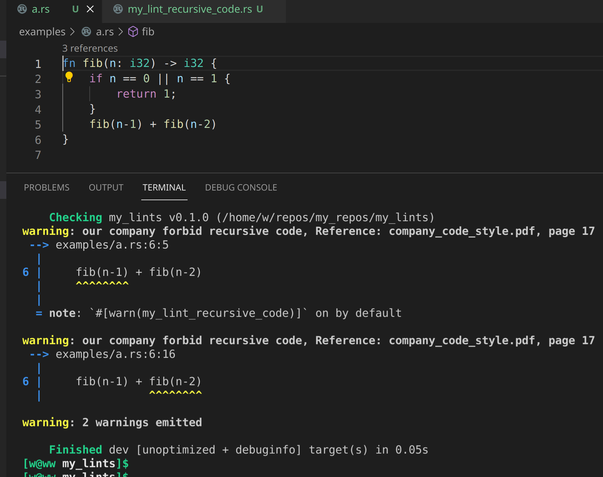

# 定制静态分析 lint 检查规则

作者: 吴翱翔@pymongo / 后期编辑： 张汉东

> 原文: [custom Rust lint](https://pymongo.github.io/#/2021/06/custom_rust_lint.md)

需求: vscode-ra 的 tfn 会生成 `fn feature` 的函数，我希望静态分析能帮我检查出来，不让 feature 函数提交到 github 上

## 静态分析的可行性

由于 Intellij-Rust 是用 kotlin 写的，好处是不依赖 rustc，坏处暂时还不能分析 rustc 源码

由于做静态分析/过程宏/编译原理相关的研究都需要深入研究编译器源码，所以我只考虑用 Rust 静态分析 Rust 代码的解决方案，不考虑 Intellij-Rust

- 过程宏: 被过程宏标记的函数可以在编译时进行AST静态分析，但是每个函数都得打上标记很不方便
- 改 rustc 源码: 例如 [non_ascii_idents lint](https://github.com/rust-lang/rust/pull/61883/files)，但 rustc 编译太慢
- cargo clippy: 改 clippy 源码后可以 `cargo install` 编译成 cargo 子命令
- cargo dylint: 可行性待考察

## lint 对公司的重大意义

例如公司团队禁止项目代码使用递归调用，因为 Rust 对非线性递归的优化有限，而且递归用的不好容易爆栈导致生产服务器 panic

但毕竟有很多用 Rust 算法实现时用到了递归，所以不可能提 PR 让 clippy 官方加入「禁止递归」的 lint

如果让公司人工 code review 有没有递归代码，不仅效率低而且不能保证 100% 准确

这时候如果把自定义的 lint 加到公司的 CI/CD 流程中，就能自动检测不符合公司 coding_style 的代码



## cargo-lint 可执行文件

为了跟 clippy 的可执行文件命名区分，我把 fork 的 clippy 代码做出以下改动:

```
diff --git a/Cargo.toml b/Cargo.toml
index 9b5d9b2ad..17e13950d 100644
--- a/Cargo.toml
+++ b/Cargo.toml
@@ -12,13 +12,15 @@ publish = false
 [[bin]]
-name = "cargo-clippy"
+name = "cargo-lint"
 
 [[bin]]
-name = "clippy-driver"
+name = "lint-driver"
 
 [dependencies]
diff --git a/src/main.rs b/src/main.rs
index 7bb80b119..3df9e40d5 100644
--- a/src/main.rs
+++ b/src/main.rs
@@ -107,7 +107,7 @@ impl ClippyCmd {
-            .with_file_name("clippy-driver");
+            .with_file_name("lint-driver");
```

首先 clippy 需要 cargo-clippy 和 clippy-driver 两个可执行文件，所以我是通过以下方式安装 cargo-lint 的:

> cargo install --bin=cargo-lint --bin=lint-driver --path=.

## 添加新的 lint

参考: [addling_lints](https://github.com/rust-lang/rust-clippy/blob/master/doc/adding_lints.md#setup)的文档

`cargo dev`是 clippy 项目的 cargo alias，可以通过 cargo dev 创建新的 lint

> cargo dev new_lint --name=my_lint_function_name_is_feature --pass=early --category=correctness

```
diff --git a/clippy_lints/src/lib.rs b/clippy_lints/src/lib.rs
index f5082468a..005f99895 100644
--- a/clippy_lints/src/lib.rs
+++ b/clippy_lints/src/lib.rs
@@ -276,6 +276,7 @@ mod mut_mutex_lock;
 mod mutex_atomic;
+mod my_lint_function_name_is_feature;
 mod needless_arbitrary_self_type;
@@ -822,6 +823,7 @@ pub fn register_plugins(store: &mut rustc_lint::LintStore, sess: &Session, conf:
         mutex_atomic::MUTEX_INTEGER,
+        my_lint_function_name_is_feature::my_lint_function_name_is_feature,
@@ -1345,6 +1347,7 @@ pub fn register_plugins(store: &mut rustc_lint::LintStore, sess: &Session, conf:
         LintId::of(mutex_atomic::MUTEX_ATOMIC),
+        LintId::of(my_lint_function_name_is_feature::my_lint_function_name_is_feature),
@@ -1702,6 +1705,7 @@ pub fn register_plugins(store: &mut rustc_lint::LintStore, sess: &Session, conf:
         LintId::of(mut_key::MUTABLE_KEY_TYPE),
+        LintId::of(my_lint_function_name_is_feature::my_lint_function_name_is_feature),
```

新增了两个文件:
1. clippy_lints/src/my_lint_function_name_is_feature.rs
2. tests/ui/my_lint_function_name_is_feature.rs

改动了一个文件: clippy_lints/src/lib.rs

但是这样会把 `CHANGELOG.md` 改掉，也把 `clippy_lints/src/lib.rs` 改掉，导致我很难合并 clippy upstream 的改动

## lint 的单元测试

我将我的 lint 命名为: my_lint_function_name_is_feature

所以单元测试的重点是只有函数名是 feature 时，才会报错，如果变量名是 feature 则不会

> TESTNAME=my_lint_function_name_is_feature cargo uitest

`cargo dev bless`会将上次运行的`cargo uitest`的错误生成为`my_lint_function_name_is_feature.stderr`文件

这时候报错: error: unknown lint: `clippy::my_lint_function_name_is_feature`

## Unknown lint

clippy 的 CONTRIBUTE.md 的 `How clippy works` 和 `Syncing changes between Clippy and rust-lang/rust`

章节提醒 clippy 跟 rustc 版本似乎是强绑定的，要等 rust 更新 clippy 子仓库后才能让新的 lint 生效?

2021-06-19 clippy 加入的 lint `nonstandard_macro_braces` 用 2021-06-16 的 rustc 就会报错 `Unknown lint`

由于用 clippy 添加新的 lint 时各种报错读了几遍文档依然没解决，所以我寻求更可行的静态分析方案

## cargo dylint

由于 Rust 自定义 lint 静态分析检查的资料很少，我搜索全网只能找到这篇文章: <https://www.trailofbits.com/post/write-rust-lints-without-forking-clippy>

幸运的是 cargo dylint 跟 clippy/rustc 新增 lint 的写法完全一样，看 rustc 的学习资料足以学习 dylint

首先需要安装 dylint 工具以及 dylint 的 linker:

> cargo install cargo-dylint dylint-link

## dylint 模板

虽然 dylint 跟 clippy 极其相似，但还是建议学习下 dylint 的示例

1. [dylint-template](https://github.com/trailofbits/dylint-template)
2. dylint 代码仓库下 examples 每个示例都可以参考下
3. 我基于 path_separator 改的模板: <https://github.com/pymongo/my_lints>

**⚠注意由于 dylint 工作原理跟 clippy 相似，所以 dylint/rustc/clippy_utils 三者的版本必须互相兼容**

修改 rustc 或 clippy 版本很可能让 dylint 编译失败或不生效，**不要轻易修改依赖版本**!

## dylint 运行方法

假设我们自定义 lint 的源码文件夹目录是 MY_LINTS_PATH

> export MY_LINTS_PATH=/home/w/repos/my_repos/my_lints

假设公司项目代码的路径是 /home/w/temp/other_rust_project

**⚠注意!: 如果发现新加的 lint 不生效，那就 cargo clean 清理下 MY_LINTS_PATH 再重新编译**

¶ 1. 在自己写 lint 的文件夹运行 dylint

> cd $MY_LINTS_PATH
> 
> cargo dylint --all -- --manifest-path=/home/w/temp/other_rust_project/Cargo.toml

¶ 2. 在项目文件夹内引入

> DYLINT_LIBRARY_PATH=$MY_LINTS_PATH/target/debug cargo dylint --all

¶ 3. 在项目 Cargo.toml 中 package.metadata.dylint

该方法我一直报错: `Warning: No libraries were found`，故放弃

## early/late lint 的概念

按照 [Overview of the Compiler - rustc-dev-guide](https://rustc-dev-guide.rust-lang.org/overview.html) 的介绍

我把 Rust 编译过程大致概括为以下流程: 

(rustc_args_and_env -rustc_driver-> rustc_interface::Config)
1. source_code_text(bytes) -rustc_lexer-> TokenStream
2. TokenStream -rustc_parse-> AST
3. AST analysis: macro_expand, name_resolution, feature_gating, checking/early_lint
4. AST convert to HIR
5. HIR analysis: type/trait checking, late_lint
6. HIR convert to MIR
7. MIR analysis: ownership/lifetime/borrow checking
8. MIR Optimizations
9. MIR convert to LLVM IR
10. LLVM backend compile LLVM IR to executable or library

所以 early_lint 能分析 AST 代码， late_lint 则是分析 HIR 代码

宏和过程宏则是输入 token_stream ，宏输出则是展开后的 token_stream (参考 [heapsize 过程宏](https://github.com/dtolnay/syn/blob/master/examples/heapsize/heapsize_derive/src/lib.rs))

## dylint 添加新的 lint

假设公司需要一个 lint，函数名字带 todo 的都要抛出警告

§ fn_name_contains_todo-step_1: 新建 lint 文件

我把这个 lint 命名为 fn_name_contains_todo，注意 lint 的命名不能跟 rustc 自带的 lint 冲突

首先复制我写的 dylint 简易模板: git clone https://github.com/pymongo/my_lints

然后在 src/ 目录下 新增一个 fn_name_contains_todo.rs 的文件

并且在 src/lib.rs 下加一行 `mod fn_name_contains_todo;` 加新文件加入到模块树中

§ fn_name_contains_todo-step_2: lint 实现

首先要在 fn_name_contains_todo.rs 中定义 lint 的结构体和常量，这步跟 clippy 创建新的 lint完全一样

```rust
rustc_session::declare_lint! {
    pub FN_NAME_CONTAINS_TODO,
    Warn,
    "fn_name_contains_todo"
}

rustc_session::declare_lint_pass!(FnNameContainsTodo => [FN_NAME_CONTAINS_TODO]);
```

由于分析变量名或函数名只需要 AST 就足够了，不需要带类型信息的 HIR，因此只用 early lint

```rust
impl rustc_lint::EarlyLintPass for FnNameContainsTodo {
    fn check_fn(
        &mut self,
        cx: &rustc_lint::EarlyContext<'_>,
        fn_kind: rustc_ast::visit::FnKind<'_>,
        span: rustc_span::Span,
        _: rustc_ast::NodeId,
    ) {
        // Ignore FnKind::Closure
        if let rustc_ast::visit::FnKind::Fn(_, ident, ..) = fn_kind {
            if ident.as_str().contains("todo") {
                clippy_utils::diagnostics::span_lint(
                    cx,
                    FN_NAME_CONTAINS_TODO,
                    span,
                    "fn name with todo is not allow to commit",
                );
            }
        }
    }
}
```

§ fn_name_contains_todo-step_3: 注册 lint

lint 的实现写完后，在 lib.rs 的 `pub fn register_lints` 内

1. lint_store.register_lints 的入参数组内追加 fn_name_contains_todo::FN_NAME_CONTAINS_TODO
2. 加入 early_pass 一行 lint_store.register_early_pass(|| Box::new(fn_name_contains_todo::FnNameContainsTodo));

第二点很好理解，如果 lint 用了 EarlyLintPass 就加 register_early_pass，用了 LateLIntPass 就加 register_late_pass

⚠注意: lint_store.register_lints 加入的是 lint 常量， 而 lint_store.register_early_pass 则是传入 lint 结构体

于是重新编译代码后，新加的 lint 就生效了

§ fn_name_contains_todo-step_4: (可选) 测试 lint

粗糙的测试方法是，我们在 src/lib.rs 中加入以下内容:

```rust
#[allow(dead_code)]
fn todo() {

}
```

然后运行 dylint 分析当前项目(也就是 lint 源码项目):

> cargo clean && cargo b && cargo dylint --all

```
    Checking my_lints v0.1.0 (/home/w/repos/my_repos/my_lints)
warning: fn name with todo is not allow to commit
  --> src/lib.rs:26:1
   |
26 | / fn todo() {
27 | |
28 | | }
   | |_^
   |
   = note: `#[warn(fn_name_contains_todo)]` on by default

warning: 1 warning emitted
```

如果觉得 lib.rs 其他代码污染了 cargo expand 或者 TokenSteam/HIR 代码的展开

例如我只想看两个函数的HIR代码，那么可以新建一个 examples/fn_name_contains_todo.rs 文件或者用 --tests 指定静态分析的文件

例如 `cargo clean && cargo b && cargo dylint --all -- --examples`

至于 ui 测试方法，建议去读 clippy 文档，本文不做演示

⚠注意!: 跑 ui 测试时不能加 RUST_LOG=info 日志级别的环境变量，否则会把日志输出导致测试比较失败

## 禁止递归代码的 lint

由于自己对 AST/HIR 解析不是很熟练，我参考了以下代码:

- rustc_lint::builtin::UNCONDITIONAL_RECURSION: 没找到实现代码(好像在MIR)
- clippy 的 main_recursion lint

仿照 main_recursion 不难写出静态分析检测递归的代码:

```rust
impl rustc_lint::LateLintPass<'_> for MyLintRecursiveCode {
    fn check_expr_post(&mut self, cx: &rustc_lint::LateContext<'_>, expr: &rustc_hir::Expr< '_>) {
        if let rustc_hir::ExprKind::Call(func_expr, _) = &expr.kind {
            // 函数调用表达式 func_expr 的前一个函数调用**栈帧**函数的 defid
            let func_expr_owner_defid = func_expr.hir_id.owner.to_def_id();
            if let rustc_hir::ExprKind::Path(rustc_hir::QPath::Resolved(_, path)) = &func_expr.kind {
                // path.res: The resolution of a path or export
                if let Some(func_expr_call_defid) = path.res.opt_def_id() {
                    if func_expr_owner_defid == func_expr_call_defid {
                        clippy_utils::diagnostics::span_lint(
                            cx,
                            MY_LINT_RECURSIVE_CODE,
                            expr.span,
                            "our company forbid recursive code, Reference: company_code_style.pdf, page 17",
                        );
                    }
                }
            }
        }
    }
}
```

遗憾的是还不能检测a调用b且b调用a这种函数循环调用导致的无限递归

在 Rust 官方的 issue 57965, 70727 中也在讨论编译期要如何检测跨函数调用导致的无限递归

## 更多的 lint 需求

### f32_cast_to_f64

公司业务上有个价格的参数需要保留两位小数，然后再从 f32 转换为 f64 进行传输，也就是 JavaScript 的 Number 类型

但是保留两位小数的 f32 转 f64 时会精度丢失: `0.1_f32 as f64 = 0.10000000149011612`

但这是浮点数 IEEE 标准的正常行为，用 C/C++ 进行 float -> double 的转换也会出现一样的问题

目前 Rust 浮点数的 lint 只有大小比较、i32 as f32 等 lint 并没有业务需要的这种精度丢失检测

所以很有必要根据自身业务定制一些浮点数的 lint ，避免前端展示的浮点数出现异常情况

---

## 结束语

得益于 强大的调试宏 dbg! 和 AST/HIR 优秀的结构体设计，像作者这样非计算机专业没学过编译原理课程的水平也能轻松定制静态分析

本文的源码仓库: <https://github.com/pymongo/my_lints> ，欢迎大家能贡献代码检查的需求或想法
