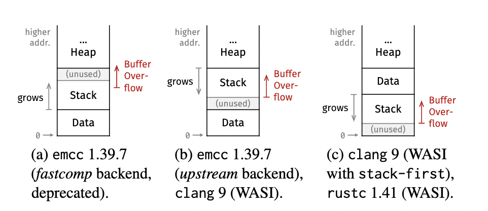
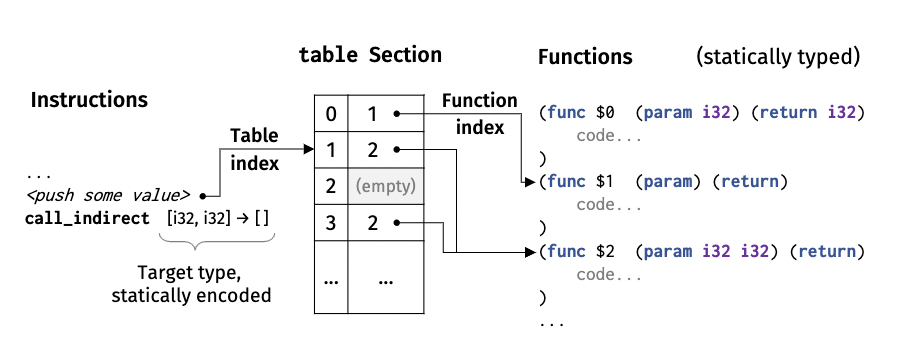
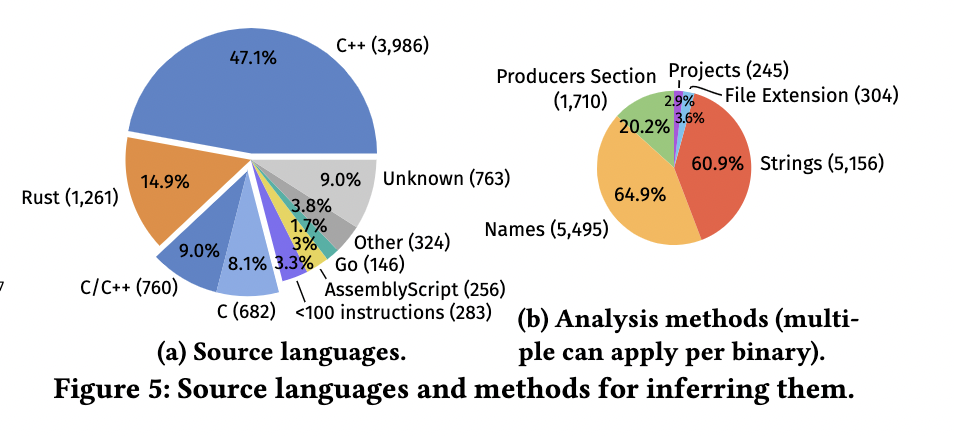
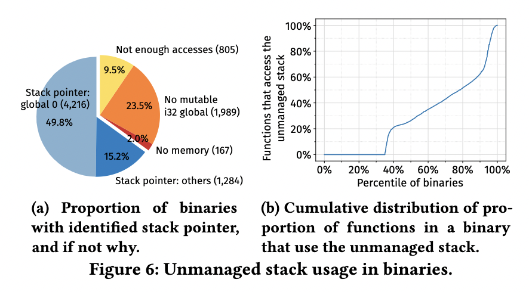

# 华为 | WebAssembly 安全性调研

作者：华为可信软件工程和开源2012实验室

---

2015年4月，W3C成立WebAssembly工作组，用于监督与规范WebAssembly提案，倡导浏览器厂商使用一致性的规范。WebAssembly 技术虽脱胎于浏览器，但截至到2021年的今天，早已经走出浏览器，大有让计算无处不在的趋势。

WebAssembly 天生具备安全、可移植、高效率，轻量化等特点，所以非常适于应用安全沙箱场景。除了浏览器领域，WebAssembly 还得到了容器、函数计算、IoT / 边缘计算等社区的广泛关注。WebAssembly 沙箱甚至可以安全地在与其他代码相同的进程中运行，这与软件故障隔离(SFI)非常相似。

本文将从 WebAssembly 的特性、安全、性能、应用领域四个方面探讨其应用价值。

## WebAssembly 特性

WebAssembly（或wasm）是一种适用于Web的可移植编译格式，提供更小的文件尺寸和更快的加载速度。WebAssembly旨在成为高级语言的编译目标。目前可以使用C、C++、Rust、Go、Java、C#编译器（还有更多）来创建wasm模块。

### WebAssembly 当前状态

截止 2021 年的今天，WebAssembly 的阶段目标还没有完全实现。从 [WebAssembly 官方 Roadmap](https://webassembly.org/roadmap/) 可以了解到当前状态。

看得出来，三大主流浏览器，以及浏览器之外的主流 wasm 运行时基本都已支持 WebAssembly的一半特性 。对于异常处理，模块链接（Module Linking），尾调用，线程，接口类型（Interface Types）等还未得到完整支持。

2021 年，模块链接和接口类型有望得到支持。

模块链接提案旨在运行时声明标准中链接两个或更多个模块，而不是靠开发人员手动编写代码将一个模块导出给另一个模块，这很耗时且容易出错。如果其中一个模块被修改，则Webassembly 引擎可以处理将它们连接在一起，也可能会优化它们。

接口类型提议将有助于在模块（guest）或主机（host）之间进行通信。 这是因为WebAssembly 模块本地支持四个数据类型（32位整数，64位整数，32位浮点和64位浮点）。 为了让不同语言编写的 WebAssembly 模块相互通信，接口类型提供某种类似接口的映射方式，可以正确映射要通信的类型，这样就可以使用更富表达力的高级类型来相同通信了。

为 WebAssembly 在 Server Side 提供 Runtime 的 wasmtime 和 wasmer ，目前基本都已经进入 GA 状态。

### WebAssembly 内存模型

WebAssembly 只提供一个沙盒化的线性内存，并不提供托管内存（堆）和 垃圾回收器。

线性内存是一个连续的、字节可寻址的内存范围，从偏移量 0 一直延伸到不同的内存大小。此大小始终是 WebAssembly 页面大小的倍数，固定为 64KiB。每个 WebAssembly 实例都有一个专门指定的默认线性内存。

线性内存有以下特点：

- 线性内存中的所有数据始终是可写的，不存在只读内存。
- 线性内存始终为零初始化。
- 线性内存每个指针都是有效的。
- 线性内存是确定性排列的，即栈位置可以从编译器和程序中预测。
- 线性内存可以请求 VM 使用 memory.growin 指令增加线性内存。

**数据管理**

- 非托管数据：指在线性内存中驻留的数据。不受 vm 保护，完全受程序内存写入指令的控制。
- 托管数据：即局部变量、全局变量、栈上的执行的值和返回地址，都驻留在由 VM 直接处理的专用存储中。WebAssembly 代码只能通过指令隐式地与托管数据进行交互，而不能直接修改其底层存储。并且托管数据没有地址。

由于WebAssembly 只有四种基本类型，所以托管数据只能保留这四种基本类型实例。而其他的诸如字符串、数组、列表等非标量（复合）类型数据都必须存储在线性内存。

因为托管数据中没有地址，所以在源程序中取过地址的任何变量也必须存储在线性内存中。

**内存布局**

因为 源代码中有很多作为函数作用域、全局或动态生命周期的数据，所以编译器会在线性内存中创建分别用于调用栈、堆（动态分配内存）和静态数据的区域。

所以分为：

- 非托管栈：编译器在线性内存上创建的调用栈。
- 托管evaluation栈：用于保存指令的中间值，由 VM 管理。
- 托管 调用栈：保存局部变量和返回地址等，由 VM 管理。

相比 elf 二进制文件，`.data`、`.rodata` 和 `.bss` 在 WebAssembly 中没有明确区分，因为 线性内存 并没有只读区域，并且始终零初始化。

不同的编译器会产生不同的内存布局。上图展示了 Emscripten 的 fastcomp backend 和 upstream backend，以及 clang 和 rustc 编译出的 Wasm 二进制文件内存布局。其中 clang和rustc 的内存布局相似：静态数据在栈和堆之间。

### 导入导出

Wasm 模块可以提供 Host 可以读取以便与 Wasm 模块链接的符号信息，包括：导出（Export）/ 导入（Import）/ 入口点（Entry Point）。

导出符号是指 Host 可以访问的 wasm 模块组件，包括：

- 函数
- 全局变量
- 内存
- 表（table）

Wasm 模块导出函数是类型安全的。函数导出信息由目标函数的函数签名组成。因此，宿主环境可以在函数调用之前验证函数参数。它消除了无效的参数传递，从而提高了整体程序的安全性。

Wasm 模块还可以导出全局变量和内存。它可以在不调用Wasm函数的情况下实现主机和Wasm模块之间的信息交换。全局变量导出也是类型安全的，但它只提供了Wasm 基本类型。

对于较大的数据，内存导出是更好的选择，因为它允许在 Wasm 模块和主机之间有效传输原始数据。然而，内存导出是无类型和非结构化的。宿主代码在通过内存导出操作数据时需要慎重考虑。

同样，导入是指从Host环境或其他模块的函数/  内存/ 表。但必须在 Host 实例化 wasm 模块之前提过所需的元素，Host 环境要确保Host 代码提供所有必须的元素，包括正确的内存分配、表分配和函数。模块实例化过程类似于编译中的链接过程，其中代码在执行之前链接到所有必需的符号。

### 控制流安全

WebAssembly 不允许跳转到任意指令点。

wasm 模块中 指令 被分组为 块（block），分为三类块：

- 常规块
- 条件块
- 循环块 

一个块以block关键字开始，以end指令结束。end指令是一个伪指令，标志着块的结束。块内不能访问块外中的操作数。程序需要通过一个局部变量填充该值，以在块内传输该值。Wasm会根据块的结果类型来验证栈状态。

Wasm有三种类型的分支：

- 无条件分支（br），总是被执行的，不考虑外部状态。
- 有条件分支（br_if），从栈中消耗一个操作数来确定是否需要进行分支。
- 表分支（br_table），需要一个整数操作数作为索引来选择目标块，分支指令对每个块类型的行为都不同。

### Wasm 表 

Wasm 表用于交换 引用信息。

Wasm 表存储对一个函数的引用，Wasm 程序可以使用该函数来执行动态或间接调用。通常，编译器会根据需要填充该表。 编译器使用函数指针检测动态函数调用是否需要表。 

另一种情况，例如使用函数指针作为返回值，也需要一个表。 编译器静态填充表并使用表索引作为指令的引用。 

目前，Wasm 不允许在 Wasm 程序中操作表。

## WebAssembly 安全性

WebAssembly 生态安全性可以从两个维度看待：

- Host 安全性 ，在运行时环境能有效保护主机系统免受恶意 WebAssembly 代码的侵害。
- Wasm二进制安全性，内置故障隔离机制防止利用其他良性 WebAssembly 代码作恶。

### Host 安全性分析

WASM虚拟机提供的的[沙箱和内存隔离机制](https://webassembly.org/docs/security/)，可以有效减少安全攻击面。而当WebAssembly走出浏览器，面向更加通用的场景。WASM也面对更加复杂的安全挑战。

WASI 提供了[基于能力的安全模型](https://en.wikipedia.org/wiki/Capability-based_security)。WASI应用遵循最小权限原则，应用只能访问其执行所需的确切资源。传统上，如果应用需要打开文件，它会带路径名字符串调用系统操作open。然后系统调用会检查应用是否具有访问该文件的相关权限，比如Linux实现了基于用户/组的权限模型。这样隐式的安全模型，依赖于正确的安全管理配置，比如一旦特权用户执行了一个恶意应用，它就可以访问系统中任意的资源。而对于WASI应用而言，如果它需要需要访问指定文件等系统资源，需要从外部显式传入加有权限的文件描述符引用，而不能访问任何其他未授权资源。这中依赖注入的方式可以避免传统安全模型的潜在风险。

WASI的安全模型与传统操作系统安全模型非常不同，而且还在持续演进中。比如字节码联盟提出了 [nanoprocess](https://hacks.mozilla.org/2019/11/announcing-the-bytecode-alliance/) 来解决应用模块间的安全协同和信任传递。

WebAssembly/WASI的安全模型依然存在不足，比如：

- 资源隔离： 
  - 对于内存资源，WebAssembly实现了线性内存模型。WebAssembly应用只能利用索引访问传入的一段逻辑线性内存。而WASM虚拟机负责确定内存的实际物理地址，WASM应用无法获知内存的真实地址，也无法通过越界访问等方式发动攻击。所以理论上，可以对WASM应用进行资源容量限制。但是目前部分WASM虚拟机还无法对内存进行精确的隔离限制。
  - 对于CPU资源，部分的WASM虚拟机实现可以对应用使用的CPU资源进行计量，但是大多无法实现精确的配额限制、优先级和抢占式调度。
  - I/O资源，比如IOPS等，WASM目前完全没有相关的隔离能力。
- 网络安全： 
  - WASI的Capability模型对于文件系统访问相对比较容易保护。但是这个静态的安全模型无法适用于动态的网络应用场景。在微服务架构中，应用经常通过Service Registry进行服务发现，为服务的调用者和提供者实现动态的调用绑定。这个语义是无法用静态的capability模型描述和注入的。这也导致了WASI的网络部分API还处于讨论之中。现有的[WASI网络安全模型](https://github.com/bytecodealliance/wasmtime/blob/master/docs/WASI-capabilities.md#berkeley-socket-rules)，以及相关[讨论](https://github.com/bytecodealliance/wasmtime/issues/70)，

### Wasm 二进制安全性分析

论文 [《Everything Old is New Again:Binary Security of WebAssembly》](https://www.usenix.org/conference/usenixsecurity20/presentation/lehmann) 专门研究了这个问题。

该论文针对 WebAssembly 当前特性，构建出了一组攻击原语。

如上图，可以通过构造上面三步攻击原语来进行攻击。

1. 获得写原语。
2. 覆盖栈上或堆上的安全相关数据。
3. 通过 控制流分发 或 操作宿主（Host ）环境来触发恶意行为。

第一步，获得写原语。因为 WebAssembly 没有本地程序常见的 Fortify_source （用来编译时缓冲区检查）和 stack canary（栈溢出保护）安全机制，所以在 非托管栈上更容易受到利用。

有三种手段可以获得写原语：

1. 栈缓冲区溢出。因为线性内存是非 VM 托管的，所以缓冲区溢出可能覆盖其他函数调用里的局部变量。
2. 栈溢出。假如给函数传一个能引起无限递归的特定数据可以引发栈溢出。栈溢出在 WebAssembly 并不会发生段错误，而是会覆盖栈区之外的敏感数据，比如 堆上的数据。
3. 破坏堆元数据。通过内存分配器的缺陷，破坏 WebAssembly 二进制文件附带的内存分配器的堆上元数据。

并非只有这三种方法可以获得写原语，还有一些其他传统的攻击方法可以用来利用，比如格式化字符串、UAF(use after free)等。

第二步，在获得写原语之后，就可以覆盖安全数据了。

能被覆盖的数据包括：

- 线性内存中非托管栈包含的函数范围内的数据，比如函数表索引的函数指针或安全关键函数的参数。虽然缓冲溢出无法控制函数的执行路径，但是有能力可以覆盖掉当前溢出能到达的所有活动的调用栈帧。
- 堆数据。堆通常包含具有更长生命周期的数据，并将存储跨不同功能的复杂数据结构。并且由编译器在线性内存上分配的堆区域没有任何保护机制，缓冲区溢出或栈溢出可能会破坏堆数据。
- 常量数据。任意写入原语可以更改程序中任何非标量常量的值，包括例如所有字符串文字。从而破坏编程语言所预期的保证。

甚至有的 wasm 运行时的实现还无法正确分离栈和堆，更加重了安全风险。

第三步，触发恶意行为。

- 重定向间接调用。攻击者可以通过覆盖线性内存中的整数来重定向间接调用。这个整数值可能是非托管堆栈上的局部变量、堆对象的一部分、vtable 中，甚至是一个所谓的常量值。受限于 WebAssembly 间接调用的机制，攻击者只能在相同类型的函数的等价类内重定向调用。
- 代码注入宿主环境。例如，假设 WebAssembly 通常使用存储在线性内存中的“常量”代码字符串调用 eval，然后攻击者可以用恶意代码覆盖该常量。
- 特定于应用程序的数据覆盖取决于应用程序，可能会有其他敏感的数据覆盖目标。例如，一个 WebAssembly 模块通过一个导入的函数发出 Web 请求，可以通过覆盖目标字符串来联系不同的Host，以启动 cookie 窃取。

总的来说，这些都是基于 WebAssembly 线性内存的天生的特性而构造的攻击方式。并且经过实验证明是可行的。

所以，应该使用安全的编程语言，比如 Rust ，来编写 WebAssembly 模块会更加安全。另外还需要独立的 wasm 模块验证装置，以确保每个 wasm 模块是符合规范的。

### 利用 CPU 漏洞可绕过 WASM 沙箱隔离

论文 [《Swivel: Hardening WebAssembly against Spectre》](https://cseweb.ucsd.edu/~dstefan/pubs/narayan:2021:swivel.pdf)中介绍了 利用 CPU 漏洞幽灵攻击（spectre attacks ），可以绕过 WASM 沙箱隔离。

幽灵攻击利用CPU 分支预测器来诱导错误预测，从而导致错误执行指令。 有三种攻击分类：

- 利用模式历史表（PHT）攻击。攻击者 污染 PHT 中的条目，从而将分支错误预测到错误的路径。 然后攻击者可以使用这种错误路径执行来绕过内存隔离保护或控制流完整性。
- 利用分支目标缓冲区（BTB）攻击。攻击者污染 BTB 中的条目，将推测控制流重定向到任意目标。
- 利用返回堆栈缓冲区（RSB）攻击。攻击者使用调用或保留指令链使 RSB 上溢或下溢，并依次重定向推测控制流。

可以在 FaaS 平台上传任意恶意 wasm 模块，利用 幽灵漏洞 来绕过 wasm 沙箱隔离。

攻击类型也可以分为三种：

1. 沙箱突围攻击：攻击者定制模块内的控制流，以达到访问沙箱区域外的数据。比如，可以在访问间接调用表时使用 Spectre-PHT 绕过条件边界检查。 或者，他们可以使用 Spectre-BTB 将控制流转移到指令中间以执行不安全的代码。
2. 沙箱投毒攻击：攻击者通过影响受害者沙箱的控制流，强迫受害者泄露私有数据。
3. 主机投毒攻击：攻击者通过幽灵攻击影响主机的控制流，以便从主机或其他任意沙箱访问数据。

为了防范幽灵攻击，论文中提出一种解决方案：构建线性块（linear block）。

通过自己实现的 Swivel-SFI的工具，将 wasm 代码编译为了 线性块。线性块是直线代码块，除了它们的终止符之外不包含任何控制流指令。与传统的基本块（Basic Block）形成对比，后者通常不将函数调用视为终止符。这个简单的区别很重要：它允许我们确保所有控制流传输 (顺序和推测) 落在线性块边界上。 然后，通过确保单个线性块是安全的，就可以确保整个 Wasm 程序在编译时受到限制并且不会违反 Wasm 的隔离保证。

所以，如果想利用 WebAssembly 的 SFI 机制，还必须防范类似于 幽灵攻击之类的恶意攻击。

## WebAssembly 沙箱性能

**wasm 执行性能**

关于 Wasm 执行的性能，在 论文  [《Swivel: Hardening WebAssembly against Spectre》](https://cseweb.ucsd.edu/~dstefan/pubs/narayan:2021:swivel.pdf) 中也有一些统计。Swivel-SFI工具执行 wasm 模块中函数调用性能基本是 5微秒左右。

另外在 2021 第一季度也有人测试过目前主流 wasm 运行时的性能：[Benchmark of WebAssembly runtimes - 2021 Q1](https://00f.net/2021/02/22/webassembly-runtimes-benchmarks/)

和本地代码执行性能相比，还是要差一个数量级。

**沙箱和主机上下文切换性能**

使用 WebAssembly 的沙箱机制，有一部分开销部分主要是存在于 主机（Host） 和 沙箱（Sandbox） 的上下文切换中。

如果在沙箱和主机切换中再加一些确保安全的指令，性能损耗就更多。

拿 lucet 来说，它的上下文切换成不就比较高，因为它要确保安全。上下文切换成本包括：

- Callee-Save寄存器完整性。
- 初始寄存器机密性。
- 栈帧封装。

论文 [《Isolation Without Taxation: Near Zero Cost Transitions for SFI》](https://arxiv.org/abs/2105.00033) 提供了一种接近零成本切换的WebAssembly SFI 的方案，并且基于 lucet 实现了该方案，修改后将 Firefox 中的字体和图像渲染速度提高了 29.7% 和 10%。因为 Firefox 的渲染组件使用了 WebAssembly SFI 功能，该 SFI 基于 lucet 实现，下文会有介绍。 

关于零成本切换的更多细节可以查看该论文。

## WebAssembly 与 SFI

### Firefox 中的应用

Firefox 中使用 RLBox 沙盒，在 论文 [《Retrofitting Fine Grain Isolation in the Firefox Renderer》](https://www.usenix.org/system/files/sec20-narayan.pdf) 中有详细介绍。

RLBox 采用了直接在 C++ 类型系统中表达的静态信息流强制和轻量级动态检查。RLBox 通过基于软件的故障隔离（software-based-fault isolation）或多核进程隔离（multi-core process isolation）来支持有效的沙箱。性能开销适中且短暂，并且只有很小对页面延迟的影响。RLBox 使用 WebAssembly 沙盒，已集成到生产 Firefox 中。

RLBox 通过其类型系统和 API 使渲染器沙盒接口处的数据和控制流显式化，以便调解这些流并跨信任边界强制执行安全检查，确保在任何潜在的不安全使用之前验证沙箱数据。另一方面，API 设计用于限制渲染器和沙箱之间的控制传递。例如，渲染器必须使用`andbox_invoke()` 来调用沙箱中的函数； 沙箱对渲染器的任何回调必须首先由渲染器使用`sandbox_callback(callback_fn)`API 注册。

RLBox 通过提供一个 `tainted<T>`数据类型，来包装来自沙箱的任何数据，以此保障控制流和数据流安全：

1. 自动化安全检查：Swizzling 操作、执行检查以确保沙箱提供的指针指向沙箱内存，以及识别 tainted 数据的位置，都是自动完成的。
2. 仅在必要时才执行 tainted 数据验证。
3. 有效地共享数据结构：静态检查确保共享数据在沙盒内存中分配并通过 tainted 类型访问。

另外，RLBox 通过编译时错误强制应用程序开发人员使用`sandbox_callback() `函数显式注册回调，因为在沙盒中允许回调任意函数是不安全的。

更多详细内容请查看该论文。

## 小结

因为 WebAssembly 的特性，和当前存在的安全风险，以及社区中的实践和验证，证明当前基于 WebAssemby 的 SFI 机制是可行的，但是还是有风险的。

并不能单纯依赖 WebAssembly 的沙盒机制来提供 SFI 机制，还需要从 加强 wasm 模块合法性验证、wasm 运行时安全机制、自定义 SFI 实现、减少性能损耗等等各种机制来进一步提供保证才可以。

## 附录： WebAssembly 应用统计

论文 [《An Empirical Study of Real-World WebAssembly Binaries》](https://software-lab.org/publications/www2021.pdf) 从当前 WebAssembly 生态中抽取五万多个 wasm 二进制文件，从使用源语言、使用不安全语言传播的漏洞、是否还有wasm在浏览器中挖矿、WebAssembly 应用领域 这四个角度进行了一份统计。

#### 编写 WebAssembly 的语言占比

虽然 Cpp 是最先支持 WebAssembly 的语言，但是 Rust 后来居上，成为第二个使用最多的 WebAssembly 源语言。

#### 使用不安全语言传播的漏洞

上图展示了，几乎 三分之二的 wasm 二进制文件使用 非托管栈（线性内存上）。图右 显示了二进制文件中有多少函数至少访问堆栈指针一次。所有二进制文件的 35% 中没有函数使用栈指针。已经有 33% 的函数使用栈指针，而在某些二进制文件中，几乎每个函数都使用非托管堆栈。

结合前文中对 wasm 安全的分析，其实已经得到结论了:  WebAssembly 并不会让不安全的语言变得安全。

#### 是否还有wasm在浏览器中挖矿

经过分析，目前在浏览器中利用 wasm 挖矿的应用下降了 99%。可能都去研究如何利用  wasm 漏洞去了。

#### WebAssembly 应用领域

从五万个 wasm 二进制文件中，随机抽取 100 个样本，对 wasm 应用领域做了一份统计。

但我认为这个统计有点偏颇。目前 WebAssembly 最大的应用潜力在于 云计算/边缘计算/分布式计算/ VR领域，但这个统计并没有凸显这点。

目前围绕 WebAssembly 云计算/边缘计算/分布式计算/ VR 涌现出了一些非常优秀的项目。

- [wasmcloud](wasmcloud.com)，利用 wasm 构建的分布式/微服务平台，并创造了 waPC 协议来安全方便地进行 guest 和 host 的通信。
- [wagi](https://github.com/deislabs/wagi)，利用 WebAssembly 构建 WebAssembly Gateway Interface 。
- [makepad](https://github.com/makepad/makepad)， cloud9 IDE 作者创建的项目，它利用 wasm和webgl 技术为开发者提供一个 VR 开发平台。

