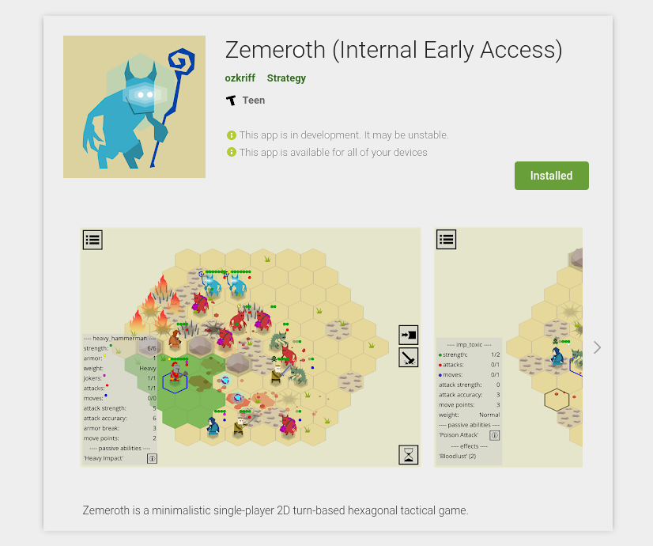
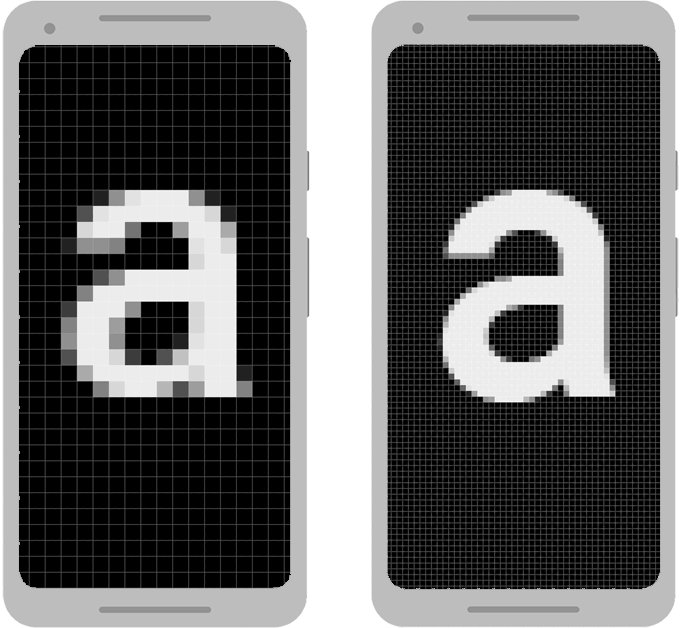
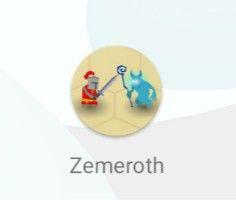

# 使用Macroquad在Android设备上发布游戏
 

**译者注：** macroquad是一个简单易用的Rust游戏库。macroquad尝试避免任何Rust特定概念比如生命周期/借用，这使得它对初学者非常友好。

详见https://docs.rs/macroquad/0.3.7/macroquad/index.html

# 1. 简介

这篇教程基于在Google Play商店发布的 [Zemeroth](https://github.com/ozkriff/zemeroth)游戏开发发布过程。目前这款游戏已经公开测试，点击[这里](https://play.google.com/store/apps/details?id=rust.zemeroth)可以试玩！

本篇主题包括：

- 构建一个适用于android设备的macroquad游戏
- 常见问题和调试技巧
- 构建并上传APK包到Google Play商店

# 2.搭建开发环境

## 使用docker配置环境并构建APK包

在已经拉取所有NDK（Native Development Kit原生开发工具包）依赖的docker宿主机上构建开发环境非常简单，

```shell
docker pull not-fl3/cargo-apk
```

推荐大家使用docker来构建适用于android设备的macroquad游戏。

### 基于docker构建APK包

只需一条命令即可完成构建APK包

```shell
docker run 
  --rm 
  -v $(pwd):/root/src 
  -w /root/src 
  notfl3/cargo-apk cargo quad-apk build --release
```

上面的命令会生成APK包到 `target/android-artifacts/release/apk`。

这一步骤可能会耗费较长时间，因为每次docker调用都会完整构建三个android目标文件。

docker命令中加入`-v /tmp/registry\":/usr/local/cargo/registry\"`会使得构建过程稍微快一些。这样做会使docker将宿主机的 `/tmp/registry`目录作为缓存目录注册到cargo，然后docker就无需在每次构建时都重新下载依赖。

另一种方法：运行docker交互模式，在同一个容器中完成多次构建。

```
docker run 
  --rm 
  -v $(pwd):/root/src 
  -w /root/src 
  -it notfl3/cargo-apk /bin/bash
```

最后，在docker的shell中运行`cargo quad-apk build --release`。

## 手工配置环境并构建APK包

docker简化了安装android-sdk和android-ndk的过程。不过，有些时候使用原生构建流程可能会更方便。这里我们不太不推荐这样的构建方式，不过我们可以通过这个构建流程来阐述容器中是如何完成这个过程的。

### 环境配置

命令及路径写法取决于宿主机操作系统，我们这里使用的linux，其他操作系统下也是相同思路。

- 安装JRE或者JDK

  这一步骤不同的操作系统差别会很大，这里以ubuntu为例：

  ```
  sudo apt-get install openjdk-8-jdk
  ```

- 安装Rust android

  利用rustup安装android相关库：

  ```
  rustup target add armv7-linux-androideabi
  rustup target add aarch64-linux-android
  rustup target add i686-linux-android
  rustup target add x86_64-linux-android
  ```

- 安装Android SDK

  ```
  # 创建目录存放所有前置安装内容
  mkdir /this/may/be/any/path/android
  
  cd android
  wget -q https://dl.google.com/android/repository/sdk-tools-linux-4333796.zip
  unzip -q sdk-tools-linux-4333796.zip
  rm sdk-tools-linux-4333796.zip
  tools/bind/sdkmanager "platform-tools"
  tools/bin/sdkmanager "platforms;android-29"
  tools/bin/sdkmanager "build-tools;29.0.0"
  tools/bin/sdkmanager --update
  ```

- 安装Android NDK

  ```
  # 到前一步android-sdk的目录
  cd /path/from/previous/step/android
  
  wget -q http://dl.google.com/android/repository/android-ndk-r20-linux-x86_64.zip
  unzip -q android-ndk-r20-linux-x86_64.zip
  rm android-ndk-r20-linux-x86_64.zip
  ```

- 安装Cargo APK

  安装`cargo-quad-apk`cargo扩展。

  ```
  cargo install cargo-quad-apk
  ```

### 手工构建APK包

```
export ANDROID_HOME=/path/from/previous/step/android
export NDK_HOME=/path/from/previous/step/android/android-ndk-r20

# 构建debug版本
cargo quad-apk build
# 构建release版本
cargo quad-apk build --release
```

构建完成的apk文件在 `target/android-artifacts/debug/apk` 或 `target/android-artifacts/release/apk`下。

# 3. 调试android游戏

## 资源目录

假设目录结构如下：

```
.
├── assets
├── └── nice_texture.png
├── src
├── └── main.rs
└── Cargo.toml
```

加入如下内容到你的Cargo.toml以引入资源目录到APK：

```ini
[package.metadata.android]
assets = "assets/"
```

之后通过`load_texture("nice_texture.png")`来加载纹理贴图。

不过，在PC中通常使用`load_texture("assets/nice_texture.png")`，需包含assets到路径中。

为修复这个问题使得android和PC中使用的路径统一，我们需要借助 [set_pc_assets_folder](https://docs.rs/macroquad/0.3.6/macroquad/file/fn.set_pc_assets_folder.html)来解决。

```
macroquad::file::set_pc_assets_folder("assets");
```

这样我们就可以在不同的平台使用统一的`load_texture("nice_texture.png")`来加载纹理贴图了。

## 高DPI适配

 

*[图片来源](https://developer.android.com/training/multiscreen/screendensities)*

不同android设备具有明显的像素密度差异。默认情况下，android操作系统会尝试用高像素密度来模拟低像素密度显示效果。

这意味着`screen_width()/screen_height()`得到的值低于实际的屏幕像素分辨率，不过之后android操作系统会自动缩放viewport来适配设备屏幕。

这样也许没问题，因为更小的viewport能够获得更高的FPS，如果我们不想让android操作系统自动缩放的话，我们需要告知android操作系统以支持高DPI屏幕。

```rust
fn window_conf() -> window::Conf {
    window::Conf {
        window_title: "Zemeroth".to_owned(),
        high_dpi: true,
        ..Default::default()
    }
}

#[macroquad::main(window_conf)]
async fn main() {
}
```

## 屏幕方向

默认情况下，Macroquad游戏是全屏幕的并且允许任何屏幕方向，我们可以在Cargo.toml文件中加入以下内容来限制支持的屏幕方向：

```ini
[package.metadata.android.activity_attributes]
"android:screenOrientation" = "userLandscape"
```

## 图标




应用图标在APK内被视为一种特殊资源，我们将res目录加入APK：

```ini
[package.metadata.android]
res = "android_res"
icon = "@mipmap/ic_launcher"
```

不同DPI的图标目录类似下面这样：

```
android_res/
├── mipmap-hdpi
│   └── ic_launcher.png
├── mipmap-mdpi
│   └── ic_launcher.png
├── mipmap-xhdpi
│   └── ic_launcher.png
├── mipmap-xxhdpi
│   └── ic_launcher.png
└── mipmap-xxxhdpi
    └── ic_launcher.png
```

不同尺寸的图标需要手工生成。[这里](http://romannurik.github.io/AndroidAssetStudio/icons-launcher.html)提供了一种较为好用的方法。

## 日志调试

macroquad的所有`warn!`/`info!`/`debug!` 消息都会合并到android系统消息。我们可以通过 `adb logcat` 命令来访问，下面是几种过滤 `adb logcat` 的方法。

### 通过tag来过滤 `adb logcat` 

tag过滤针对的是macroquad产生的 `warn!`/`info!`/`debug!`消息。

```
adb logcat -v brief SAPP:V "*:S"
```

`-v brief` 会通过隐藏一些log元数据来优化显示结果；

之后的参数是过滤器参数；

SAPP:V - V(verbose)过滤器会应用到tag为SAPP的消息，这些消息都将被输出。*:S - S(silent)过滤器会应用到所有其他tag，这些消息都将被过滤掉。

### 通过PID过滤

一些应用在运行时会产生额外的系统消息，可能是系统警告或者未处理的原生库异常。但是这些消息在应用tag过滤时都将被过滤掉。

PID是进程ID，使用PID过滤可以获得包括任何tag在内的所有应用输出消息。

```
# Find out PID
> adb shell pidof -s rust.CRATENAME
30243
# Get all the messages from a given PID
>adb shell pidof -s 30243
```

以上的命令可以通过命令参数的形式简写如下：

```
adb logcat --pid=$(adb shell pidof -s rust.CRATENAME)
```

# 4. APK签名

默认情况下，`cargo quad-apk`生成调试kestore文件并使用调试key来签名APK。这样的APK包可以在本地安装测试，但是不能上传至Google Play应用商店。

Google Play应用商店要求非调试kestore文件，这个文件将被上传到Play Console来验证开发者身份。

我们需要用`keytool` 来生成key，`keytool` 包含在`openjdk`中。然后使用 `apksigner`给APK签名， `apksigner`内置在Android SDK中。

```
keytool -v -genkey -keystore mygame.keystore -alias mygame -keyalg RSA -validity 10000
```

现在所有的前置环节都已完成，这一步生成的key可以用于构建release包。

首先，我们使用参数通知`cargo-apk`停止使用调试keystore文件来签名APK，

`cargo quad-apk build --release --nosign`

然后再使用非调试keystore文件来签名APK。

```
apksigner sign --ks mygame.keystore my-app.apk --ks-key-alias alias_name
```

最后使用下面的命令进行验证：

```
apksigner verify my-app.apk
```

[点此查看APK签名官方文档](https://developer.android.com/studio/publish/app-signing.html#signing-manually)

## 提示：如何在docker中获取`keytool`/`apksigner`

假设android keystore文件在~/.android目录，并且待签名的.apk文件在当前工作目录：

```
docker run --rm 
    -v (pwd):/root/src  
    -v(/home/USER/.android):/root/.android_secrets 
    -w /root/src -it notfl3/cargo-apk /bin/bash
```

这条命令会启动docker容器，并挂载当前工作目录到容器中`/root/src` ，挂载.android到容器中`/root/.android_secrets` ，然后在容器中使用下面的命令来签名APK：

```
apksigner sign --ks my.keystore my-app.apk --ks-key-alias alias_name
```

## Android目标设备

默认情况下，`cargo quad-apk` 会构建适用于三个不同平台的APK包。为满足Google Play应用商店要求，我们需要添加所有平台如下：

```ini
[package.metadata.android]
..
build_targets = [ "armv7-linux-androideabi", "aarch64-linux-android", "i686-linux-android", "x86_64-linux-android" ]
```

在调试期间为加快构建过程我们可以选择我们的测试设备在用的其中任一个平台。

```ini
[package.metadata.android]
..
build_targets = [ "armv7-linux-androideabi" ]
```

## Google Play版本管理

Google Play应用商店对上传的APK包有它自己的版本管理机制，每个APK都必须有独一无二的`version_code`。否则google开发者控制台会报错：`Version code 1 has already been used. Try another version code.`

在Cargo.toml中设置app版本号`version_code`：

```ini
[package.metadata.android]
..
version_code = 2
version_name = "Version Name"
```

[点此查看APK版本管理官方文档](https://developer.android.com/studio/publish/versioning)

## 商店APP预览页面

为了提交游戏到Google Play应用商店用于审核及开放测试、正式发布，我们需要上传用于APP展示页面的游戏截图、描述信息等内容。APP上传过程中很多数据都被标记为必填（*），这里我们至少需要上传下面几种游戏图像：

- 512x512 图标
- 1024x500 banner图
- 两个16:9截图

[关于预览页面的其他信息](https://developer.android.com/studio/publish/versioning)

## 内部测试、开放测试和正式发布

**内部测试、封闭测试和开放测试区别是什么？你可以在发布正式产品之前发布各种测试版本用于测试验证。**

**内部测试：**创建内部测试版本以快速分发至最多100测试用户，进行早期质量保证测试。

不需要搭建商店页面也不需要应用审核。用于帮助开发者确保签名过程有效、应用成功上传至商店。也允许通过邮件方式添加测试用户。

**封闭测试：**分发预发布版本至更大范围的测试用户用于收集更多反馈意见。

接近于开放测试，但是要求添加测试用户邮箱。

**开放测试：**创建开放测试版本可以将你的APP展示到Google Play应用商店进行大规模测试。这种情况下，任何人都可以加入你的测试并提交自己的反馈意见。

接近于正式发布状态，商店页面公开可用，测试用户无需其他额外步骤即可安装使用。

[关于测试发布流程的其他信息](https://support.google.com/googleplay/android-developer/answer/9845334?hl=en)

