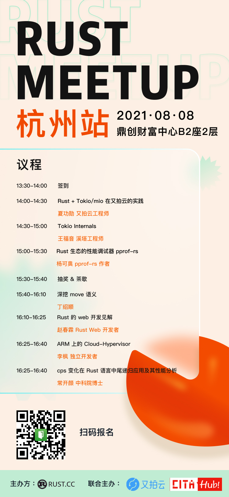

# 活动回顾

后期编辑：张汉东

> 编者按：
>
> 总结了本月的活动，包括线上和线下。
>
> 线上： 《Rust 唠嗑室》和 《RustFriday 飞书群线上沙龙》

---

# 活动预告：

## 2021.08.08 杭州线下 Meetup

## 公开课：认识面向基础架构语言Rust

Rust究竟是一门怎样的语言? 为什么连续五年夺得”最受程序员喜爱的编程语言”称号。我们有幸邀请到Rust中文社区的苏林老师分享一下:

课程主题：《认识面向基础架构语言Rust》

课程时间： 2021年8月1日 20:30-21:30

课程内容：

- Rust语言设计思想
- Rust语言现状和未来
- 通过一个hello word理解Rust语言如何执行

[https://mp.weixin.qq.com/s/z-L33EyR7qac8KUlSxUFlA](https://mp.weixin.qq.com/s/z-L33EyR7qac8KUlSxUFlA)

---

# 【线上】Rust 唠嗑室本月汇总

- 来源：[Rust 唠嗑室](https://space.bilibili.com/25566598/video)
- 主持人：MikeTang
- 后期编辑：高宪凤

### 《Rust 唠嗑室》第28期 - 对Rust标准库的扩展实现技术分享

**时间**: 2021/07/06 20:30-21:30

**主讲人**：Arch

**题目**：hzqd 的小工具箱

**内容**： Kotlin 标准库的 Rust 实现，和其他一些小玩意儿。对Rust标准库的扩展实现技术分享。

参考资料：

1. https://crates.io/crates/tap
2. https://github.com/hzqd/aoko
3. https://github.com/tokio-rs/bytes

[查看回放](https://www.bilibili.com/video/BV1Sw411R7s6)

---

### 《Rust 唠嗑室》第29期 - rust no_std的库开发经验分享

**时间**: 2021/07/20 20:30-21:30

**主讲人**：DaviRain

**题目**：rust no_std的库开发经验分享

**内容**：

- 首先简单介绍std和no_std的区别
- 然后介绍使用no_std库方式， 由于支持no_std的特性有两种不同的方式，因此使用no_std库也有两种方式。
  - 如何验证一个库是否支持no_std特性的验证方式
  - 如何改写一个std库为支持std和no_std的特性的方法。

- 其它：
  - 具体的如何写一个支持std和no_std的库。
  - 一些在std和no_std下都可以使用的primitive的仓库和相关的资源和文章。

参考资料：

1. https://github.com/DaviRain-Su/rust-no-std-source
2. https://github.com/confio/ics23

[查看回放](https://www.bilibili.com/video/BV11o4y1D7RZ)

---

 🔥🔥🔥🔥 <strong>RustFriday 飞书群线上沙龙</strong> 🔥🔥🔥🔥 

# 【线上】RustFriday 飞书群线上沙龙

每周五晚八点，限定两个主题：语言特性和开源项目，在线讨论。

Rust 中文社群 飞书群 邀请你加入：

对话群： [https://applink.feishu.cn/TeLAcbDR](https://applink.feishu.cn/TeLAcbDR)

话题群：[https://applink.feishu.cn/TeLD868w](https://applink.feishu.cn/TeLD868w)

视频来源：[https://space.bilibili.com/24917186](https://space.bilibili.com/24917186)

## 第十三期 讨论主题：如何在面试中考察一个人 Rust 水平？

1. 如何面试/或准备应聘一场 Rust 面试。
2. 实际面试经验分享 （@ huangjj ）
3. vscode + ra 使用小技巧分享 。

[查看回放](https://www.bilibili.com/video/BV1ZV411p7Y3)

## 第十四期： 

分享者：吴翱翔

【讨论主题】

1. Rust 消息队列实现多房间号的聊天室应用(视频长度 26 分钟)
2. Rust 运行时动态加载配置文件和软中断(视频长度 17 分钟)

【回放】

- [视频一](https://www.bilibili.com/video/BV1w64y1t7PQ/)
- [视频二](https://www.bilibili.com/video/BV1Jw41197Rd/)

## 第十五期 讨论主题：了解 rust-analyzer 原理 Part 1

1. 这系列视频是 ra 作者为贡献者或潜在贡献者录制的
2. 第一集展示了 ra 源码仓库的代码组织结构，从项目文档开始，逐步介绍了 cargo xtask 的使用，虽然采用扁平的 crate 结构，但也分主要的几个入口库 （ide/ hir 等），还看到了处理过程宏和声明宏相关的crate，还有 vfs（虚拟文件系统）等。
3. 还展示了一些可能的贡献点：
  - bench 测试目录下有一个很大的 8500 行 代码的文件，需要分隔成多个小文件
  -  指定了 code style，然后接下来会根据code style 进行代码重构
  -  对标准库扩展的库中，可能需要添加一些文档
  -  帮忙增加 fuzz 测试等等。

参考资料：

1. https://github.com/rust-analyzer/rust-analyzer

[查看回放](https://www.bilibili.com/video/BV1wg411772D)

## 第十六期 讨论主题：了解 rust-analyzer 原理 Part 2

【主题】 

1.  Rust 1.54 特性 
2.  学习 LSP-language-server-protocol规范 ，然后跟随 rust-analyzer 作者学习 rust-analyzer 原理 （part 2）

【总结】

1. Rust 1.54 更新的特性并不是很多，值得注意的是，增量编译功能又重新默认开启了。并且在 ErrorKind 中 多了一个 OutOfMemory 类型。 
2. RustAnalyzer 学习心得：
  - ra 为什么需要虚拟文件系统？ 主要有三点原因：
    - 为了重复使用文件，以及优化内存。所以不可能使用  std::fs::read_to_string 这样的方式去读取文件。有虚拟文件系统就方便多了。
    - 需要兼容多平台文件系统和路径。比如 windows 路径和linux路径有很大差异，需要统一抽象。
    - 需要平台无关的 绝对路径和相对路径的 控制转换。 
  - ra 的虚拟文件系统（vfs）只是一种快照系统，它只需要获取文件什么时候修改，哪里修改即可，不需要知道具体修改什么内容。类似于 git。
  - 代码架构比较常规，比如通过对象安全的 Hander trait  来提供统一接口，用于监控文件。也针对 每个 crate 提供一个对应的 FileSet 来管理文件，就好像是 文件系统分区的概念。
  - vfs 是 ra 数据流动的基础。 如果你对 实现一个简易且健壮的文件系统比较感兴趣，可以看看 vfs 的实现。
  - ra 作者强烈推荐了这个库 ： https://crates.io/crates/fst 。

【回放】

[https://www.bilibili.com/video/BV1jL411n7e3/](https://www.bilibili.com/video/BV1jL411n7e3/)

---

 🔥🔥🔥🔥 <strong>北京-Rust区块链开发者活动现场实录-20210619</strong> 🔥🔥🔥🔥 

视频集地址：[https://www.bilibili.com/video/BV1Jh411h7pp](https://www.bilibili.com/video/BV1Jh411h7pp)

# Rust异步编程原理及其在Starcoin中实践
**演讲者**：方圆

参考资料：
1. https://starcoin.org
2. https://github.com/starcoinorg

# Web3.0时代背景下Rust的机遇
**演讲者**：Mike

Web3.0时代背景下，Rust的机遇

WebAssembly
- Serverless 边缘计算
- 链上代码
- 浏览器中运行UI

Web3.0 框架

参考资料：
1. https://rustcc.cn/article?id=289da7be-19ce-49fe-af6d-3a7946404ca6
2. https://www.chainnews.com/articles/601126700329.htm

# 谈谈CKB的同步优化
**演讲者**：罗超

CKB上线前4个月遇到重大问题优化思路和优化方案。

# 用 Rust 语言开发可扩展和隐私保护服务
**演讲者**：Jamie

# 用Rust写EVM.Ewasm合约
**演讲者**：Antonio

参考资料：
1. https://github.com/WasmEdge/WasmEdge

# Rust 与零知识证明
**演讲者**：张烨

参考资料：
1. https://github.com/veorq/cryptocoding

# Rust 在Substrate开发框架中的使用
**演讲者**：王大锤

# 圆桌1-Rust编程语言应用前景

Rust 独特的地方：
1. 内存管理机制，在编译进做代码检查；
2. 所有权和生命周期机制，保证内存安全；
3. 后云计算时代会使用WebAssembly，WebAssembly与Rust紧密相关；
4. Rust是最适合区块链开发的语言；
......

# 圆桌2-Rust区块链开发实践漫谈
问题1：如何与Rust结缘？
- 因工作结缘
- 因解决实际问题结缘

问题2：开发者放弃Rust语言的原因是什么？新手如何克服困难？
- 计算机基础知识欠缺
- 习惯于高级语言，不习惯底层算法与逻辑，不愿意改变

问题3：Rust安全性是如何实现的？
- 所有权机制，没有空指针

问题4：项目由C++转向Rust，项目在迁移过程中有什么需要注意的？
- Rust 基于社区语言，参与度很强，通过交流不断学习
- 对Rust有全局认识，减少学习成本
