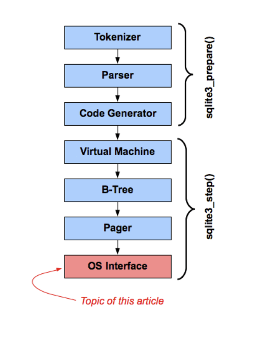
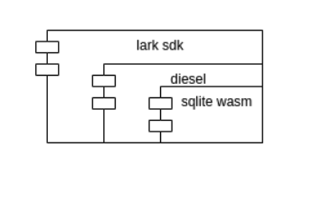

# 字节跳动 ｜ 飞书 Rust 实践 之 SQLite 适配 WASM

作者：木色 / 后期编辑：张汉东

---

> 飞书在做WASM的适配，分享下关系型数据库SQLite适配WASM的历程。

SQLite是一个跨平台的关系型数据库，广泛使用于客户端开发，飞书也使用SQLite作为数据持久化存储；同时为了方便上层使用，采用了diesel作为orm与SQLite进行交互，整体使用方式为：

```js
rust code -> diesel orm -> sqlite ffi
```
调用情况如图：


为了将SQLite移植到WEB上，我们需要做两部分内容：

1.  将sqlite编译到wasm平台
1.  封装wasm平台的跨模块调用接口给diesel使用

考虑到WEB上持久化存储机制的脆弱，以及业务形态考量，在WEB上并不需要做持久化，暂时只做一个**内存中的关系型数据库**；确定好这几个特点要求，我们SQLite的WASM移植之路开始了，Let's Go!

# WASM的工作模式
目前WASM实际有三种工作模式：Emscripten模式、WASI模式和无任何依赖的纯粹模式，在Rust语言中，分别对应`wasm32-unknown-emscripten`、`wasm32-wasi`、`wasm32-unknown-unknown`三种编译目标；前两种模式的wasm产物分别需要宿主提供posix接口和wasi接口功能，最后一种模式完全没有外部依赖

对于这三种模式，对C/C++代码的友好度：`Emscripten>Wasi>>Unknown`

rust社区的生态基本是围绕着`wasm32-unknown-unknown`和`wasm32-wasi`构建的，如wasm-bindgen工具等；不过考虑到unknown环境对外部依赖少，所以sdk中的rust代码我们就先确定了，优先使用`wasm32-unknown-unknown`模式，`wasm32-wasi`模式次之。而对于sqlite部分，我们则将三种wasm工作模式都尝试了：

# Emscripten模式适配

Emscripten是用于帮助将C/C++代码编译到WASM目标格式的工具链，并且提供posix相关调用的模拟功能。

## 编译出emscripten产物
SQLite是一个C库，用emscripten很方便地就可以将SQLite编译为wasm，这个过程很简单，使用emcc就可以直接编译（可以参考：https://github.com/sql-js/sql.js/blob/master/Makefile）

第一步编译sqlite到wasm轻松搞定：我们将sqlite编译为一个emscripten target的wasm实例，由前端负责加载；然后在sdk侧，通过wasm的abi接口调用sqlite wasm实例提供的接口。

## SQLite接口调用
但是到第二步，提供wasm的ffi给diesel时，我们遇到了麻烦：默认diesel使用的libsqlite-sys提供的是C abi的ffi，在native环境，SQLite库和ffi的使用者共享同一个内存空间，所以很多事情都比较容易处理，比如内存分配或者指针的直接操作等；但是如果sqlite编译成一个单独的wasm实例，ffi部分作为一个独立的wasm实例调用sqlite时，两个wasm实例在不同的内存空间，不能直接使用指针等依赖相同内存空间的操作，这就导致emscripten target下的ffi调用流程都需要全新实现。

### 使用类似动态库方式调用
具体表现为：先异步启动sqlite wasm实例，并将实例导出的接口挂在js全局对象window上，然后在rust中通过wasm-bindgen来绑定这些js接口。比如sqlite连接db创建db连接时传入db路径的操作，wasm环境需要调用wasm的内存分配函数分配内存，并写入数据：

```rust
// native版操作

pub fn establish(raw_database_url: &str) -> ConnectionResult<Self> {

    let mut conn_pointer = ptr::null_mut();

    let database_url = CString::new(raw_database_url.trim_start_matches("sqlite://"))?;

    let connection_status = unsafe { ffi::sqlite3_open(database_url.as_ptr(), &mut conn_pointer) };

    ...

}

// wasm版操作

#[wasm_bindgen]

extern "C" {

    // sqliteBindings是挂在window上的全局对象

    // allocateUTF8、stackAlloc是emscripten wasm导出的字符串、栈内存分配接口

    #[wasm_bindgen(js_namespace = sqliteBindings, js_name = allocateUTF8)]

    pub fn allocate_utf8(s: &str) -> *const i8;

    #[wasm_bindgen(js_namespace = sqliteBindings, js_name = stackAlloc)]

    pub fn stack_alloc_sqlite3(size: usize) -> *mut *mut ffi::sqlite3;

}

pub fn establish(raw_database_url: &str) -> ConnectionResult<Self> {

    let conn_pointer = stack_alloc_sqlite3(0);

    let database_url_ptr = allocate_utf8(raw_database_url.trim_start_matches("sqlite://"));

    let connection_status = unsafe { ffi::sqlite3_open(database_url_ptr, conn_pointer) };

    ...

}
```

对于diesel中用到sqlite的地方都类似添加wasm支持，我们实现了在emscripten模式下工作的diesel+sqlite，其数据流动方式为：


这种工作模式下，sqlite是一个独立的wasm实例，其他的lark sdk代码是一个实例，实际运行时，先由js代码加载sqlite的wasm实例，再加载sdk的wasm实例，之后sdk中的diesel代码通过封装好的交互接口调用sqlite实例的功能。

这个工作模式下，每次sqlite的调用都涉及到两个wasm实例间数据的拷贝（不同wasm实例的内存空间是独立的），对于db这种高频率数据调用场景来说开销过大。

因此我们考虑：能否能将sqlite实例和其他sdk实例代码合并生成一个wasm实例？如果sqlite是一个emscripten模式的wasm，sdk其他代码就也必须打成emscripten模式，但是如前面所述，rust的wasm生态的核心是`wasm32-unknown-unknown`和`wasm32-wasi`，所以如果想做到一个实例包含sdk代码和sqlite，就不能使用`wasm32-unknown-emscripten`模式。另外，在`wasm32-wasi`和`wasm32-unknown-unknown`模式下，我们可以使用C的abi，也就是不需要如emscripten模式的wasm接口封装，可以类似native平台下的方式从rust调用sqlite。

# WASI模式适配
在优化sdk和sqlite为一个实例的实践中，我们排除了Emscripten模式的使用；而在wasi和unknown模式中，wasi是一个对C/C++代码更加友好的平台，wasi标准中的接口和posix比较接近。

但是wasi目前一般是在非WEB平台执行的，想要在web上跑就需要提供wasi需要的对应功能的模拟，幸运的是，社区已经有了对应功能：https://github.com/wasmerio/wasmer-js/tree/master/packages/wasi

运行的宿主环境搞定了，我们来看sqlite本身；目前sqlite是没有提供wasi的官方支持的，但是sqlite有一个非常灵活的架构：



SQLite将所有平台相关的操作都封装在了OS对应模块中，并且通过VFS的方式抽象了平台功能使用，那么只要我们实现一个在WASI模式下工作的vfs即可

直接参考官方的实现https://www.sqlite.org/src/doc/trunk/src/test_demovfs.c， 编译时打开SQLITE_OS_OTHER选项，并链接到我们对应的C语言实现的vfs，配合wasmer-js的wasi模拟，终于，我们将sqlite和sdk其他代码都打成一个wasm32-wasi模式的wasm实例。

但是。。。

一次升级rust版本后，发现wasm-bindgen不再工作了。。。详情见：https://github.com/rustwasm/wasm-bindgen/issues/2471， 问题原因是2021年1月13日，rust合并了一个更改wasi模式下abi格式的提交，在这个之前rust下wasi模式和unknown模式的abi是一致的，但是这个提交之后，两者分叉了，而且wasm-bindgen官方也没有适配wasi的计划。。。

所以现在留给我们的只剩下一条路了：wasm32-unknown-unknown

# Unknown模式适配
unknown模式是对C/C++最不友好的模式：没有头文件声明、没有字符串操作方法、没有fd相关方法甚至连malloc都没有。。。不过只有这一条路了，见山开山，遇海填海

有三个功能需要提供在Unknown模式下工作的实现：内存分配器、用到的C函数、VFS实现

## 内存分配器适配
C语言在wasm32-unknown-unknown模式下是没有提供malloc的封装的，但是rust里面有内存相关的封装，那么我们可以在rust中实现malloc方法供sqlite链接后调用：
```rust
// 为了最小影响，更改了malloc的调用名

#[cfg(all(target_arch = "wasm32", target_os = "unknown"))]

mod allocator {

    use std::alloc::{alloc, dealloc, realloc as rs_realloc, Layout};

    #[no_mangle]

    pub unsafe fn sqlite_malloc(len: usize) -> *mut u8 {

        let align = std::mem::align_of::<usize>();

        let layout = Layout::from_size_align_unchecked(len, align);

        let ptr = alloc(layout);

        ptr

    }

    const SQLITE_PTR_SIZE: usize = 8;

    #[no_mangle]

    pub unsafe fn sqlite_free(ptr: *mut u8) -> i32 {

        let mut size_a = [0; SQLITE_PTR_SIZE];

        size_a.as_mut_ptr().copy_from(ptr, SQLITE_PTR_SIZE);

        let ptr_size: u64 = u64::from_le_bytes(size_a);

        let align = std::mem::align_of::<usize>();

        let layout = Layout::from_size_align_unchecked(ptr_size as usize, align);

        dealloc(ptr, layout);

        0

    }

    #[no_mangle]

    pub unsafe fn sqlite_realloc(ptr: *mut u8, size: usize) -> *mut u8 {

        let align = std::mem::align_of::<usize>();

        let layout = Layout::from_size_align_unchecked(size, align);

        rs_realloc(ptr, layout, size)

    }

}
```
## libc功能提供
打开SQLITE_OS_OTHER开关后，因为不再使用系统的接口，对libc的依赖已经少了很多，但是还有几个基础非系统函数依赖：
```C
strcspn
strcmp/strncmp
strlen
strchr/strrchr
qsort
```
字符串的几个函数非常简单，直接自己实现就行；而对最后一个qsort函数，拷贝许可证宽松的三方实现就行

## VFS实现
emscripten和wasi都是利用宿主提供的虚拟文件系统进行操作，在unknown模式下为了不增加外部依赖，我们可以直接在sdk代码内部提供一个memory vfs供sqlite使用。

实现vfs的核心是提供两个结构体实现：
```C
typedef struct sqlite3_vfs sqlite3_vfs;

typedef void (*sqlite3_syscall_ptr)(void);

struct sqlite3_vfs {

    int iVersion; /* Structure version number (currently 3) */

    int szOsFile; /* Size of subclassed sqlite3_file */

    int mxPathname; /* Maximum file pathname length */

    sqlite3_vfs *pNext; /* Next registered VFS */

    const char *zName; /* Name of this virtual file system */

    void *pAppData; /* Pointer to application-specific data */

    int (*xOpen)(sqlite3_vfs*, const char *zName, sqlite3_file*,

    int flags, int *pOutFlags);

    int (*xDelete)(sqlite3_vfs*, const char *zName, int syncDir);

    int (*xAccess)(sqlite3_vfs*, const char *zName, int flags, int *pResOut);

    int (*xFullPathname)(sqlite3_vfs*, const char *zName, int nOut, char *zOut);

    void *(*xDlOpen)(sqlite3_vfs*, const char *zFilename);

    void (*xDlError)(sqlite3_vfs*, int nByte, char *zErrMsg);

    void (*(*xDlSym)(sqlite3_vfs*,void*, const char *zSymbol))(void);

    void (*xDlClose)(sqlite3_vfs*, void*);

    int (*xRandomness)(sqlite3_vfs*, int nByte, char *zOut);

    int (*xSleep)(sqlite3_vfs*, int microseconds);

    int (*xCurrentTime)(sqlite3_vfs*, double*);

    int (*xGetLastError)(sqlite3_vfs*, int, char *);

    /*

    ** The methods above are in version 1 of the sqlite_vfs object

    ** definition. Those that follow are added in version 2 or later

    */

    int (*xCurrentTimeInt64)(sqlite3_vfs*, sqlite3_int64*);

    /*

    ** The methods above are in versions 1 and 2 of the sqlite_vfs object.

    ** Those below are for version 3 and greater.

    */

    int (*xSetSystemCall)(sqlite3_vfs*, const char *zName, sqlite3_syscall_ptr);

    sqlite3_syscall_ptr (*xGetSystemCall)(sqlite3_vfs*, const char *zName);

    const char *(*xNextSystemCall)(sqlite3_vfs*, const char *zName);

    /*

    ** The methods above are in versions 1 through 3 of the sqlite_vfs object.

    ** New fields may be appended in future versions. The iVersion

    ** value will increment whenever this happens.

    */

};

typedef struct sqlite3_io_methods sqlite3_io_methods;

struct sqlite3_io_methods {

    int iVersion;

    int (*xClose)(sqlite3_file*);

    int (*xRead)(sqlite3_file*, void*, int iAmt, sqlite3_int64 iOfst);

    int (*xWrite)(sqlite3_file*, const void*, int iAmt, sqlite3_int64 iOfst);

    int (*xTruncate)(sqlite3_file*, sqlite3_int64 size);

    int (*xSync)(sqlite3_file*, int flags);

    int (*xFileSize)(sqlite3_file*, sqlite3_int64 *pSize);

    int (*xLock)(sqlite3_file*, int);

    int (*xUnlock)(sqlite3_file*, int);

    int (*xCheckReservedLock)(sqlite3_file*, int *pResOut);

    int (*xFileControl)(sqlite3_file*, int op, void *pArg);

    int (*xSectorSize)(sqlite3_file*);

    int (*xDeviceCharacteristics)(sqlite3_file*);

    /* Methods above are valid for version 1 */

    int (*xShmMap)(sqlite3_file*, int iPg, int pgsz, int, void volatile**);

    int (*xShmLock)(sqlite3_file*, int offset, int n, int flags);

    void (*xShmBarrier)(sqlite3_file*);

    int (*xShmUnmap)(sqlite3_file*, int deleteFlag);

    /* Methods above are valid for version 2 */

    int (*xFetch)(sqlite3_file*, sqlite3_int64 iOfst, int iAmt, void **pp);

    int (*xUnfetch)(sqlite3_file*, sqlite3_int64 iOfst, void *p);

    /* Methods above are valid for version 3 */

    /* Additional methods may be added in future releases */

};
```
### 使用rust实现vfs
实现一个memvfs，至少需要一个可动态调整的容器；而C语言官方没有这种容器，如果要使用C语言实现memvfs，那只能自己实现一个类似的HashMap或者LinkedList，稍显麻烦；所以这块逻辑也用rust实现了。

#### VFS绑定
在rust代码中，提供一个sqlite3_os_init的方法出来，在和sqlite链接时，会自动链接到这个函数
```rust
#[no_mangle]

pub unsafe fn sqlite3_os_init() -> std::os::raw::c_int {
    let mut mem_vfs = Box::new(super::memvfs::get_mem_vfs());

    let mem_vfs_ptr: *mut crate::sqlite3_vfs = mem_vfs.as_mut();

    let rc = crate::sqlite3_vfs_register(mem_vfs_ptr, 1);

    debug!("sqlite3 vfs register result: {}", rc);

    std::mem::forget(mem_vfs);

    rc
}
```

#### 内存数据存储容器
因为要支持多个路径，所以最简单的实现就是提供一个HashMap，使用路径作为key：
```rust
struct Node {
    size: usize,
    data: Vec<u8>,
}

lazy_static! {
    static ref FS: RwLock<HashMap<String, Arc<RwLock<Node>>>> = RwLock::new(HashMap::new());
}
```

数据读写接口：
```rust
fn copy_out(&self, dst: *mut raw::c_void, offset: isize, count: usize) -> Option<()> {
        if self.size < offset as usize + count {
            log::trace!("handle invalid input offset");
            return None;
        }

        let ptr = self.data.as_ptr();

        let dst = dst as *mut u8;

        unsafe {
            let ptr = ptr.offset(offset);
            ptr.copy_to(dst, count);
        }

        Some(())
 }

 fn write_in(&mut self, src: *const raw::c_void, offset: isize, count: usize) {
        let new_end = offset as usize + count;
        
        // 这里注意要根据传入的offset做扩容
        let count_extend: isize = new_end as isize - self.data.len() as isize;
        if count_extend > 0 {
            self.data.extend(vec![0; count_extend as usize]);
        }

        if new_end > self.size {
            self.size = new_end;
        }

        let ptr = self.data.as_mut_ptr();

        unsafe {
            let ptr = ptr.offset(offset);
            ptr.copy_from(src as *const u8, count);
        }
 }
```

#### VFS实现
在`
sqlite3_vfs
`的`xOpen`方法实现中注册对应自定义的`sqlite3_io_methods`


借助上述的工作，我们最终将sqlite编译为wasm32-unknown-unknown模式下的wasm文件，同时上层使用可以直接复用diesel，做到业务代码不用改动。

至此，lark sdk在web上的工作模式为：




整体工作模式再次和native平台对齐了，无外部依赖，查询时也不需要wasm实例之间的数据拷贝。

