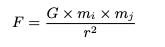

# 论文导读 | 性能与生产力 : Rust vs C

作者： 张汉东

---


> - 原标题：Performance vs Programming Effort betweenRust and C on Multicore Architectures:  CaseStudy in N-Body
> - 论文地址：[https://arxiv.org/abs/2107.11912](https://arxiv.org/abs/2107.11912)
> - 发表时间：2021年7月26
> - 关键字：Rust,  C,  N-Body,  Parallel  Computing,  Performance  comparsion, Programming Cost

---

## 前言

曾经 Fortran和C一直是高性能计算（HPC）的默认编程语言。这两种语言都提供了可以和操作系统内存以及硬件进行交互的基础类型和函数，从而在响应时间和资源使用方面产生高效的代码。然而，对这两种语言而言，如何生成可维护和可扩展的代码是一个真正的挑战。

Rust 语言诞生之后，它天生为并发和安全而设计，并且借鉴了面向过程/面向对象/函数式等语言的特点。Rust 的目标在性能方面对标 C 语言，但在安全和生产力方面则比 C 更胜一筹。

这篇论文就是比较研究 Rust 和 C 语言在 性能和 编程效能（Programming effort）两方面，看能否确定 Rust 是一种保持一定性能水平的同时拥有更少工作量（更高的编程效能和生产力）的语言。如果是这样，那么 Rust 则是 HPC 领域的绝佳替代品。

之前 Rust 社区也探讨过如何确定 Rust 生产力的问题，那么这篇文章就是一个启示。本文并非论文完整翻译，只是一些重点摘要。

## 什么是 N-Body ?

### 背景

N-Body ，即 N 体问题。

在二十世纪的第一次数学家大会(1900年)上，二十世纪伟大的数学家希尔伯特(David Hilbert)在他著名的演讲中提出了23个困难的数学问题。其中 N 体问题的 特例 三体问题就被提了出来。

先从 三体 问题说起。三体问题是天体力学中的基本力学模型。它是指三个质量、初始位置和初始速度都是任意的可视为质点的天体，在相互之间万有引力的作用下的运动规律问题。三体问题（three-body problem）最简单的一个例子就是太阳系中太阳、地球和月球的运动。

N 体问题就是 三体问题更一般化的多体问题。多体问题是一个十分复杂的理论问题，也是天体力学各个分支学科的共同基础课题。当`N=2`时，即为二体问题，已完全解决（回想一下牛顿万有引力定律）。`N=3`即成为著名的三体问题，除一些特殊的限制性三体问题可以得出特解外 ，一般三体问题仍是悬而未决的难题。对于`N>3`的N体问题，根本无法求出分析解。现在主要是采用数值方法和定性方法来进行研究。特别是随着电子计算机的广泛使用，数值方法更成为研究N体问题的主要手段。

八卦：

1. 科幻作家刘慈欣的《地球往事》三部曲之一《三体》即是以此问题为基础而创作的。
2. 多体问题也在电视连续剧《犯罪心理》中"Compulsion"这段被显著提到。
3. 多体问题也出现在1951年科幻电影《地球停转之日》，其中Klaatu为了吸引一位科学家的注意而解决了这个问题。

以上参考维基百科。

### 计算

对于 N body 有很多的稍微近似的算法，多是基于实际的物理场景的，比如大部分天体是属于一个星系的，每个星系之间都非常远，所以可以将一些星系作为整体计算，构建一颗树，树中的某些节点是其所有叶子的质心，这样就可以减少计算量，但是放到 GPU 的场景下一个 `O(N^2)` 的暴力算法利用 GPU 的并行能力可以非常快的算出来。

在网上也有针对 `n-body`的 各个语言性能比较：https://benchmarksgame-team.pages.debian.net/benchmarksgame/performance/nbody.html


## 高性能计算特点


高性能计算（HPC）是指使用非凡的计算能力系统和并行处理技术来解决具有高计算需求的复杂问题。实现这一目的不仅需要有提供必要处理能力的架构，还需要有允许问题被有效计算的软件。这就是为什么不能简单地选择一门编程语言，它的选择会对应用性能和所需的编程效能产生影响。

HPC系统必须有效地计算问题，以提高程序的响应时间。能做到这一点的语言，必须是拥有和底层硬件打交道的能力。目前在这个领域最流行的语言是 Fortran 和 C 。尽管被广泛使用，但用这些语言生成可维护和可扩展的代码是一个真正的挑战。Java 和 Python 这两种语言还试图进入这个领域，可想而知，它们失败了。

 在这个意义上，语言应该至少提供以下功能： 

- 允许直接操作内存内容的指针。 
- 一套位操作符，如果使用得当，可以大大改善程序时间。 
- 支持不同的标志或编译选项，根据支持的架构优化代码。
- 使用/嵌入本地底层架构指令的能力，以利用其硬件特性的优势。

此外，为了提高响应时间，语言应该提供工具或库，允许扩展基础语言功能，为多处理器架构提供并发和并行处理能力，包括共享（如OpenMP）和分布式内存（如OpenMPI或MPICH）。

该论文的重点是评估 Rust 能否在 HPC 领域成为 C 语言的替代品，所以使用 HPC 领域最常见的 N体问题 作为案例，并且做了如下工作：

1. 在多核架构上，使用 Rust 语言对 N 体问题进行多次优化实现。
2. 严格对比 多核架构下 N 体问题的 C 和 Rust 实现，来确定 Rust 在 HPC 领域中的优势与劣势。


## Rust 实现

N 体问题用于模拟一个由 N 个个体组成的系统在时间推移过程中的演变。每个个体都有一个初始状态，由其速度和位置给出。系统的运动是通过离散的时间瞬间来模拟的。 在每一个瞬间，个体都经历了一个加速度，这个加速度来自于其余个体的引力，这影响了它的状态。牛顿力学是模拟的基础。

这项模拟是在 3 个空间维度上进行的，两个物体`Ci`和`Cj`之间的引力是用牛顿的万有引力定律计算出来的。




其中，`F`是指物体之间的引力大小，`G`是指引力常数（`6.674×(10^11)`），`mi` 对应 Ci 的质量，`mj` 对应 Cj 的质量，`r` 对应 Ci和Cj之间的欧氏距离（euclidean distance）。

当 N 大于 2 时，一个物体上的引力相当于其余 `N-1` 个物体施加的所有引力总和。根据牛顿第二定律，牵引力导致每个物体加速和移动： `F = m·a` （这是一个矢量表达式，加速度和合力的方向始终保持一致）

牛顿第二定律独立性告诉我们：物体受几个外力作用，在一个外力作用下产生的加速度只与此外力有关，与其他力无关，各个力产生的加速度的矢量和等于合外力产生的加速度，合加速度和合外力有关。

 在一个小的时间间隔`dt` 内，`Ci`的加速度大约是恒定的，所以速度的变化大约是: `d·vi = ai·dt`。

`Ci`位置的变化是其速度和加速度在`dt`时间间隔内的积分：


在这个公式中，很明显，一半的位置变化是由于旧的速度，而另一半是由于新的速度。 这种整合方案被称为 Leapfrog 。解法伪代码如下：

```rust
FOR every-body-i = 1 to N
		FOR every-body-j = 1 to N
    		Calculate the force exerted by j on i // 计算 j 对 i 所施加的力
        Sum of the forces affecting i         // 影响 i 的力之和
    Calculate the displacement of the body i  // 计算 i 的位移
    Moving the body i                         // 移动 i
```

上面伪代码中有两个数据依赖：

1. 首先，一个个体不能移动，直到其他个体完成计算它们的相互作用。
2.  第二，在其他个体完成当前步骤之前，他们也不能前进到下一个步骤。


## Rust vs  C 实现

### 性能

论文中给出了一些性能测试图表。看得出来，整体性能 Rust 和 C 相差无几。

在单精度方面，C语言版本在所有问题规模上都优于Rust，实现了高达1.18倍的改进，而在双精度方面，两种实现的性能几乎相同。

当分析两种实现产生的汇编代码时，可以看到当使用数学优化（precision relaxation）时，C语言对主代码进行了更有效的转译。 这种行为在双精度中没有被复制，在双精度中两种代码是非常相似的。

这些优化还没有包含在 Rust 的稳定版本中，所以这一点有望在未来得到改善。

### 编程效能

有很多方法来衡量编程的成本，包括计算代码行数。尽管它们很简单，但这些参数并不能反映算法的复杂性。

还可以测量开发时间，但这取决于程序员的经验。这些指标都极具主观性，导致很难去评估编程的成本。

但是 代码行数 和 开发时间 算是互补的方法，一定程度上在广义上来评估编程的效能是可以的。

**先来看看代码行数：**

|       | C    | Rust |
| ----- | ---- | ---- |
| Main  | 66   | 40   |
| Total | 219  | 195  |

Rust的优势在于，作为一种具有高级语言的一些特征的语言，它既是函数式的，也是面向对象的，它可以开发出比C语言更紧凑、更容易解释的代码。代码量少的情况下，还有更强的可维护性。

在优化过程中：

- C 语言需要不断改变解决方案的逻辑才能更好地利用数据位置的优势，而 Rust 则更有效地管理了内存，优化过程中不需要对解决方案进行修改。
- Rust 的迭代器可以通过更简单的方式生成并行代码，而 C 则需要对不同的 OpenMP 选项来实现适当并行化。
- Rust 中添加外部库非常方便，比如数学优化库或 rayon库。C 则比较麻烦。

## 实验结论

先来看一下论文结论。

Rust 创建的 N-Body 优化算法是从一个基础版本开始，然后不断迭代优化出来的。优化措施如下：

1. 多线程。将单线程的基础版本修改为多线程，增加并发计算。
2. 用 `for_each` 代替 `fold`，性能没有变化，但是增加了可读性。
3. 在数学层面上进行优化，虽然损失了计算精度，但是提升了算法性能。
4. 开启自动向量化，进行并行计算。Rust 支持自动向量化（SIMD）。
5. 使用 Jemalloc 内存分配器替换默认分配器，性能有所提高，但不是很明显。
6. 其他。

对 Rust 算法优化完之后，和 C 语言对应的算法进行了比较。在双精度方面，性能结果很接近，但在单精度方面，C版本的性能要好一些。 这是因为Rust对这种数据类型的数学运算的优化不如C语言好。

在编程效能（生产力）方面，Rust与C不同，它有一些高级语言的特性，这有利于生成易于维护的代码。  此外，由于它具有函数式语言和面向对象语言的特点，它允许生成更紧凑的代码，导致程序的代码行数更少。 此外，Rust试图有效地管理内存，在某些情况下，不需要对计算逻辑进行修改就可以利用数据位置的优势。

基于所获得的结果和所进行的分析，论文作者们认为在与本研究类似场景的情况下，**Rust可以被定位为HPC的C语言的替代品**。 由于该语言仍在不断发展中，社区支持将成为其最终可行性的决定因素。


## 相关资料

[https://github.com/ManuelCostanzo/Gravitational_N_Bodies_Rust](https://github.com/ManuelCostanzo/Gravitational_N_Bodies_Rust)

