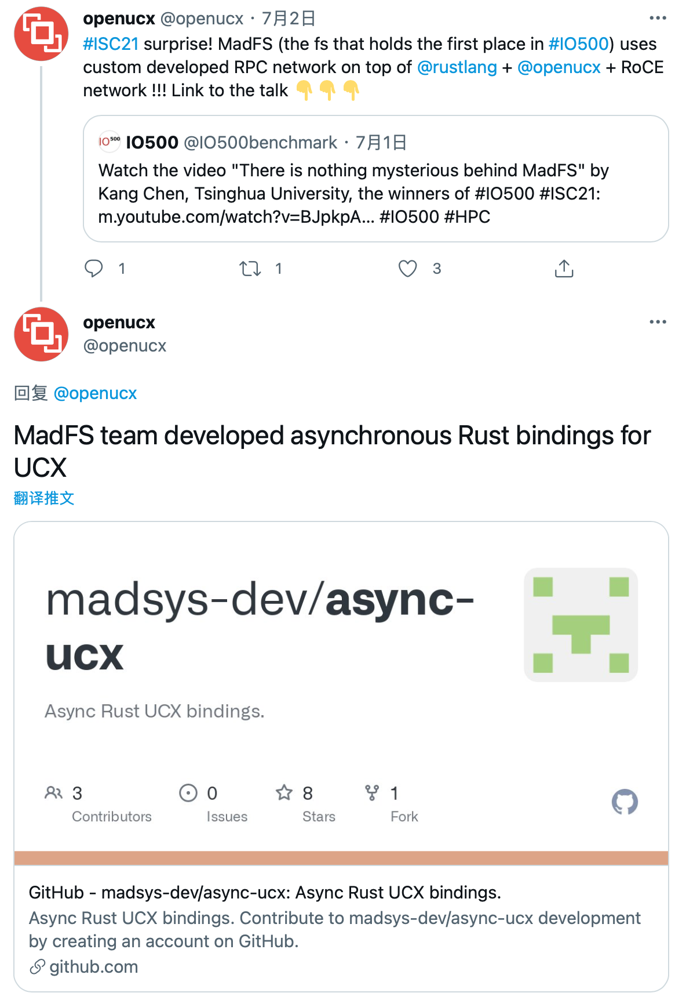
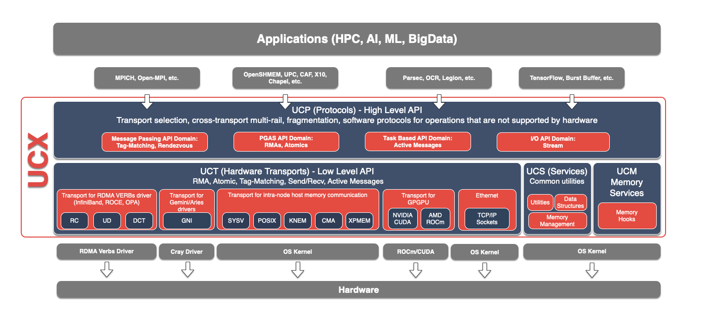
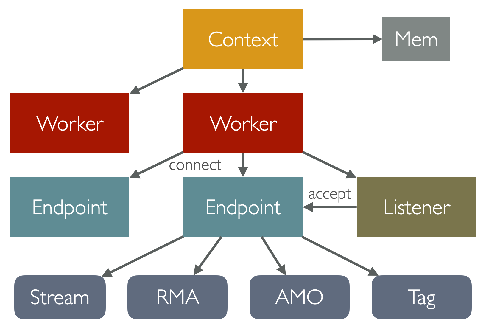
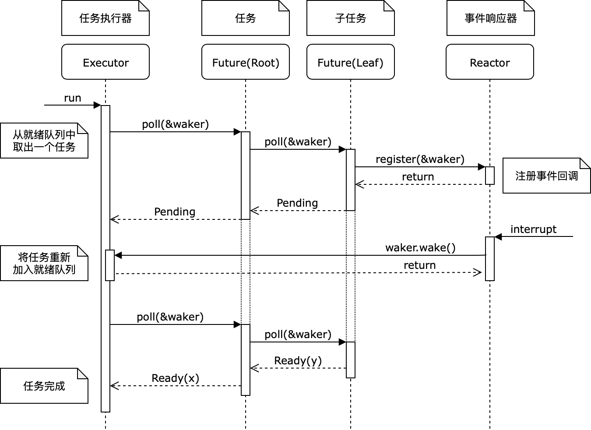

# Datenlord | Rust实现RDMA异步编程（二）：async Rust 封装 UCX 通信库

作者：王润基

---

UCX 是一个高性能网络通信库，它作为 MPI 所依赖的通信模块之一在高性能计算领域得到广泛的使用。UCX 使用 C 语言编写，为了在 Rust 项目中使用它，我们需要将它的 C 接口包装成 Rust 库。在这个过程中我们充分利用了 Rust 的杀手级特性—— async-await 协程来包装异步 IO 接口，从而极大降低了应用的编程复杂度。

去年我们用 Rust 实现的高性能分布式文件系统 MadFS，底层就使用了我们自己包装过的 UCX 作为通信模块，它在大规模 RDMA 网络上展现出了良好的性能。UCX 官方在得知这一消息后也很开心地宣传了我们这个项目 :)



本文首先会介绍一下 UCX 通信库的功能和编程模型，然后介绍我们用 async Rust 封装 UCX 的过程，具体代码可以参考 GitHub 仓库：[async-ucx][async-ucx]。值得注意的是，这里介绍的 IO 模型和封装异步 IO 的方法是通用的，可以适用到其它 IO 库当中。

[async-ucx]: https://github.com/madsys-dev/async-ucx

## UCX 通信接口简介

UCX 的全称是 Unified Communication X。正如它名字所展示的，UCX 旨在提供一个统一的抽象通信接口，能够适配任何通信设备，并支持各种应用的需求。

下图是 UCX 官方提供的架构图：



可以看到，UCX 整体分为两层：上层的 UCP 接口和底层的 UCT 接口。

底层的 UCT 适配了各种通信设备：从单机的共享内存，到常用的 TCP Socket，以及数据中心常用的 RDMA 协议，甚至新兴的 GPU 上的通信，都有很好的支持。

上层的 UCP 则是在 UCT 不同设备的基础上，封装了更抽象的通信接口，以方便应用使用。具体来说有以下几类：

* Active Message：最底层的接口，提供类似 RPC 的语义。每条 Active Message 会触发接收端进行一些操作。
* RMA / Atomic：是对远程直接内存访问（RDMA）的抽象。通信双方可以直接读写远端的内存，但是需要有额外的内存注册过程。
* Tag Matching：常用于高性能计算 MPI 程序中。每条消息都会附带一个 64 位整数作为 tag，接收方每次可以指定接收哪种 tag 的消息。
* Stream：对字节流（TCP）的抽象。

一般来说，和底层通信设备模型最匹配的接口具有最高的性能，其它不匹配的接口都会有一次软件转换过程。另一方面，同一种 UCP 接口发送不同大小的消息可能也会使用不同的 UCT 方法。例如在 RDMA 网络中，由于内存注册也有不小的开销，因此对于小消息来说，拷贝到预注册好的缓冲区再发送的性能更高。这些策略默认是由 UCX 自己决定的，用户也可以通过设置环境变量的方式手动修改。

> 在我们的系统中，使用了 UCP Tag 接口并基于此实现了轻量级的 RPC。在 RPC 场景下，Tag 可以用于区分不同上下文的消息：每个链接双方首先随机生成一个 tag 作为请求的标识，对于每次请求再随机生成一个 tag 作为回复的标识。此外 Tag 接口还支持 IO Vector，即将不连续的多个内存段合并成一个消息发送。这个特性可以用来将用户提供的数据缓冲区和 RPC 请求打包在一起，一定程度上避免数据拷贝。

## UCX 编程模型简介

UCX 采用了以异步 IO 为核心的编程模型。其中 UCP 层定义的核心对象有以下四种：

* Context：全局资源的上下文，管理所有通信设备。一般每个进程创建一个即可。
* Worker：任务的管理调度中心，以轮询方式执行任务。一般每个线程创建一个，会映射为网卡上的一个队列。
* Listener：类似 TCP Listener，用来在 worker 之间创建连接。
* Endpoint：表示一个已经建立的连接。在此之上提供了各种类型的通信接口。

它们之间的所属关系如下图所示：



### 建立连接

UCX 中双方首先要建立连接，拿到一个 Endpoint 之后才能进行通信。建立连接一般要通过 Listener，过程和 TCP 比较类似：

通信双方 A/B 首先建立各自的 Context 和 Worker，其中一方 A 在 Worker 上创建 Listener 监听连接请求，Listener 的地址会绑定到本机的一个端口上。用户需要通过某种方法将这个地址传递给另一方 B。B 拿到地址后在 Worker 上发起 connect 操作，此时 A 会收到新连接请求，它可以选择接受或拒绝。如果接受则需要在 Worker 上 accept 这个请求，将其转换为 Endpoint。之后 B 会收到 A 的回复，connect 操作完成，返回一个 Endpoint。此后双方就可以通过这对 Endpoint 进行通信了。

### 内存注册

对于常规的通信接口，用户可以直接在 Endpoint 上发起请求。但对于 RMA（远程内存访问）操作，需要被访问的一方首先在自己的 Context 上注册内存，同时指定访问权限，获得一个 Mem handle。然后将这个本地 handle 转化为其他节点可以访问的一串 token，称为 remote key（rkey）。最后想办法把 rkey 传给远端。远端拿着这个 rkey 进行远程内存访问操作。

### 异步任务处理（重点）

为了发挥最高的性能，整个 UCX 通信接口是全异步的。所谓异步指的是 **IO 操作的执行不会阻塞当前线程**，一次操作的发起和完成是独立的两个步骤。如此一来 CPU 就可以同时发起很多 IO 请求，并且在它们执行的过程中可以做别的事情。

不过接下来问题来了：程序如何知道一个异步任务是否完成了？常见的有两种做法：主动轮询，被动通知。前者还是需要占用 CPU 资源，所以一般都采用通知机制。在 C 这种传统过程式语言中，异步完成的通知一般通过 **回调函数（callback）**实现：每次发起异步操作时，用户都需要传入一个函数指针作为参数。当任务完成时，后台的运行时框架会调用这个函数来通知用户。下面是 UCX 中一个异步接收接口的定义：

```c
ucs_status_ptr_t ucp_tag_recv_nb (
  ucp_worker_h worker,
  void ∗ buffer,
  size_t count,
  ucp_datatype_t datatype,
  ucp_tag_t tag,
  ucp_tag_t tag_mask,
  ucp_tag_recv_callback_t cb  // <-- 回调函数
);

// 回调函数接口的定义
typedef void(∗ ucp_tag_recv_callback_t) (
  void ∗request, 
  ucs_status_t status,        // 执行结果，错误码
  ucp_tag_recv_info_t ∗info   // 更多信息，如收到的消息长度等
);
```

这个接口的语义是：发起一个异步 Tag-Matching 接收操作，并立即返回。当真的收到 tag 匹配的消息时，UCX 后台会处理这个消息，将其放到用户提供的 buffer 中，最后调用用户传入的 callback，通知用户任务的执行结果。

这里有一个很重要的问题是：上面提到的“后台处理”到底是什么时候执行的？答案是 UCX 并不会自己创建后台线程去执行它们，**所有异步任务的后续处理和回调都是在 `worker.progress()` 函数中，也就是用户主动向 worker 轮询的过程中完成的**。这个函数的语义是：“看看你手头要处理的事情，有哪些是能做的？尽力去推动一下，做完的通知我。” 换句话说，Worker 正在处理的所有任务组成了一个状态机，progress 函数的作用就是用新事件推动整个状态机的演进。后面我们会看到，对应到 async Rust 世界中，所有异步 IO 任务组成了最基础的 Future，worker 对应 Runtime，而 progress 及其中的回调函数则充当了 Reactor 的角色。

回到传统的 C 语言，在这里异步 IO 的最大难点是编程复杂性：多个并发任务在同一个线程上交替执行，只能通过回调函数来描述下一步做什么，会使得**原本连续的执行逻辑被打散到多个回调函数中**。本来局部变量就可以维护的状态，到这里就需要额外的结构体来在多个回调函数之间传递。随着异步操作数量的增加，代码的维护难度将会迅速上升。下面的伪代码展示了在 UCX 中如何通过异步回调函数来实现最简单的 echo 服务：

```c
// 由于 C 语言语法的限制，这段代码需要从下往上读

// 这里存放所有需要跨越函数的状态变量
struct CallbackContext {
  ucp_endpoint_h ep;
  void *buf;
} ctx;

void send_cb(void ∗request, ucs_status_t status) {
  //【4】发送完毕
  ucp_request_free(request);
  exit(0);
}

void recv_cb(void ∗request, ucs_status_t status, ucp_tag_recv_info_t ∗info) {
  //【3】收到消息，发起发送请求
  ucp_tag_send_nb(ctx->ep, ctx->buf, info->length, ..., send_cb);
  ucp_request_free(request);
}

int main() {
  // 省略 UCX 初始化部分
  //【0】初始化任务状态
  ctx->ep = ep;
  ctx->buf = malloc(0x1000);
  //【1】发起异步接收请求
  ucp_tag_recv_nb(worker, ctx->buf, 0x1000, ..., recv_cb);
  //【2】不断轮询，驱动后续任务完成
	while(true) {
    ucp_worker_progress(worker);
  }
}
```

作为对比，假如 UCX 提供的是同步接口，那么同样的逻辑只需要以下几行就够了：

```c
int main() {
  // 省略 UCX 初始化部分
  void *buf = malloc(0x1000);
  int len;
  ucp_tag_recv(worker, buf, 0x1000, &len, ...);
  ucp_tag_send(ep, buf, len, ...);
  return 0;
}
```

面对传统异步编程带来的“回调地狱”，主流编程语言经过了十几年的持续探索，终于殊途同归，纷纷引入了控制异步的终极解决方案—— async-await 协程。它的杀手锏就是能让开发者**用同步的风格编写异步的逻辑**。经过我们的封装过后，在 Rust 中用 async 协程编写同样的逻辑是长这样的：

```rust
async fn main() {
  // 省略 UCX 初始化部分
  let mut buf = vec![0u8; 0x1000];
  let len = worker.tag_recv(&mut buf, ...).await.unwrap();
  ep.tag_send(&buf[..len], ...).await.unwrap();
}
```

下面我们就来介绍如何用 Rust 的协程机制包装 UCX 异步接口。

## Rust 封装 UCX

### 生成 Rust 接口

用 Rust 包装 C 语言库的第一步是用社区提供的 [bindgen](https://github.com/rust-lang/rust-bindgen/) 工具，从 C 头文件自动生成 Rust 绑定代码。生成的代码一般直接作为 `*-sys` 库发布，具体实现可以参考我们封装的 [ucx-sys](https://github.com/madsys-dev/async-ucx/tree/master/ucx-sys)。接下来我们要在它的基础上继续封装出高层接口，也就是 async-ucx。

### 封装 UCX 对象

async-ucx 做的第一件事就是封装 UCX 对象。在 C 语言中对象创建出来后用户会拿到一个 handle，也就是一个指针。用户之后需要自己管理对象的生命周期，在用完后手动释放掉资源。

在 Rust 中我们需要将 C 的 handle 包装成一个 struct，通过引用计数来自动管理对象的生命周期，在对象的 Drop 函数中释放其资源。下面的代码展示了对 Worker 对象的封装过程：

```rust
// 创建 Worker 需要依赖 Context，具体实现代码略过
pub struct Context {
  handle: ucp_context_h,
}

pub struct Worker {
  handle: ucp_worker_h,		// 包装 C handle
  context: Arc<Context>,	// 引用上级对象
}
impl Worker {
  // 从 Context 创建 Worker
  pub fn new(context: &Arc<Context>) -> Rc<Self> {
    // 准备参数和返回值
    let mut params = MaybeUninit::<ucp_worker_params_t>::uninit();
    unsafe { (*params.as_mut_ptr()).field_mask = 0 };
    let mut handle = MaybeUninit::uninit();
    // 调用 C 函数创建对象，获得 handle
    let status =
    unsafe { ucp_worker_create(context.handle, params.as_ptr(), handle.as_mut_ptr()) };
    assert_eq!(status, ucs_status_t::UCS_OK);
    // 包装为 Rust 对象
    Rc::new(Worker {
      handle: unsafe { handle.assume_init() },
      context: context.clone(),
    })
  }
}
// 析构时释放资源
impl Drop for Worker {
  fn drop(&mut self) {
    unsafe { ucp_worker_destroy(self.handle) }
  }
}
```

对象其它接口的包装也是类似的：首先将用户传入的参数转化成 C 接口的形式，然后 unsafe 调用 C 接口，最后将返回结果转化成 Rust 的形态返回给用户。

### 封装异步操作（重点）

接下来到了最重要的一步：用 Future 封装基于回调函数的异步接口。

首先我们来回顾一下 Future 的工作原理：它本质是一个状态机，只提供一个 poll 函数来驱动内部状态的演进。poll 函数的本质是事件轮询，它会检查自己关心的事件是否已经完成，如果完成就继续推进执行，否则就挂起等待。在挂起之前 Future 需要将自己的 waker 注册到后台的事件响应器（Reactor）中，以便在事件发生时能够被唤醒。当事件发生后，Reactor 通过 waker 唤醒 Future，Future 再次执行上述 poll 的过程，这一次它会看到事件已经发生，于是状态机得以继续推进。

基于 Future 的整个异步运行时的工作原理如下图所示：



其中 Future 接口的具体定义如下：

```rust
pub trait Future {
  type Output;
  // 尝试推进状态机：
  //   如果事件就绪就返回 Poll::Ready(T)
  //   否则从 cx 中拿一个 waker 注册给 reactor，然后返回 Poll::Pending
  fn poll(self: Pin<&mut Self>, cx: &mut Context<'_>) -> Poll<Self::Output>;
}
```

下面我们要做的就是：利用回调函数来实现上面的 poll 函数。主要解决两个问题：查询事件状态，注册 waker。

* 查询事件状态：这个比较好办。因为 UCX 的异步函数都会返回一个 request 对象，并且提供了接口来查询 request 的状态。所以我们只需要将 request 对象加入 Future 的状态中即可。

  ```c
  // 异步函数的返回值就是 request
  ucs_status_ptr_t ucp_tag_recv_nb (...);
  // 查询 request 状态的接口
  ucs_status_t ucp_tag_recv_request_test (
    void ∗request,
  	ucp_tag_recv_info_t ∗info
  );
  ```

* 注册 waker：这件事需要一些技巧。之前我们提到 callback 实际上充当了 Reactor 的角色，所以这里我们需要将 waker 从 Future 传递给 callback。

  观察 UCX callback 函数的定义，可以发现其中一个参数就是 request：

  ```c
  typedef void(∗ ucp_tag_recv_callback_t) (
    void ∗request,  // 可以通过这里，在 Future 和 callback 之间传递信息
    ucs_status_t status,
    ucp_tag_recv_info_t ∗info
  );
  ```

  并且 UCX 允许我们塞一些自己的私货到 request 对象中，正好就解决了传递 waker 的问题。

接下来正式开始实现！首先定义我们要向 request 中夹带的私货：

```rust
#[derive(Default)]
struct Request {
  // 只有一个 waker，使用了 futures 库中的 AtomicWaker 来保证原子性
  waker: futures::task::AtomicWaker,
}
// NOTE：这里无需 #[repr(C)]，因为操作内部变量都是在 Rust 中实现的
```

然后向 UCX Context 注册这个私货：

```rust
impl Context {
  pub fn new() -> Arc<Self> {
    // 创建 Context 的时候注册私货信息
    let params = ucp_params_t {
      request_size: std::mem::size_of::<Request>() as u64,
      request_init: Some(Request::init),
      request_cleanup: Some(Request::cleanup),
			...
    };
    // 构造 Context 略
  }
}
impl Request {
	// 初始化私货（原地构造）
  unsafe extern "C" fn init(request: *mut c_void) {
    (request as *mut Self).write(Request::default());
    // 注意：不能使用 *request = xxx; 的写法
    // 因为 request 指向的内存是未初始化状态，会导致在未定义内存上触发析构函数！
  }
	// 清理私货（原地析构）
  unsafe extern "C" fn cleanup(request: *mut c_void) {
    std::ptr::drop_in_place(request as *mut Self)
  }
}
```

接下来将整个 request 包装成一个 Future：

```rust
// 由于不同的操作会有不同的返回值，这里就用泛型参数 T 表示返回值类型
struct RequestHandle<T> {
  // UCX 返回的 request 对象，它的头部就是我们的私货
  ptr: ucs_status_ptr_t,
	// 查询 request 状态的函数
  poll_fn: unsafe fn(ucs_status_ptr_t) -> Poll<T>,
}
//////////////////////// 核心代码 /////////////////////////
impl<T> Future for RequestHandle<T> {
  type Output = T;
  fn poll(self: Pin<&mut Self>, cx: &mut std::task::Context) -> Poll<Self::Output> {
    // 查询状态，如果就绪直接返回
    if let ret @ Poll::Ready(_) = unsafe { (self.poll_fn)(self.ptr) } {
      return ret;
    }
    // 注册 waker（通过私货）
    let request = unsafe { &mut *(self.ptr as *mut Request) };
    request.waker.register(cx.waker());
    // 返回等待，挂起任务
    Poll::Pending
  }
}
//////////////////////////////////////////////////////////
impl<T> Drop for RequestHandle<T> {
  fn drop(&mut self) {
    // request 要求手动释放
    unsafe { ucp_request_free(self.ptr as _) };
  }
}
```

最后，用这个 Future 实现一个完整的 recv 过程：

```rust
impl Endpoint {
	pub async fn tag_recv(&self, tag: u64, buf: &mut [u8]) -> usize {
    // 首先实现 callback
    unsafe extern "C" fn callback(request: *mut c_void, ...) {
      // 只需简单地从 request 中取出 waker 唤醒即可
      let request = &mut *(request as *mut Request);
      request.waker.wake();
    }
    // 发起异步操作，调用 C 函数，传入 callback
    let status = unsafe {
      ucp_tag_recv_nb(self.handle, ..., Some(callback))
    };
    if UCS_PTR_IS_PTR(status) {
      panic!("failed to recv tag: {:?}", UCS_PTR_RAW_STATUS(status));
    }
    // 将返回的 request 包装成 Future 并 await 结果！
    RequestHandle {
      ptr: status,
      poll_fn: poll_tag,	// 查询状态的具体实现略
    }.await
  }
}
```

经过这样一番包装，我们就可以简单地使用一行命令，以同步风格完成 IO 操作了：

```rust
let len = worker.tag_recv(tag, &mut buf, ...).await;
```

### 封装 worker progress

终于结束了吗？别忘了所有的回调函数都是由 `worker.progress()` 驱动的。用户必须定期调用这个函数，不然所有任务都会卡住不动了。

那么解决方法也非常简单：我们在异步运行时中首先创建一个协程，不停地调用 `worker.progress()` ，然后 yield 让出。为了做到与具体的异步运行时库无关，我们这里只实现了这个协程本身，用户需要手动 spawn 它：

```rust
impl Worker {
	pub async fn polling(self: Rc<Self>) {
    // 不停循环直到 worker 的其它引用都释放了为止
    while Rc::strong_count(&self) > 1 {
      // 不停地调用 progress，直到没有新事件产生
      while self.progress() != 0 {}
      // 暂时让出 CPU，等待下次调度
      futures_lite::future::yield_now().await;
    }
  }
}
// 用法示例：tokio::task::spawn_local(worker.clone().polling());
```

当所有其它协程任务都挂起时，运行时就会调度运行 polling 协程，用新事件触发若干回调函数，从而唤醒对应的协程。

## 在 Rust 异步运行时中使用 UCX

到此为止我们就完成了对 UCX 异步封装的主要工作。值得注意的是，上面过程只用到了 Rust 语言内建的 async-await 语法，以及标准库中定义的最核心接口（Future 等），完全不依赖于任何一种特定的运行时环境（Tokio，async-std，smol 等）。

接下来我们以 Tokio 为例，介绍在 Rust 异步运行时中使用 async-ucx 构建一个完整可用程序的过程。这里我们实现一个最简单的 echo 程序：客户端向服务端发送一条消息，服务端收到后打印出来。完整代码在 [examples/tag.rs](https://github.com/madsys-dev/async-ucx/blob/master/examples/tag.rs)。

首先写主函数：

```rust
use async_ucx::ucp::*;
use std::io::Result;

// 使用 Tokio 默认的单线程运行时
#[tokio::main(flavor = "current_thread")]
async fn main() -> Result<()> {
  env_logger::init();
  // 这里需要创建一个 LocalSet，才能 spawn !Send 的单线程 Future
  let local = tokio::task::LocalSet::new();
  // 根据命令行参数决定是服务端还是客户端
  if let Some(server_addr) = std::env::args().nth(1) {
    local.run_until(client(server_addr)).await?;
  } else {
    local.run_until(server()).await?;
  }
  Ok(())
}
```

接下来实现服务端：

```rust
async fn server() -> Result<()> {
  println!("server");
  // 创建 worker 和后台 progress 协程
  let context = Context::new();
  let worker = context.create_worker();
  tokio::task::spawn_local(worker.clone().polling());

  // 创建 listener 并等待连接
  let mut listener = worker.create_listener("0.0.0.0:0".parse().unwrap());
  println!("listening on {}", listener.socket_addr());
  let connection = listener.next().await;
  let _endpoint = worker.accept(connection);
  println!("accept");

  // 接收消息并打印出来
  let mut buf = [0u8; 0x100];
  let len = worker.tag_recv(100, &mut buf).await;
  let msg = std::str::from_utf8(unsafe { transmute(&buf[..len]) }).unwrap();
  println!("recv: {:?}", msg);
  Ok(())
}
```

客户端更加简单：

```rust
async fn client(server_addr: String) -> Result<()> {
  println!("client");
  // 创建 worker 和后台 progress 协程
  let context = Context::new();
  let worker = context.create_worker();
  tokio::task::spawn_local(worker.clone().polling());

  // 建立连接
  let endpoint = worker.connect(server_addr.parse().unwrap());
  println!("connect to {:?}", server_addr);
  
  // 发送消息
  let msg = b"hello";
  endpoint.tag_send(100, msg).await;
  println!("send: {:?}", msg);
  Ok(())
}
```

就这么简单，不到 50 行代码就可以实现一个完整的客户端和服务端。相比之下，UCX 官方提供的 [ucp_hello_world](https://github.com/openucx/ucx/blob/50ad33918b242d35d5c7ef1ba032dbc6a636ca2f/examples/ucp_hello_world.c) 程序足足用了好几百行 C 代码才实现了同样的功能。这说明我们的封装更加简单易用，同时 async Rust 能够极大的提高异步编程开发效率。

## 总结与展望

本文介绍了用 async Rust 封装 UCX 异步接口的主要过程。其中涉及的核心知识技巧包括：

* C 语言中用回调函数处理异步逻辑的方法
* Rust 语言中 Future 的角色和功能，异步运行时的基本原理
* 如何用 Future 包装回调函数，如何在二者之间传递信息
* 如何实现 Reactor，用事件驱动整个异步框架的运行

目前 async-ucx 已经基本完成了对 UCP 接口的封装，还剩下另一半 UCT 接口没有实现。

此外，目前 async-ucx 还只支持以 busy-polling 轮询模式处理事件，这会使得运行它的 CPU 核一直处于 100% 满载状态。这样做当然性能是最高的，但是不太节能。UCX 自身支持休眠-唤醒机制，可以在没有事件发生的时候休眠当前线程、让出 CPU、等事件发生时再唤醒。其内部实现是为每个 worker 都创建了一个 event_fd，用户可以拿它去做 epoll，从而阻塞线程等待事件发生。

但是，要用好这一机制需要与 Rust 异步执行器进行深度整合。据我了解，至少 Tokio 1.0 是没有暴露相关接口的。而且这部分的实现一旦有任何闪失，都会导致唤醒遗失、程序卡住的问题出现。未来如何科学地实现休眠机制也是一个不小的挑战。

总的来说，异步 IO 在支持极高性能的同时也带来了极大的编程复杂性，而 Rust 的 async 协程机制很好的压制了这种复杂性。在我看来，Rust 是这个时代最适合编写复杂 IO 系统的语言。欢迎感兴趣的读者继续关注，~~一同加入到我们推翻 C/C++ 旧世界的行列中来！~~

