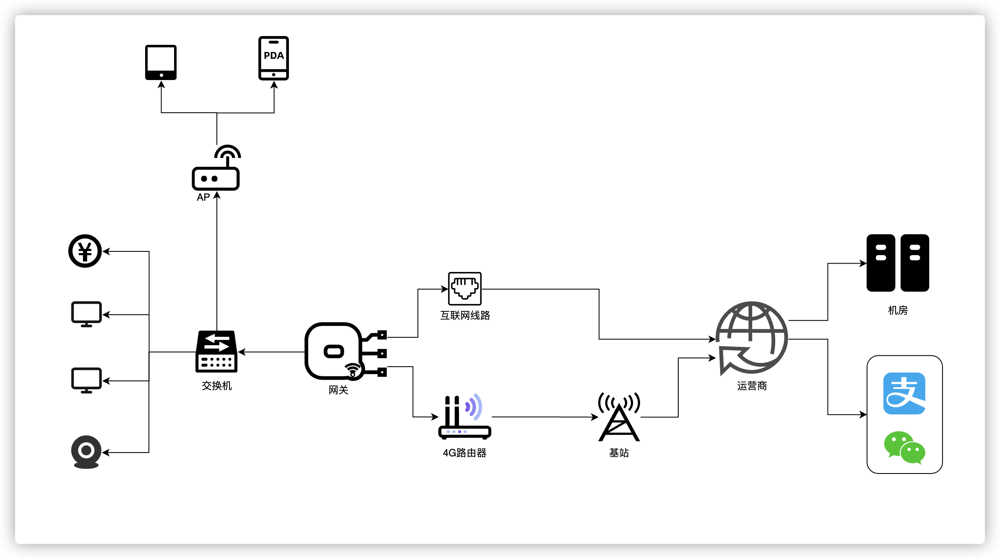

# 便利蜂 | 门店网络与 Rust 落地实践

作者：刘凯，裴振 / 后期编辑：张汉东

> 编者按： 便利蜂门店相信很多人都去过，也享受过其便利的自助服务。但谁能想到，Rust 已在便利蜂100% 支撑店内网络已达 2 年时间，稳定性达 99.9999% 呢？ 功能虽然不太复杂，但这个是 Rust 在嵌入式领域落地的一个非常接地气的场景了！

---

## 背景

### 关于便利蜂

便利蜂是一家以新型便利店为主体的科技创新零售企业，公司以科技为核心驱动运营，以“品质生活 便利中国”为己任，怀抱“小小幸福 在你身边”的初心，为中国消费者提供优质、健康、安心的产品和高效、便捷、满意的服务。目前全国开业的门店已超2000家。

### 网络在门店的作用

便利蜂店内大部分设备都已智能化，依赖网络的设备多达数十种，覆盖了从订单支付到店内运营的方方面面。
店内琐碎的事务中，背后有若干算法在支撑，从订货、陈列、盘点、废弃、热餐制作，到实时变价、自助咖啡、订单结算，每一个环节都有着复杂的网络交互。
要支撑住门店的正常运营，门店网络的稳定非常重要。

### 门店网络架构



上图是便利蜂门店网络拓扑。
在便利蜂门店场景中，要特别关注稳定性与成本的平衡。
对于网络稳定性，拓扑中可以看到，互联网出口以主线为主4G作为兜底，由算法控制主线恶化程度后决定是否启用4G网络，从而保证门店网络的可靠。
关于成本，便利店生意很注重规模效应，大规模的场景通常对单套成本是非常敏感的。拆解开看，成本项主要有三部分，第一是设备成本，第二是互联网接入成本，第三是运维人力成本。关于设备成本，在后续章节有所提及。关于互联网接入，通常我们会使用最低廉的宽带做为主线接入。

### 难点分析

基于上述要求，我们要达成【高质量的一人管千店】，那么会面临几个难题:

1. 如何定义高质量；
2. 如何解决多品牌设备问题；
3. 这么多设备配置，因为各种原因，每天都有可能出现网络中断的情况，如何做到一人管千店。

其中最关键的因素在网关，它负责重要的线路逃生决策，还兼具各种智能检测、信息采集等任务，汇聚信息到中心，最终会在监控中实时分析全国门店的网络情况。
所以网关是整个管理系统的眼睛和手，总部系统是大脑。

## 方案选择

### 硬件和系统选型

硬件选型要满足如下条件：

1. 不能单一供应商，风险太大；
2. 多供应商带来的复杂性不能伤害一人管千店的目标；
3. 硬件稳定性不输给大厂设备；

目前我们选型的策略如下：

1. 品牌 or ODM（设备制造商）；
   1. 品牌往往Console界面互不兼容且不具备编程能力，灵活度大打折扣；
   2. ODM往往出货量远低于大品牌，需要对硬件有一定了解谨慎选择；
   3. 我们目前倾向ODM；
2. 高通 or MTK；
   1. 从sdk成熟度来讲，高通占优，但若选MTK需要接受使用低版本Kernel；
   2. 从成本来讲，MTK占优；
   3. 我们目前倾向MTK；
3. 系统用 OpenWRT 官方 or 厂商 SDK；
   1. 如果对新版本有洁癖，且具备一定的 Kernel debug 能力，建议用 OpenWRT 官方，我们在这条路上有过探索，是完全可以走通的；
   2. 综合考虑后，我们目前倾向厂商SDK。

从以上策略出发，便利蜂必然会是一个多系统并存的状态。

### 开发语言为什么选 Rust

我们的嵌入式硬件有三种，两种 ARM 和一种 MIPS，其中最低的配置为 MT7621 CPU，有 880MHz MIPS CPU、512M内存（可用400M）、370M Flash，属于嵌入式环境。

兼顾嵌入式环境和成熟度，入选的语言有：Golang、C、Lua、Shell、Rust。分析各语言利弊如下：

1. Golang:
   1. 优势：支持多种平台的移植、强大的异步编程能力、并且开发快速；
   2. 缺点：需要 Runtime，内存和CPU占用较高，且测试中发现MIPS版本有内存泄漏；
   3. 结论：排除；
2. C:
   1. 优势：代码简洁、轻量高效，执行效率高，可移植性好；
   2. 缺点：开发效率不高、需要面临内存安全性问题；
   3. 结论：备选；
3. Lua:
   1. 优势：Openwrt 因为有 luci，是最佳选择，并且足够的轻量，可以完美的和C系语言做粘合；
   2. 缺点：其他OS移植sdk的工作量较大；
   3. 结论：排除；
4. Shell:
   1. 优势：轻量、开发快捷、上手难度低、系统自带；
   2. 缺点：对类型的定义和检查不严格，不适合做大型项目的构建，对于高质量交付对人要求较高；
   3. 结论：排除；
5. Rust:
   1. 优势：运行速度快、内存安全、没有Runtime和GC(零成本抽象)、跨平台；
   2. 缺点：学习曲线陡峭、上手难度大、比较新的语言、许多基础库待完善；
   3. 结论：备选。

最终在 C 和 Rust 中做选择，做过一些尝试后最终决定使用 Rust, 它的高质量交付是我们最关心的优势。

## Rust 实践

### 网络质量定义

衡量一个门店网络质量的好坏最直接的方法就是通过Http检测或者ICMP检测，根据检测结果的丢包率、延迟等相关指标来评定。我们根据门店的已有监控数据计算了一个合理的Ping值检测定级区间，具体分级如下：

- A 级：延迟 <= 200ms or 丢包 <= 10%
- B 级：延迟 <= 500ms or 丢包 <= 20%
- C 级：延迟 <= 600ms or 丢包 <= 40%
- D 级：延迟 > 600ms or 丢包 > 40%

`A级`网络质量基本不会对门店产生影响；`B级`基本会造成门店网络出现卡顿以及服务短暂失效等影响；`C级`就是比较大的影响了，门店网络属于短暂不可用；`D级`则代表门店网络不可用状态严重影响到了门店业务。

### 线路逃生的难题

因为低成本的宽带和分散的接入方式，一些门店的网络环境甚至比家用网络更不可靠，所以网关会配有一个 4G 路由器来作 Standby。在主线中断时候切换到备线，在主线恢复后切换回主线。保证门店的网络不受影响。同时，店内实时采集监控数据到中心，并通过流式处理实时监控全局状态，当单店出问题时，会有工单生成一线运维介入，当整体`A级`比例下降时，网络组二线会第一时间收到电话告警并介入处理。

理想情况下，主线质量始终要优于备线质量，所以即使主线和备线同等级别，也应该优先保证线路在主线。其余情况则是谁好在谁则路由保持在哪里。

但实际情况不止如此。主线通常不会直接中断，而是处于`弱网`状态，大多数设备此时只能眼看网络变差不能切换，我们会把质量经过ABCD规则匹配并防抖后第一时间做切换。但这又引出新问题，主线故障会频繁在A和D之间抖动，这时候就会出现主备切换的 `flapping` 状态，因为路由切换的瞬间会影响到业务 http 访问，所以我们通过指数退避的方式尽可能的减少 flapping 的发生。然而又会暴露一个问题：在退避期间，由于抑制了频繁切换，但是实际线路已经无法使用，就会导致全店网络中断情况的发生。这时候就需要采用异常介入模式，避免网络处于瘫痪状态。

### 快速调研，扫清障碍

既然明确了需求、明确了选型，剩下的就是 POC 的工作了。

首先是并发库方面。在 `Rust` 社区中，我们有几个选型可以参考：

- `crossbeam` (多线程)
- `async-std` (异步)
- `tokio` (异步)

`crossbeam` 这个库非常之优秀，完全可以满足程序的功能设计，但是我们需要考虑到我们的设备硬件资源限制条件，`CPU` 更是能省则省，所以我们更倾向于选择一个异步运行时来解决我们的问题。

`tokio` 和 `async-std` 都是比较好的选择，在最初开发的时候 `async-std` 项目刚刚开始起步，很多功能还没有完善，并且 `tokio` 库已经在很多项目中进行过验证，稳定性各方面要相对于 `async-std` 更好一些。所以我们最终决定采用 `tokio` 来作为我们整个程序的异步运行时。

其次是网络检测方面。网络质量检测不仅需要检测主备线质量、还有若干业务的质量检测，ip数量一般能达到**20~30**左右。并且这些检测的`频率`、`Size`、`Interface`也各不相同。我们的网络设备款式比较多，`Ping` 命令的输出格式不统一，且由于 Ping 命令本身是一个 `blocking` 的操作，放在异步运行时中需要单开 worker 来执行这些操作，后来开始调研其他的 Ping 实现，如果要做到多设备兼容需要适配各种设备上安装的 `Ping` 命令的输出结果，并且和程序嵌套会繁琐，开销较大；

我们对`Ping`的使用主要有这几个需求：

- 每个地址发送的频率不一致，大小不一致
  - 大包低频：对一些比较重的资源地址采用了大包检测，但同时要保证门店网络的带宽不受影响所以作为低频包
  - 小包高频：对一些敏感资源地址，采用小包高频策略，这样可以保证每分钟相对均匀的检测
  - 小包低频：对一些不敏感，仅做链路检测的做小包低频，能节省带宽
- 发送`Ping`包需要与`Interface`接口绑定
  - 由于需要支持主备线路由检测，需要绑定 Interface 来做（backup：静态路由）
- 最好支持`Traceroute`功能（Icmp）
  - 需要上传重点监测线路的完整 traceroute 信息到机房来做后期故障分析
- 能与`Tokio`的 Runtime 结合并且支持`mips`、`arm`、`aarch64`等架构
  - 网络多元化，拥有多款设备需要做到跨平台，并且对资源占用有要求
- 能控制 Sequence Number 起始数
- 可编程
  - 可个性化定制、符合人体工程学

社区已有几个实现：

- [oping](https://github.com/cfallin/rust-oping): oping 是一个 Rust 绑定 C 的实现，还是一个 blocking 的操作，但是能提升一些编程体验；
- [fastping](https://github.com/bparli/fastping-rs): fastping 是类似 go 的 fastping 实现，可以同时 Ping 多个地址，但是我们的需求是在 Ping 很多地址的前提下 duration 不同、size 不同、绑定的网络接口不同，所以虽然也是 batch 类的 Ping，但是不太适用；
- [tokio-ping](https://github.com/knsd/tokio-ping): tokio-ping 其实最开始是最适合我们项目的，但是 rust 异步生态那会刚好处在新老交替的阶段，tokio-ping 处于异步的上一个阶段，没法跟我们的项目完美兼容，需要一些 compat 才能使用，并且作者基本已经不维护了。

基于以上的情况，我们实现了一套适用于自己的异步 Ping 程序[surge-ping](https://github.com/kolapapa/surge-ping) 完全贴合我们的使用需求。

代码示例：

```rust
use std::time::Duration;

use surge_ping::Pinger;

#[tokio::main]
async fn main() -> Result<(), Box<dyn std::error::Error>> {
    let mut pinger = Pinger::new("114.114.114.114".parse()?)?;
    pinger.bind_device(Some("eth0".as_bytes()))?;
    // pinger.set_ttl(20)?;
    pinger.timeout(Duration::from_secs(1));
    for seq_cnt in 0..10 {
        let (reply, dur) = pinger.ping(seq_cnt).await?;
        println!(
            "{} bytes from {}: icmp_seq={} ttl={:?} time={:?}",
            reply.size, reply.source, reply.sequence, reply.ttl, dur
        );
    }
    Ok(())
}
```

### 程序结构


网关 Agent 的组织图如上所示，我们对每个门店都部署了 `Agent` 来监测门店网络质量，通过将采集的数据上传到监控系统中对门店网络进行实时监控，在故障发生时能做到尽快发现减少门店损失。

### 多设备兼容

目前我们门店由于网络设备比较多元化，所以会涉及到跨平台的需求，以目前我们主要的两个平台 ARM64 和 MIPS 举例展现下 Rust 的跨平台能力。

#### MIPS交叉编译

这种需要借助厂商的编译 sdk 来做，由于我们使用的是一款老 Rom（mipsel-uclibc）的，这种在 rust 的编译阶级里属于第三层，没有预设在 rust 官方支持的 target 列表中，所以要借用[xargo](https://github.com/japaric/xargo)来实现编译。

先确定设备的三元组信息（`{arch}-{vendor}-{sys}-{abi}`），一般通过 toolchain 的目录基本可以确定 libc 版本，比如我们的：`toolchain-mipsel_24kec_gcc-4.8-linaro_uClibc`，我们看到 Arch 是`mipsel`，ABI 是 `uclibc`，vendor 的话一般是`unknown`,system 为`Linux`,所以我们的三元组信息为`mipsel-unknown-linux-uclibc`.

操作如下：

```shell
# step1 配置环境变量
export STAGING_DIR="/path/to/staging_dir"
export PATH="$STAGING_DIR/toolchain-mipsel_1004kc_gcc-4.8-linaro_uClibc/bin/:$PATH"
export OPENSSL_DIR='/path/to/openssl'
export AR_mipsel_unknown_linux_musl=mipsel-openwrt-linux-uclibc-ar
export CC_mipsel_unknown_linux_musl=mipsel-openwrt-linux-uclibc-gcc
export CXX_mipsel_unknown_linux_musl=mipsel-openwrt-linux-uclibc-g++

# step2 指定编译选项
cat ~/.cargo/config
[target.mipsel-unknown-linux-uclibc]
linker = "mipsel-openwrt-linux-gcc"

# step3 安装Xargo
cargo install xargo

# step4
# 向Cargo.toml中加入如下内容，因为panic有栈回溯， 某些平台不支持这个语法;取消panic展开异常堆栈信息有利于减小程序体积(https://doc.rust-lang.org/edition-guide/rust-2018/error-handling-and-panics/aborting-on-panic.html)
[profile.dev]
panic = "abort"

[profile.release]
panic = "abort"

# step5
cat Xargo.toml
[target.mipsel-unknown-linux-uclibc.dependencies.std]
features = []

# step6 编译
xargo build --target mipsel-unknown-linux-uclibc --release
```

TIPS:
在早期编译期间遇到了很多`libc`库支持不全的问题，这时候需要去查 uclibc 的代码来协助完善 rust 的`libc`库。

#### ARM64 交叉编译

需要用到 Cross 项目： <https://github.com/rust-embedded/cross>

使用 Cross 的坑不多，大部分 unix 类的 OS 都可以使用它，它默认使用 docker 进行编译。使用方法：

```sh
cargo install cross
cross build --target aarch64-unknown-linux-gnu --release
```

对于 OpenSSL，非 MIPS 架构可直接使用 rustls-tls 库，使用方法如下：

```toml
# reqwest使用rustls
reqwest = { version = "0.11", default-features = false, features = ["rustls-tls", "json"]}
```

若使用 mips + openssl，需要将 OpenSSL 在 Dockerfile 中注明编译。Dockerfile 如下：

```Dockerfile
# File: docker/Dockerfile.aarch64-gnu
# openssl: https://github.com/rust-embedded/cross/blob/c183ee37a9dc6b0e6b6a6ac9c918173137bad4ef/docker/openssl.sh
FROM rustembedded/cross:aarch64-unknown-linux-gnu-0.2.1

COPY openssl.sh /
RUN bash /openssl.sh linux-aarch64 aarch64-linux-gnu-

ENV OPENSSL_DIR=/openssl \
    OPENSSL_INCLUDE_DIR=/openssl/include \
    OPENSSL_LIB_DIR=/openssl/lib
```

然后进行编译

```sh
docker build -t kolapapa/aarch64-gnu:0.1 docker/ -f docker/Dockerfile.aarch64-gnu
cat > Cross.toml <<EOF
[target.aarch64-unknown-linux-gnu]
image = "kolapapa/aarch64-gnu:0.1"
EOF
cross build --target aarch64-unknown-linux-gnu --release
```

## 总结

Rust 非常适合此类门店嵌入式场景，其完整易用的工具链、高质量社区、安全的内存管理，能大量缩短上线时间、提高交付质量。
目前 Rust 在便利蜂已 100% 支撑店内网络 2 年时间，稳定性达 99.9999%，需求频次每半个月会做一次迭代。

## 开源社区贡献

我们在实践的过程中也对社区有一些小的贡献：

- [https://github.com/rust-lang/libc](https://github.com/rust-lang/libc) 帮助`libc`库完善了对于 `mips-uclibc` 的支持；
- [https://github.com/rust-lang/socket2](https://github.com/rust-lang/socket2) 支持了绑定`interface`的功能，并且添加了对`mipsel-uclibc`的支持；
- [https://github.com/kolapapa/surge-ping](https://github.com/kolapapa/surge-ping) 一个异步Ping的实现，也可以用作`traceroute` (ICMP版)；

-----

## 作者简介

刘凯，便利蜂运维开发工程师，主要负责 监控报警系统 以及 门店网络多元化项目 的开发和维护。

裴振，便利蜂运维负责人。

最后，便利蜂正在寻找优秀的伙伴，每一份简历我们都会认真对待，期待遇见。

- 邮箱地址：[tech-hiring@bianlifeng.com](tech-hiring@bianlifeng.com)
- 邮件标题：运维

## 招聘官网

[https://bianlifeng.gllue.me/portal/homepage](https://bianlifeng.gllue.me/portal/homepage)
