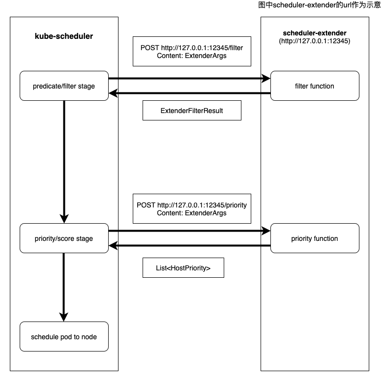

# DatenLord | Rust 实现K8S调度扩展

作者：潘政

---

## 背景介绍

[K8S调度器](https://github.com/kubernetes/community/blob/master/contributors/devel/sig-scheduling/scheduler.md)(kube-scheduler)是K8S调度pod的控制器，它作为K8S核心组件运行。调度器基于一定的调度策略为pod找到合适的运行节点。

### 调度流程
K8S调度器调度一个pod时候主要分为三个阶段
1. 过滤阶段：调用一系列`predicate`函数或者叫`filter`函数过滤掉不合适的节点，比如说某些节点上不满足pod声明的运行所需要的资源，如CPU，内存等资源，那么这些节点会在这个阶段被过滤掉。
2. 打分阶段：调用一系列`priority`函数或者叫`score`函数给通过第一步过滤的节点打分排序。比如有三个节点通过了过滤阶段，当三个节点通过资源均衡函数的打分，那么最终剩余CPU，内存等资源更多的节点会获得更高的优先级评分。
3. 调度阶段：把pod调度到选择优先级最高的节点上 

调度过程如下图所示：


### 调度算法
前文提到，K8S调度器会调用一系列`filter`函数和`priority`函数，这些函数是K8S内置的[调度算法](https://github.com/kubernetes/community/blob/master/contributors/devel/sig-scheduling/scheduler_algorithm.md), K8S会根据默认的调度算法将pod调度到最合适的节点上。`filter`函数的目的是过滤掉不符合pod要求的节点，通常会有多个节点通过`filter`阶段，`prioriry`函数的目的就是在剩下的节点中选出最合适的节点。

我们来介绍一下K8S默认的调度策略有哪些。
* `filter`策略:
    * `PodFitsResources`: 这条策略是过滤掉所剩资源不满足pod要求的节点
    * `MatchNodeSelector`: 这条策略是过滤掉不匹配pod `nodeSelector`要求的节点
    * `PodFitsHostPorts`: 这条策略是过滤掉pod声明的`HostPort`已经被占用的节点
    * 等等
* `priority`策略：
    * `BalancedResourceAllocation`: 这条策略希望当pod被调度到一个节点后CPU，内存使用率是均衡的。
    * `LeastRequestedPriority`: 这条策略基于节点的空闲部分，空闲部分基本算法就是（节点总容量 - 已有pod的请求 - 将要被调度的pod请求）/ 节点总容量，有更多的空闲部分的节点会获得更高的优先级。
    * 等等

K8S提供了很多调度策略，我们在这里就不一一列举，K8S并不会使用所有的这些调度策略，它会默认使用部分调度策略，我们可以通过K8S配置文件来组合使用这些策略来达到最符合我们应用场景的调度策略。


## 调度扩展
前文中介绍到K8S会提供很多调度策略，它们很大程度上允许我们控制K8S调度器的行为，然而K8S提供的调度策略也有它的局限性，它只能根据通用的标准如CPU，内存的使用率来设计调度策略，当我们的应用需要更有针对性的调度策略时，比如说我们想把一个pod调度到网路带宽更高，延迟更低的节点上，这时候K8S提供的调度策略很难满足我们的需求。幸运的是K8S提供了[K8S调度扩展](https://github.com/kubernetes/community/blob/master/contributors/design-proposals/scheduling/scheduler_extender.md)机制。K8S调度扩展提供给用户扩展调度策略的方法。K8S调度扩展允许用户提供定制的`predicate/filter`函数和`priority/score`函数来扩展的调度策略。调度扩展的实现方式是用户提供一个web服务，并将web服务的url通过配置文件通知K8S，K8S会在调度pod的过滤阶段和打分阶段通过RESTful API的`POST`方法来调用用户提供的自定义扩展函数，从而达到扩展K8S调度策略的效果。具体架构如下图所示：


- 在K8S过滤阶段，kube-scheculer发送 `POST ${URL}/filter`到scheduler-extender，请求中包含Json格式序列化的数据`ExtenderArgs`，scheduler-extender收到请求后，通过本地自定义的`filter`函数，产生filter结果`ExtenderFilterResult`并序列化成Json格式返回。
- 在打分阶段，kube-scheculer发送 `POST ${URL}/priority`到scheduler-extender，请求中包含Json格式序列化的数据`ExtenderArgs`，scheduler-extender收到请求后，通过本地自定义的`priority`函数，产生score结果`List<HostPriority>`并序列化成Json格式返回。
### 数据结构
如上所示，K8S在和用户调度扩展交互的过程中涉及到三个数据结构，K8S使用go语言来定义它们，在通过http发送的时候会把它们序列化成Json格式。在Rust实现的调度扩展中需用将这些数据结构用Rust语言定义，并进行序列化和反序列化。
#### 调度扩展请求
这个数据结构是K8S发送的调度扩展请求，`filter`和`priority`请求的结构是相同的。go语言定义如下：
```go
type ExtenderArgs struct {
	// Pod being scheduled
	Pod *v1.Pod
	// List of candidate nodes where the pod can be scheduled; to be populated
	// only if Extender.NodeCacheCapable == false
	Nodes *v1.NodeList
	// List of candidate node names where the pod can be scheduled; to be
	// populated only if Extender.NodeCacheCapable == true
	NodeNames *[]string
}
```
* `Pod`表示需要调度的pod
* `Nodes`表示候选的节点列表
* `NodeNames`表示候选的节点名字列表

这里需要注意的是`Nodes`和`NodeNames`只有一个会被填写，所以在Rust语言中需要将这两个域定义成`Option`，Rust的定义如下:
```Rust
#[derive(Clone, Debug, Serialize, Deserialize)]
struct ExtenderArgs {
    /// Pod being scheduled
    pub Pod: Pod,
    /// List of candidate nodes where the pod can be scheduled; to be populated
    /// only if Extender.NodeCacheCapable == false
    pub Nodes: Option<NodeList>,
    /// List of candidate node names where the pod can be scheduled; to be
    /// populated only if Extender.NodeCacheCapable == true
    pub NodeNames: Option<Vec<String>>,
}
```
#### `filter`请求的应答
这个数据结构作为`predicate`请求的应答，它包含了通过过滤的节点列表，节点失败的原因和错误信息。go语言的定义如下：
```go
type ExtenderFilterResult struct {
	// Filtered set of nodes where the pod can be scheduled; to be populated
	// only if Extender.NodeCacheCapable == false
	Nodes *v1.NodeList
	// Filtered set of nodes where the pod can be scheduled; to be populated
	// only if Extender.NodeCacheCapable == true
	NodeNames *[]string
	// Filtered out nodes where the pod can't be scheduled and the failure messages
	FailedNodes FailedNodesMap
	// Error message indicating failure
	Error string
}
```
* `Nodes`表示通过`filter`函数的节点列表
* `NodeNames`表示通过`filter`函数的节点名字列表
* `FailedNodes`是一个hashmap，保存了没有通过`filter`函数的节点和没有通过的原因
* `Error`表示`filter`函数过程中的失败原因

同样`Nodes`和`NodesNames`只有一个会被填写，也需要定义成`Option`，Rust的定义如下：
```rust
#[derive(Clone, Debug, Serialize, Deserialize)]
struct ExtenderFilterResult {
    /// Filtered set of nodes where the pod can be scheduled; to be populated
    /// only if Extender.NodeCacheCapable == false
    pub Nodes: Option<NodeList>,
    /// Filtered set of nodes where the pod can be scheduled; to be populated
    /// only if Extender.NodeCacheCapable == true
    pub NodeNames: Option<Vec<String>>,
    /// Filtered out nodes where the pod can't be scheduled and the failure messages
    pub FailedNodes: HashMap<String, String>,
    /// Error message indicating failure
    pub Error: String,
}
```
#### `priority`请求的应答
`priority`请求的应答是一个`HostPriority`的列表，`HostPrority`包含节点的名字和节点的分数，go的定义如下：
```go
type HostPriority struct {
	// Name of the host
	Host string
	// Score associated with the host
	Score int64
}
```
* `Host`表示节点的名字
* `Score`表示`priority`函数给该节点打的分数

对应的Rust定义如下:
```rust
#[derive(Clone, Debug, Serialize, Deserialize)]
struct HostPriority {
    /// Name of the host
    pub Host: String,
    /// Score associated with the host
    pub Score: i64,
}
```
在前面这三个数据结构中使用的类型比如说`Pod`, `NodeList`在[K8S-openapi](https://github.com/Arnavion/K8S-openapi)这个库中有Rust版本的定义，可以通过在Cargo.toml中加入依赖来使用它
```toml
K8S-openapi = { version = "0.11.0", default-features = false, features = ["v1_19"] }
```
这个库是根据K8S openapi的定义自动生成的Rust定义，节省了大家把go定义的数据结构转成Rust定义的麻烦，但是这个库只包含core API部分的数据结构，`ExtenderArgs`，`ExtenderFilterResult` 和`HostPriority`属于extender的API，所以需要自己定义。在使用过程中发现了go语言定义的一个问题, 主要原因是`[]string`在go语言中，`[]`和`nil`都是有效的值，序列化对应到Json中分别是`[]`和`null`，一个域可以是null代表了它是optional的，所以类型是`[]string`的域需要加上`+optional`标记，相应的在Rust定义中也需要定义成`Option`。
 详细讨论请参考[issue](https://github.com/kubernetes/kubernetes/issues/100802), 目前这个问题在K8S中已经得到修复。

### 调度扩展Web服务
有了数据结构就需要实现一个web服务来处理K8S发起的请求，web服务Rust有丰富的库可以使用，这里使用的是一个轻量级同步http的库（[tiny-http](https://github.com/tiny-http/tiny-http))，具体`filter`函数和`priority`函数的实现与具体业务逻辑相关，这里就不具体展示，示意代码如下：
```rust
match *request.method() {
            Method::Post => match request.url() {
                "/filter" | "/prioritize" => {
                    let body = request.as_reader();
                    let args: ExtenderArgs = try_or_return_err!(
                        request,
                        serde_json::from_reader(body),
                        "failed to parse request".to_string()
                    );

                    let response = if request.url() == "/filter" {
                        info!("Receive filter");
                        // 处理`filter`请求
                        let result = self.filter(args);
                        try_or_return_err!(
                            request,
                            serde_json::to_string(&result),
                            "failed to serialize response".to_string()
                        )
                    } else {
                        info!("Receive prioritize");
                        // 处理`priority`请求
                        let result = Self::prioritize(&args);
                        try_or_return_err!(
                            request,
                            serde_json::to_string(&result),
                            "failed to serialize response".to_string()
                        )
                    };
                    Ok(request.respond(Response::from_string(response))?)
                }
                _ => Self::empty_400(request),
            },
            ...省略
        }

```

## 总结
通过本文的介绍我们对K8S的调度流程，K8S的调度算法，K8S调度扩展机制有了基本的了解。并且我们用Rust语言实现了K8S调度扩展，用Rust语言定义了K8S和调度扩展之间交互的数据结构，以及介绍了Rust定义中需要定义成`Option`的域以及相关需要注意的问题。


