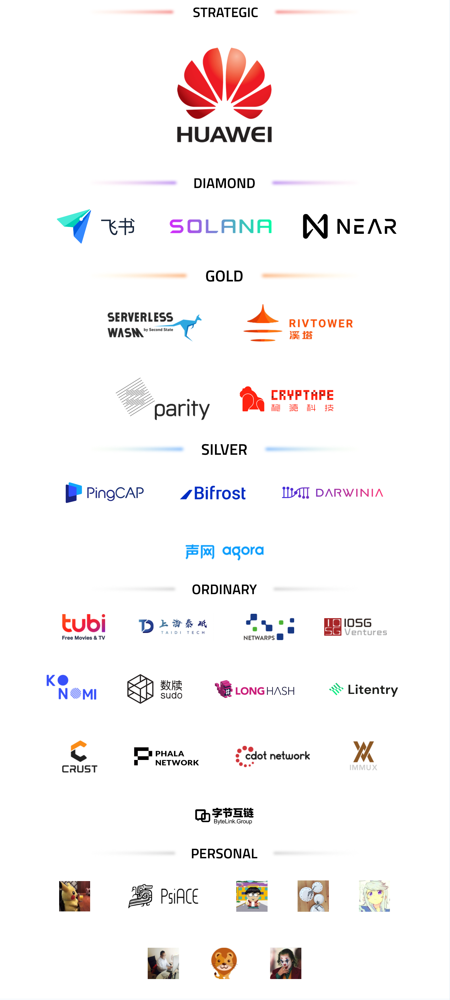

# RustChinaConf 2021 正式启动

好消息，2021 Rust China Conf 要来了！

本次大会初步定于2021年10月16、17日在上海市徐汇区云锦路701号西岸智塔AI Tower 45层 举行。

## 大会介绍

2021 Rust China Conf 由 Rust 中文社区（RUSTCC）发起主办、知名企业和开源组织联合协办，是年度国内规模最大的 Rust 线下会议，深受 Rust 中文社区开发者与相关企业的喜爱与推崇。

本次大会为线下会议，将于10月16日-17日在上海举办，预计到场人数 350 人左右。大会面向企业技术负责人、一线工程师及社区个人开发者，特别是已在公司或个人项目中实践过 Rust 的开发者。

本次大会将同步开启线上直播，以方便无法亲临现场的广大程序员第一时间观看。并且大会结束后将上传相关录像，用于国内外的开发者长期回顾学习。

本次大会也获得了国内知名开发者社区、媒体与出版社的支持，如Infoq, CSDN、思否、掘金、电子工业出版社、人民邮电出版社等。

## 大会目标

本次大会，致力于成为中国 Rustaceans 面对面交流的盛宴，为国内的 Rust 开发者和企业提供一次充分的成果展示、技术分享、能力提升、行业资讯交流、企业人才储备建设的机会。

## 大会议题征集

### 范围

Rust 语言独有的特性，使得其适应面非常广泛，通过广泛搜集整个社区和企业中的议题，分类参考如下：

- 库或框架
- Rust 语言贡献
- Rust 学术/ 教育/ 教程 / 书籍
- Rust 社区
- Rust 生产环境使用经验
- 最佳实践
- 系统编程
- WebAssembly
- 数据库
- 游戏开发
- 区块链
- 嵌入式开发
- 安全（Security）领域
- 其他领域
- workshop

### 议题提交截止时间

9月20日23:59

### 议题提交链接

[https://shimo.im/forms/xqpwpdXw6YxrJTj9/fill](https://shimo.im/forms/xqpwpdXw6YxrJTj9/fill)

## 赞助通道

本次大会赞助权益文档：https://shimo.im/docs/Yg9H6kTVYtqCWRGH/ 《Rust 大会 2021赞助方案》，可复制链接后用石墨文档 App 或小程序打开。

欢迎各企业参与赞助。如有赞助需求，请联系：

- Mike,  vx: daogangtang，email: daogangtang@qq.com
- 张汉东, vx: blackanger，email：blackang3r@163.com
- 胡晓维, vx：h0923xw，email：vivian.xiage@gmail.com

## 志愿者招募通道

本次大会需要大量的志愿者，包括且不仅限于：线上文案、设计、网络宣传、现场指引、签到、资料装袋、周边发放、展台服务等。优先报幕上海地区的志愿者。志愿者拥有相关福利。

志愿者报名地址：[https://www.wjx.top/vj/exW24IP.aspx](https://www.wjx.top/vj/exW24IP.aspx)

详情请联系志愿者事务负责人 高粱 vx：zucc2400。

## 售票通道

即将开启。估计本次大会的门票价格会与2020年Rust中国大会持平。

热忱欢迎广大 Rustaceans 们到场参会，也希望大家帮忙积极宣传，让大会的信息传达到更多开发者那里，推动国内 Rust 社区的发展！

社区有你的参与，我们前进更有动力！10月，上海，咱们不见不散！

## 去年盛况

最后，附上[去年 2020 Rust China Conf](https://rustcc.cn/2020rustchinaconf/) 的赞助及相关支持情况。

