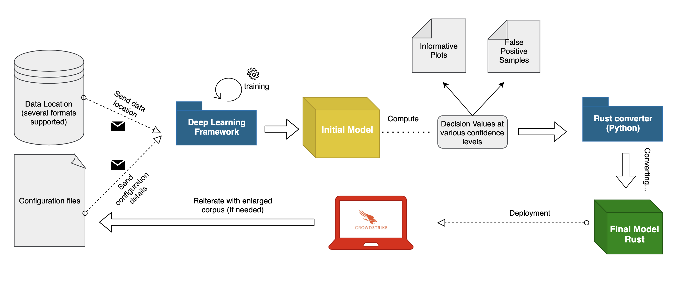
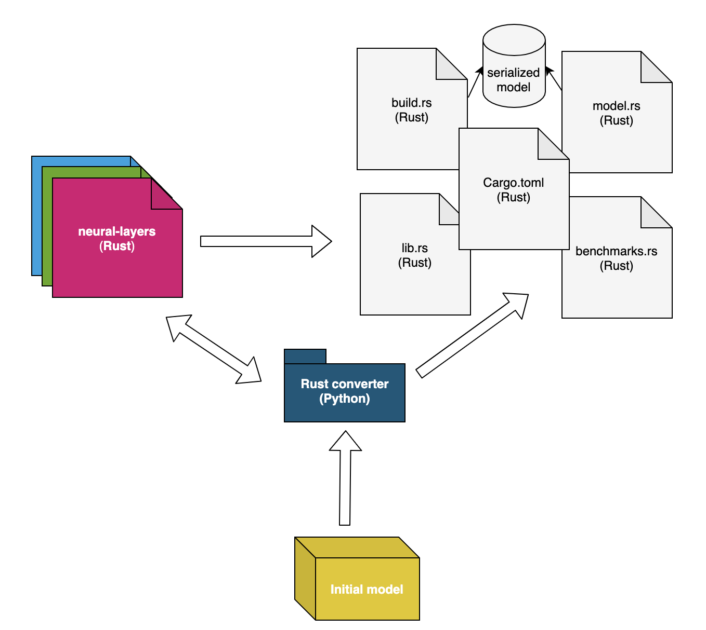

# 外刊评论

编辑：张汉东

> 编者按：国外的 Rust 资源非常丰富，将其都翻译过来也不现实，所以想到这样一个栏目。外刊评论，主要是收集优秀的 Rust 相关文章，取其精华，浓缩为一篇简单评论。
> 
> 欢迎大家贡献：[https://github.com/RustMagazine/rust_magazine_2021/discussions/129](https://github.com/RustMagazine/rust_magazine_2021/discussions/129)

---

## 目录

- [将 TensorFlow 模型移植到 Pure Rust 的开发成本有多高？](#TensorFlow)

---

## 将 TensorFlow 模型移植到 Pure Rust 的开发成本有多高？

> 原文： [https://www.crowdstrike.com/blog/development-cost-of-porting-tensorflow-models-to-pure-rust/](https://www.crowdstrike.com/blog/development-cost-of-porting-tensorflow-models-to-pure-rust/)

> 该文来自于美国网络安全软件开发商 CrowdStrike Holdings（纳斯达克上市代码:CRWD）的官方博客。该公司雇员三千多人，致力于重塑云时代的安全性。

此文作者之前写过一篇文章: [站在巨人的肩膀上：结合 TensorFlow 和 Rust](https://www.crowdstrike.com/blog/how-crowdstrike-combines-tensorflow-and-rust-for-performance/)，其中阐述了如何进行超参数调整和实验已知的深度学习框架（如TensorFlow，PyTorch，Caffe），同时用底层语言重新实现这些模型的最佳版本，以加快预测过程。然而，在那篇文章中没有触及的一个同样重要的部分是将 TensorFlow 模型移植到 Rust 中的开发成本，所以就有了现在这篇文章。

可扩展性是CrowdStrike的重点之一，因此出现了对实现可扩展性的自动化机制的需求。该文介绍了一种新颖的通用转换机制，可以在短时间内成功地将TensorFlow模型转换为纯Rust代码，以及这种技术带来的挑战。

### 从普通的训练过程说起：

一般机器学习项目的理想工作流程是从收集和清理训练阶段要用到的语料库开始的。同样重要的是选择模型架构，以及定义它的超参数集。一旦这些要求得到满足，训练阶段就可以开始了。在这个过程结束时，我们有多个候选模型可以选择。

在所有生成的候选模型中，将使用具有最有希望的结果的模型，该模型与一组预定义的指标（如验证损失、召回率、AUC）以及定义分类器信心水平的决策值相匹配。

此外，在安全等领域，检查模型对新数据进行预测时产生的FN（false negatives）和FP（false positives）可能被证明有助于通过应用聚类或人工技术发现相关信息。如果获得的结果令人满意（例如，高TPR、低FPR，并证明在设想的对抗性攻击方面具有鲁棒性），使用所选模型进行推理的代码将被转换成底层语言，该语言将被进一步优化并提供安全保证（即防止内存泄漏、内存损坏、竞赛条件）。

Rust被证明是这项特定任务的一个杰出候选者。当然，它也可以被任何其他底层编程语言所取代。

最终目标是彻底分析分类器在受控环境中的行为，并检查决策阈值是否选择得当，并有可能进一步微调。最后，在目标终端上发布模型，同时仔细监测其性能。这个过程通常会在分类器的生命周期中多次重复，以提高检测能力，并跟上每天出现的最新威胁。

### 转换机制

转换机制是一个通用工具，旨在将TensorFlow模型转化为纯Rust代码。它的主要目的是过滤冗余信息，只保留推理所需的相关细节（即每层的权重和描述性超参数），并根据计算图中描述的依赖关系重新创建目标模型。最后，产生的Rust文件就可以用来在生产中安全地运行模型，同时实现性能的显著提升。

该转换机制包括：

- 神经层（Neural-Layers Crate）：目前构建于Ndarray Rust crate之上，但是还未使用它的多线程功能，未来还有性能潜力。还有一些其他优化：
    - 使用迭代器而不是直接索引矩阵
    - 批量服务能力
    - 对瓶颈层（如卷积层）使用通用矩阵乘法程序
    - 启用了BLAS（基本线性代数子程序），以使所需的乘法运算更快，而不引入预测错误
- Rust 转换器（Rust Converter）：重新创建给定神经网络背后的整个逻辑，采用了面向对象的编程风格。

### 结论

1. 下一步的改进是采用一种更加标准化的格式，可以统一来自各种深度学习框架的模型（即ONNX）。这将确保没有必要强加一个特定的开发框架，而是让工程师根据自己的喜好来决定。
2. 即使 Rust 被证明是深度学习模型的一个显著的候选者（在时间、空间和解决安全问题方面），该团队也将继续探索进一步的优化策略。
3. 一个通用的转换机制，使该团队能够将注意力转移到更有创造性的任务上--比如设计、微调或验证不同的架构，同时将准备这些模型用于生产的成本降到最低。

