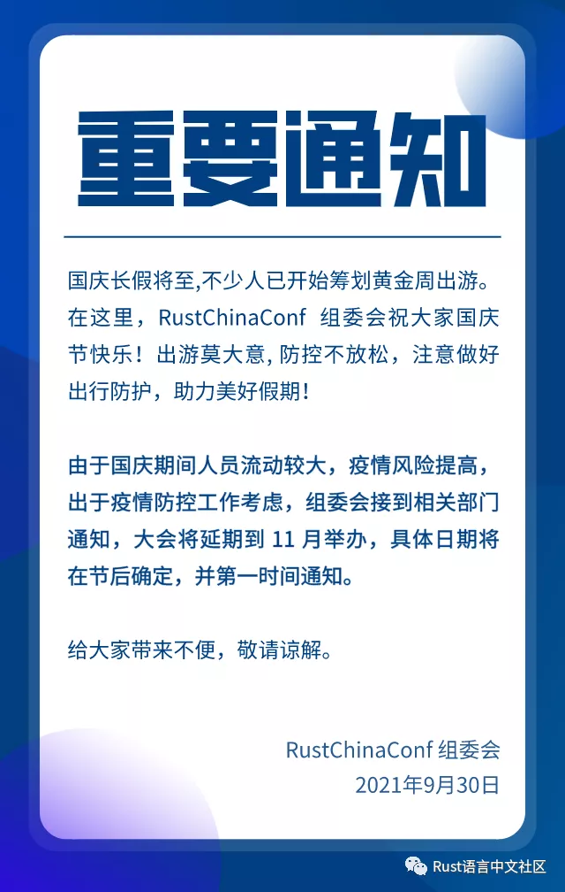

# RustChinaConf 2021 动态

## 重要通知：Rust大会延期至11月举行

## 本届 Rust 大会赞助商列表

## Rust China Conf 2021 首批议题确定

**议题审核标准发布**
 
为了提升大会的议题内容质量，议题不与赞助商权益绑定。本次议题名额有限，符合评审规则者优先考虑。评审结果将分批次放出，名额满即止。
 
**议题入选评审标准：**
 
- 内容要围绕Rust，标题明确，大纲清晰；
- 内容面向Rust的学术研究/生产经验优先；
- 内容面向Rust创业产品 且围绕Rust技术层面者优先；
- 对Rust生态有影响的开源项目优先；
- 在往期大会或meetup并未出现的内容优先；
- 禁止出现国家法规禁止的内容；
- 要符合社区友善度；
- 禁止出现大量广告；
 
**PPT 评审标准**
 
- PPT不要超过 10页（15分钟）或20页（半小时），主要是防止超过议题时间；
- PPT内容要与大纲吻合；
- 禁止出现国家法规禁止的内容；
 
### 已确定议题
 
以下是第一批已确定议题，排名不分先后。
 
#### 《通过 rust 拓展 js 并在 webassmebly 中运行》

陈思衡，WasmEdge社区开发者，就职于滴滴。
 
WebAssembly (Wasm) 最初为浏览器应用而生，但随着 WASI 的出现以及开发者生态的壮大，Wasm 作为一种轻量级的软件容器在服务端的作用愈发明显。服务端的 Wasm 提供了与本地代码相媲美的速度，但又不失安全性，可移植性，与可管理性。通过支持 JavaScript 在 wasm 中运行，可以绕开学习  c/c++、rust 使得开发者可以对基于 wasm 的产品有流畅的上手体验，减少因为开发语言的问题而流失用户的遗憾。得益于 Rust 优秀的设计，使用 Rust 来拓展 JavaScript runtime 能够开发出高质量的 module，给用户稳定的使用体验。
 
 
####  《Rust实现高效的模糊测试工具 (Use rust to develop efficient fuzzer)》

陈鹏，腾讯安全大数据实验室安全研究员，曾开发Angora、Matryoshka等多个模糊测试工具，在IEEE S&P, ACM CCS, Usenix Security等安全顶级会议发表多篇论文。
 
模糊测试(Fuzzing)是一种高效的自动化漏洞挖掘手段，其本身的实现需要高效的执行效率和高度抽象的输入，我们将介绍使用Rust来实现模糊测试工具核心特性时遇到的挑战，以及如何解决的它们的。
 
 
####  《Rust助力量化高频交易》
朱为，非凸科技北京负责人，致力于打造非凸科技下一代算法交易及高频交易引擎。拥有12年通讯和互联网行业从业经验，对于构建高并发低延迟实时系统有丰富的经验。
 
本次演讲分享非凸科技Rust选型过程以及基于Rust生态打造高效率、低延迟、高可靠全内存高频交易平台的经验。
 
####  《集成 Crashpad 到 Rust 应用》

杨博宇，秘猿科技软件开发工程师。
 
当线上 Rust 应用崩溃时，如果崩溃的点在依赖的 C/C++ 库或其他 unsafe 的代码中，往往很难定位和修复。这些情况下，集成崩溃报告系统会带来很大帮助。
 
 
####  《高性能 Rust RPC 框架设计》

徐帅，2017 年开始接触 rust, 有幸成为 rust team member, 一直致力于挖掘这门语言的潜力，并希望吸引更多的使用者, 同时壮大社区。现在在字节跳动基础架构团队探索 rust 在性能和安全问题上的更多可能性。
 
我们都知道 "机器比人便宜, 能加机器就加机器" 的这一道理, 在字节, 我们遇到了困境, 机房容量有限, 自建机房周期太长, 跨机房延时太高等等, 无法再去肆意挥霍机器, 也不能想加就加, 彻底打破了这一道理. 在存量优化的阶段, 我们希望有更好的技术选择, 就和当年大家在知道摩尔定律失效之后一样. 当然机器确实比人便宜:)
 
#### 《乐白机器人和物联网的Rust实践》

田劲锋，乐白机器人团队。
 
Rust在机器人控制器开发、运动控制、实时系统、物联网、WebAssembly的实践。
 
 
####  《基于 Rust 的下一代分布式存储 - HydroFS》

宁安，前豆瓣网DBA, 目前任职青云, 文件存储和对象存储架构师
 
Hydrofs 是基于 rust 从0开发的一款支持 posix 语义的分布式存储, 此次演讲会阐述我们创新的设计哲学和分布式理论, 以及分享 Rust 在系统编程方面的独有优势
 
#### 《我们如何通过手工汇编代码击败 Rust 的零成本抽象》

叶万标，具有十多年经验的高度专注的软件工程师, 使用各种技术在多种开发和工程职位中.  在业余时间, 我喜欢探索老旧的技术, 从纸带程序开始, 第一枚商用处理器到最古老的游戏机. 从前人的智慧中获取灵感, 并指导如今的程序开发. 这是一个有趣的体验, 因为你能学到许多极端的改善性能的方案.
 
ckb-vm 是 Rust 实现的 RISC-V 虚拟机, 我们通过在其关键位置引入手工汇编代码以获得相较原生 Rust 代码 5 倍以上的性能提升.
 
#### 《内核新设计与嵌入式Rust实现》

洛佳，华中科技大学网络空间安全学院大四学生，4年Rust开发经验，热爱Rust嵌入式和操作系统开发工作。目前致力于向教学、研究和产业界推广使用Rust语言。
 
Rust语言抽象能力强、语义描述丰富，使它尤其适合开发系统级应用。本次演讲我们列举一种内核功能模块的编程方法，以及嵌入式Rust在过去一年内的发展。最后，我们将发布一款典型Rust嵌入式应用的新版本。
 
#### 《Madsim：神奇的分布式系统确定性模拟器》

王润基，清华大学计算机系在读硕士生。从 2018 年开始用 Rust 编写操作系统内核 rCore/zCore，并参与了清华 OS 课程改革。2020 年做了打榜专用分布式文件系统 MadFS，最近在学习分布式系统与数据库。致力于推动 Rust 成为未来十年系统编程的首选语言。
 
调试是分布式系统开发过程中的一大难题。面对那种运行 1000 次才会发生一次的罕见 bug，我们常常手足无措直到怀疑人生。为了解决这一问题，我们参考 FoundationDB 的工程实践，用 Rust 开发了一个能够确定性模拟分布式系统行为的运行时框架 Madsim，并基于此移植了 6.824 Raft 实验框架 MadRaft。MadRaft 可以在 1s 内运行完成全部 50+ 组测试用例，或者重复运行一组测试 100+ 次，并在出现问题后随时复现相同的执行过程，大幅提高了开发和调试效率。本次分享讲介绍 Madsim 的实现原理，阐述确定性测试在分布式系统开发中的重要价值与其局限性。
 
#### 《在无libc的SGX可信执行环境下移植std支持》

周顺帆，毕业于复旦大学系统软件与安全实验室，曾在国际顶级安全会议 USENIX Security 上发表对于以太坊生态中攻击交易与防御手段的研究，并协作发表多篇国际顶级安全会议论文。是《Phala Network 白皮书》的联名作者，并参与设计了 Phala 的系统架构。周博士负责带领Phala研究和工程团队在算法、系统架构、网络优化方面逐步提升 Phala 云计算的先进程度，在其带领下目前已在SGX里实现了phala-blockchain的密钥管理核心功能。
 
Intel SGX是一个把应用与OS完全隔离的可信执行环境，应用无法直接访问OS提供的资源。我们采用的Teaclave-SGX-SDK只提供了no_std环境，导致crates生态下大量的库都无法被使用。为了在SGX环境下开启std支持，我们通过补齐libc缺失的函数，实现了对OS基本功能的模拟。为了保证尽可能小的安全边界，我们对每个增补的libc函数做了权限控制。同时引入了二进制分析，确保程序不会出现SGX非法指令。
 
 
#### 《用 Rust 构建插件框架 》

骆迪安，PingCAP TiKV 研发工程师，工作中使用 Rust 以及个人贡献 Rust 社区，从 2015 年开始陆续在 crate.io 贡献多个库，最高达到 468 K 下载量；5 个 LFX、GSoC 项目的 mentor；钻研分布式事务领域、PLT、形式化证明。
 
本次演讲将会介绍 Rust 语言实现热插拔插件框架及运行时的架构设计和实现细节以及其在 TiKV（一个分布式 KV 数据库）中的实践。
 
#### 《基于LLVM Rust代码混淆设计与实现》

赵禅，蚂蚁集团基础安全部 安全专家
 
基于LLVM Rust代码混淆设计与实现
 
 
#### 《基于Rust构建高性能图数据库》

翟士丹，海致科技集团技术VP，IT老兵，专注于高性能数据分析领域，有丰富的大数据BI系统及知识图谱分析平台构建经验。
 
AtlasGraph是基于Rust开发的一款高性能图数据库，项目借助了Rust强大的静态类型检查能力，在内存安全、类型安全等方面避免了很多潜在问题。Topic 会分享我们图数据库的设计，以及使用Rust构建图数据库方面的实践。
 
#### 《基于 RDMA 的 Rust 内存管理》

施继成，复旦本硕。专注于操作系统和分布式计算方向的研究和开发，曾就职于阿里巴巴、微软和谷歌等互联网公司。现为 DatenLord 的联合创始人，致力于提供更加自由的云计算环境，提供高效跨云数据访问平台。
 
RDMA 是一种高效的内存访问形式，其允许计算机直接访问远程其他机器的内存，其被广泛使用在数据中心和超算场景。RDMA 需要独特的内存管理机制来控制远程内存访问的权限， 这里介绍如何为 Rust 语言提供 RDMA 内存管理的封装接口。
 
#### 《基于SIMD指令优化Rucene》

陶锴，毕业于吉林大学，知乎搜索引擎开发工程师。目前从事于Rucene的相关研究。
 
本次演讲给大家带来的是知乎搜索技术团队在 Rucene 优化中落地 SIMD 优化的一些实践经验，总结下如何利用 SIMD 指令优化 Rust 程序，以及Rucene优化后的实际效果。
 
#### 《面向分布式服务架构的高可用流量控制组件 Sentinel 的 Rust 实现》

杨培灏，目前为上海交通大学在读硕士研究生，研究兴趣为物联网、云计算，在国际会议、期刊发表了多篇论文，曾获得杨元庆奖学金、博世 AIoT 奖学金等荣誉奖项。此次会议中，作为 Sentinel Commiter，分享阿里巴巴开源项目“面向分布式服务架构的高可用流量控制组件 Sentinel 的 Rust 实现”。
 
随着微服务的流行，服务和服务之间的稳定性变得越来越重要。Sentinel 是面向分布式服务架构的流量控制组件，主要以流量为切入点，从流量控制、熔断降级、系统自适应保护等多个维度来帮助您保障微服务的稳定性。Sentinel 拥有庞大的开源社区和众多的使用者，随着 Rust 生态在云原生领域的蓬勃发展，社区也开始尝试进行 Rust 版本的 Sentinel 开发。
 
#### 《打造可静态检查的编码规范》

张汉东，《Rust 编程之道》作者，企业咨询顾问。

[详情](https://mp.weixin.qq.com/s/foWUQLx1bZ2_bDQ4rTG5RA)

## 通知：Rust China Conf 2021 大会票已售罄

[详情](https://mp.weixin.qq.com/s/oot6XiGI4NaZc8tZx14ckQ)