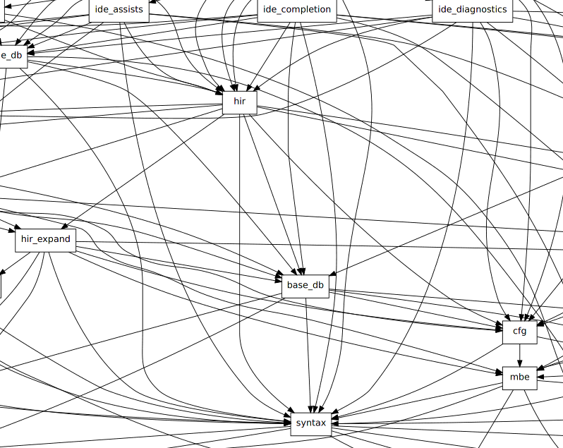
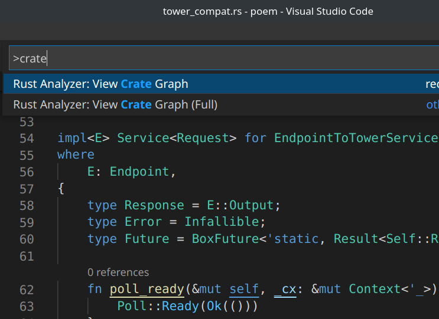

# 可视化项目成员包的调用关系

通常一个大型 Rust 项目都会用 cargo workspace 来管理

workspace 下面有多个 member 也叫 package 或者叫 crate

## 伞结构?

在《张汉东的Rust实战课》鉴赏 Rust 各个知名项目的视频分集中

经常会提到某某项目用的是 **伞结构**，但是 **伞结构** 又是什么意思呢?


借助 rust-analyzer 可视化 API 如上图就是 clippy 源码内各个库的依赖关系

可见 clippy_lints package 往下依赖很多子 package 但各个子 package 之间没有任何互相依赖

所以 clippy 源码这种项目就叫 **伞结构** 通过可视化工具发现确实很像 **一把倒立的雨伞**

本文介绍基于 rust-analyzer 公有 API 对项目中各个 package 依赖关系进行可视化

## 导入 rust-analyzer 库

rust-analyzer 的 lsp-server 的工作原理是 vscode 创建 rust-analyzer 子进程

然后 vscode 跟 rust-analyzer 之间通过两个管道借助 STDIN/STDOUT 进行通信

其实 rust-analyzer 还可以作为一个库调用它的 API

由于公开的接口尚未稳定频繁改动，所以 rust-analyzer 并没上传到 crates.io

我们可以将 rust-analyzer 源码下载到本地，在 Cargo.toml 下加上以下内容就可以引入

```
[dependencies]
# rust-analyzer commit hash dd21ad6a5e8ffa166c97447212d3da0f86555aee
rust-analyzer = { path = "../rust-analyzer/crates/rust-analyzer" }
project_model = { path = "../rust-analyzer/crates/project_model" }
paths = { path = "../rust-analyzer/crates/paths" }
syntax =  { path = "../rust-analyzer/crates/syntax" } # AST
base_db = { path = "../rust-analyzer/crates/base_db" }
hir =  { path = "../rust-analyzer/crates/hir" }
hir_expand =  { path = "../rust-analyzer/crates/hir_expand" }
ide = { path = "../rust-analyzer/crates/ide"  }
ide_db = { path = "../rust-analyzer/crates/ide_db" }
vfs = { path = "../rust-analyzer/crates/vfs" }
```

## load_cargo API 加载需要分析的项目

假设我们想要分析 rust-analyzer 源码中各个模块库的调用关系

```rust
let manifest_path = "/home/w/repos/clone_repos/rust-analyzer/Cargo.toml";
let manifest_path: paths::AbsPathBuf = manifest_path.try_into().unwrap();
let manifest = project_model::ProjectManifest::from_manifest_file(manifest_path).unwrap();
let workspace = project_model::ProjectWorkspace::load(
    manifest,
    &project_model::CargoConfig::default(),
    &|_| {},
)
.unwrap();
```

通过 `project_model::ProjectWorkspace::load` 加载出 workspace 信息后

此时我们可以遍历打印出该项目的 cargo workspace 下面总共有多少个 crate

```rust
// traverse all cargo_package(members) in cargo_workspace
for package in workspace.to_roots() {
    if !package.is_local {
        continue;
    }
    let package_path: &std::path::Path = package.include[0].as_ref();
    println!("found package {}", package_path.to_str().unwrap());
}
```

接着开始分析项目并生成 graphviz 格式的依赖关系图

```rust
let (analysis_host, _vfs, _proc_macro_srv_opt) =
    rust_analyzer::cli::load_cargo::load_workspace(
        workspace,
        &rust_analyzer::cli::load_cargo::LoadCargoConfig {
            load_out_dirs_from_check: false,
            with_proc_macro: false,
            prefill_caches: false,
        },
    )
    .unwrap();
let analysis = host.analysis();

// graphviz 文件格式的 dot 图
let is_include_std_and_dependencies_crate = false;
let dot: String = analysis
    .view_crate_graph(is_include_std_and_dependencies_crate)
    .unwrap()
    .unwrap();

// 再把 dot 图字符串写入到文件中
let file_path = concat!(env!("CARGO_MANIFEST_DIR"), "/target/graph.gv");
let mut f = std::fs::OpenOptions::new()
    .write(true)
    .create(true)
    .truncate(true)
    .open(file_path)
    .unwrap();
std::io::Write::write_all(&mut f, dot.as_bytes()).unwrap();

// 最后调用 xdot 可视化 graphviz
let is_success = std::process::Command::new("xdot")
    .arg(file_path)
    .spawn()
    .unwrap()
    .wait()
    .unwrap()
    .success();
assert!(is_success);
```



## 更简单的可视化方法

我在阅读 rust-analyzer 源码后发现其实 rust-analyzer 本身就提供 "crate graph" 的 vscode 如下图


