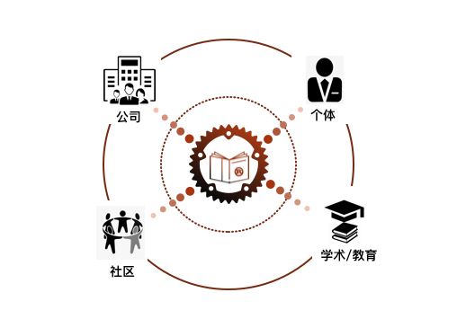

# 创刊寄语

*作者：张汉东*

**The roots aren't deep but the seeds are planted!**

自从`2015`年`5`月`15`号 `Rust 1.0` 稳定版发布以来，`Rust`发展已经经历了五个半年头。

头三个年头，`Rust`发展是缓慢的。直到`Rust 2018 Edition`发布开始，`Rust`便逐渐开始走入各大企业。我在`2018`年发起《`Rust`日报》之初，全球范围内应用`Rust`的动态还是寥寥无几，我还在发愁去哪里寻找`Rust`的动态。但是到了`2020`年底，《`Rust`日报》已经不再为`Rust`动态而发愁，几乎每天都会有新的项目和文章冒出来，覆盖了`Rust`应用领域的方方面面。足以见证`Rust`的发展趋势。

然而，这些`Rust`动态，有`90%`都是出自国外社区。其实近两年，`Rust`在国内也陆陆续续有一些公司开始采用，国内也逐渐看了一些优秀的`Rust`学习原创文章。在去年 `RustChinaConf2020`大会上，我们也看到了很多国内公司和开源社区的个人项目。然而，目前国内各大应用`Rust`的公司和`Rust`社区都还缺乏很多原创的精品输出，或者，有很多精品输出，还被隐藏在互联网信息洪流中，未被我们发现。

在当前的这种背景环境下，办一份电子杂志的想法就由此诞生了。所以，各位`Rustacean`们，《`Rust`中文精选》今天创刊了！

《`Rust`中文精选》的目标就是要连接公司、社区、高校和个体，挖掘更多国内的`Rust`领域的精品原创内容，让大家沟通有无。《`Rust`中文精选》将是永久开源和非商业化的。

《`Rust`中文精选》每月最后一天正式发刊，提供三种阅读方式：

- 在线阅读。大家可以通过我们指定的渠道找到本刊的阅读入口，点击链接可直接在线阅读。暂时是通过`GitHub Page`，回头找时间在 `Gitee` 上面发布。
- 本地阅读。你也可以通过本刊源码仓库直接获取杂志，在本地执行`mdbook build && mdbook watch --open` 就可阅读。
- PDF 电子版。可以通过GitHub仓库和指定渠道下载。

本刊内容希望涵盖且不限于以下内容：

- **Rust 本月简报**。 从《`Rust` 日报》中摘录和整理本月的亮点。
- **Rust in Production**。介绍 `Rust` 在企业内的一些生产实践和心得。
- **开源项目**。从应用到实现原理和细节，介绍 `Rust` 的一些优秀开源项目。
- **Rust 语言**。 分享 `Rust` 语言概念、技巧、设计模式、工程实践等心得经验。
- **Rust 编译器**。分享 `Rust` 编译器整体架构、实现细节、贡献。
- **Rust Security**。分享 `Rust` 语言及生态中的一些安全漏洞诞生的原因和解决方案。
- **游戏开发**。分享 `Rust` 游戏开发和学习的方方面面。
- **操作系统**。分享 `Rust` 操作系统开发和学习的方方面面。
- **嵌入式 Rust**。分享 `Rust` 嵌入式开发中的点点滴滴。
- **分布式开发**。分享 `Rust` 在分布式领域的实践。
- **网络开发**。分享 `Rust` 网络开发领域的方方面面。
- **云原生**。分享 `Rust` 在云原生领域的实践。
- **前端开发**。 分享 `Rust` 和 `WebAssembly` 在前端的应用实践。
- **图形化开发**。分享 `Rust` 在 图形化开发方面的实践。
- **大数据/人工智能**。分享 `Rust` 在 大数据和人工智能开发方面的实践。
- **Rust 算法**。用 `Rust` 刷算法是什么体验？

希望大家能踊跃投稿和参与编辑。可以直接给本刊`GitHub`仓库发`PR`，哪怕不一定能被入选，也可以发出你的声音！每个月一期，意味着你每个月精下心来创作一份精品文章，用来总结你在公司的实践和学习`Rust`的心得。

也希望越来越多的公司参与到期刊内容建设中来，对公司而言，不仅仅是经验分享，更是一种技术文化输出。

**在这浮躁的年代，希望这份期刊能帮助你找回技术的初心和野望。**

